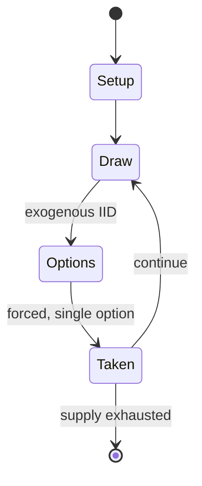

# Summoner Wars

*2009 board game*

`summoner_wars` &nbsp; state: **DEEPENED** &nbsp; method: **heuristic**

## Found layer (recorded, not trusted)

| field | value |
| --- | --- |
| wikidata | Q101598916 |
| wikipedia | Summoner Wars (card game) |
| genres (source) | -- |
| instance of (source) | board game |
| country of origin | -- |

## Declared layer (orders bench work)

| field | value |
| --- | --- |
| year created | 2009 |
| epoch | CONTEMPORARY |
| region | -- |
| media | BOARD, CARD, DICE |
| players | -- |
| age band | -- |
| exogenous process | IID |
| loss shape | -- |
| live axes | SPATIAL |
| horizon | VARIABLE |
| scoring shape | -- |
| information | -- |
| interaction | SOLITAIRE |
| turn structure | PHASE_STRUCTURED |
| tractability | EXACT_WITH_CUT |
| randomness | DICE |
| luck factor | 0.58 |
| rules complexity | 3.1 |
| strategic depth | 2.12 |
| novelty | 0.7286 |
| solved status | -- |
| strategies | spatial_packing |
| algorithms | -- |

## Object model

```
Episode
  players      : ?
  turn_structure: PHASE_STRUCTURED
  horizon       : VARIABLE
  scoring       : ?

Board          -- spatial substrate; cells carry position and occupancy
Piece          -- movable token owned by a player
Deck           -- ordered multiset, drawn without replacement
Hand           -- private multiset held by one player
DiscardPile    -- public accumulation of spent cards
DicePool       -- n dice, each an iid categorical draw
Roll           -- realised outcome of a pool
Placement      -- position subject to geometric legality
```

## State transition diagram



## Research item -- turn trace

```
# Summoner Wars -- simulated turn events
# generated from the DECLARED vector, not from a rulebook.
# structure: exo=IID loss=None horizon=VARIABLE scoring=None axes=SPATIAL

t=0    SETUP        players=2  pot=0  capacity=7
t=1    DRAW         p1 roll from d6 pool -> outcome #4  (p=0.266)
t=2    FORCED       p1 single legal option taken (pot_gain=+1.4)
t=3    ENDTURN      turn passes to p2
t=4    DRAW         p2 roll from d6 pool -> outcome #2  (p=0.159)
t=5    FORCED       p2 single legal option taken (pot_gain=+0.9)
t=6    SPATIAL      p2 places at (1,7); adjacency legal
t=7    DRAW         p2 roll from d6 pool -> outcome #5  (p=0.108)
t=8    FORCED       p2 single legal option taken (pot_gain=+1.3)
t=9    DRAW         p2 roll from d6 pool -> outcome #1  (p=0.142)
t=10   FORCED       p2 single legal option taken (pot_gain=+0.7)
t=11   SPATIAL      p2 places at (2,0); adjacency legal
t=12   DRAW         p2 roll from d6 pool -> outcome #1  (p=0.048)
t=13   FORCED       p2 single legal option taken (pot_gain=+1.4)
t=14   SPATIAL      p2 places at (7,6); adjacency legal
t=15   DRAW         p2 roll from d6 pool -> outcome #6  (p=0.172)
t=16   FORCED       p2 single legal option taken (pot_gain=+1.4)
t=17   DRAW         p2 roll from d6 pool -> outcome #3  (p=0.114)
t=18   FORCED       p2 single legal option taken (pot_gain=+1.1)
t=19   ENDTURN      turn passes to p1
t=20   DRAW         p1 roll from d6 pool -> outcome #5  (p=0.049)
t=21   FORCED       p1 single legal option taken (pot_gain=+0.9)
t=22   SPATIAL      p1 places at (5,0); adjacency legal
t=23   DRAW         p1 roll from d6 pool -> outcome #5  (p=0.231)
t=24   FORCED       p1 single legal option taken (pot_gain=+0.6)
t=25   ENDTURN      turn passes to p2
t=26   DRAW         p2 roll from d6 pool -> outcome #2  (p=0.180)
t=27   FORCED       p2 single legal option taken (pot_gain=+1.7)

terminal: VARIABLE
```

## Conditions

| kind | threshold | effect | trigger |
| --- | --- | --- | --- |
| TERMINATE | 1 player | -- | The game ends when one player's summoner is destroyed. |

## Source extract

Summoner Wars is an expandable tactical card game designed by Colby Dauch and published by Plaid
Hat Games in 2009. It was the first game released by Plaid Hat Games, which Dauch founded in
2009. The game combines faction-based card play, dice combat and movement on a grid battlefield,
with each player attempting to destroy the opposing summoner.   == Gameplay == In Summoner Wars,
each player controls a summoner and a faction deck made up of units, events and walls. Players
summon common and champion units onto the battlefield, move units across the grid, attack
opposing cards with dice, and use cards as magic to pay summoning costs. A turn in the first
edition is divided into six phases: draw, summon, play event cards, movement, attack and build
magic. Units are generally summoned adjacent to walls controlled by the player, and movement is
orthogonal rather than diagonal. The game ends when one player's summoner is destroyed. The game
was released with faction decks, starter sets, reinforcement packs and later a Master Set. The
original starter sets included four factions: the Guild Dwarves, Cave Goblins, Tundra Orcs and
Phoenix Elves. Expansions allowed players to customize facti

<sub>Wikipedia, CC BY-SA. Retained as evidence for the structural
classification above. Every rule inferred from it is HYPOTHESIZED
until audited against a rulebook.</sub>
