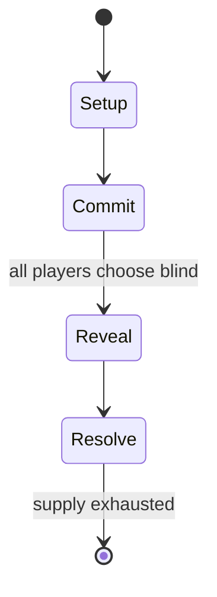

# Sungka

`sungka` &nbsp; state: **DEEPENED** &nbsp; method: **heuristic**

## Found layer (recorded, not trusted)

| field | value |
| --- | --- |
| wikidata | -- |
| wikipedia | Sungka |
| genres (source) | -- |
| instance of (source) | -- |
| country of origin | -- |

## Declared layer (orders bench work)

| field | value |
| --- | --- |
| year created | -- |
| epoch | -- |
| region | -- |
| media | MANCALA |
| players | -- |
| age band | -- |
| exogenous process | NONE |
| loss shape | OPPORTUNITY_ONLY |
| live axes | COMMIT_BLIND |
| horizon | -- |
| scoring shape | -- |
| information | SIMULTANEOUS |
| interaction | SOLITAIRE |
| turn structure | SIMULTANEOUS |
| tractability | EXACT_WITH_CUT |
| randomness | SIMULTANEOUS_CHOICE |
| luck factor | 0.05 |
| rules complexity | 2.19 |
| strategic depth | 2.0 |
| novelty | 0.7803 |
| solved status | -- |
| strategies | -- |
| algorithms | -- |

## Object model

```
Episode
  players      : ?
  turn_structure: SIMULTANEOUS
  horizon       : ?
  scoring       : ?

Pits           -- cyclic array of counts
Store          -- player's banked seeds
SealedChoice   -- irrevocable choice made without observation
```

## State transition diagram



## Research item -- turn trace

```
# Sungka -- simulated turn events
# generated from the DECLARED vector, not from a rulebook.
# structure: exo=NONE loss=OPPORTUNITY_ONLY horizon=None scoring=None axes=COMMIT_BLIND

t=0    SETUP        players=2  pot=0  capacity=6
t=1    FORCED       p1 single legal option taken (pot_gain=+1.4)
t=2    FORCED       p1 single legal option taken (pot_gain=+1.5)
t=3    FORCED       p1 single legal option taken (pot_gain=+1.4)
t=4    FORCED       p1 single legal option taken (pot_gain=+1.9)
t=5    FORCED       p1 single legal option taken (pot_gain=+1.8)
t=6    ENDTURN      turn passes to p2
t=7    FORCED       p2 single legal option taken (pot_gain=+1.6)
t=8    FORCED       p2 single legal option taken (pot_gain=+0.6)
t=9    ENDTURN      turn passes to p1
t=10   FORCED       p1 single legal option taken (pot_gain=+1.0)
t=11   FORCED       p1 single legal option taken (pot_gain=+1.1)
t=12   ENDTURN      turn passes to p2
t=13   FORCED       p2 single legal option taken (pot_gain=+1.8)
t=14   FORCED       p2 single legal option taken (pot_gain=+0.6)
t=15   ENDTURN      turn passes to p1
t=16   FORCED       p1 single legal option taken (pot_gain=+1.0)
t=17   ENDTURN      turn passes to p2
t=18   FORCED       p2 single legal option taken (pot_gain=+1.3)
t=19   ENDTURN      turn passes to p1
t=20   FORCED       p1 single legal option taken (pot_gain=+1.3)
t=21   ENDTURN      turn passes to p2
t=22   FORCED       p2 single legal option taken (pot_gain=+1.3)
t=23   FORCED       p2 single legal option taken (pot_gain=+1.8)
t=24   ENDTURN      turn passes to p1
t=25   FORCED       p1 single legal option taken (pot_gain=+1.6)
t=26   FORCED       p1 single legal option taken (pot_gain=+0.7)

terminal: VARIABLE
```

## Conditions

| kind | threshold | effect | trigger |
| --- | --- | --- | --- |
| TERMINATE | -- | -- | The first round ends when a player has no more seeds in their holes. |
| BOUNDARY | -- | -- | Indonesia has the largest variation of Southeast Asian mancalas and thus may be likely to be at least one of the major entry points, though this may also be just an artifact of the country's size. |
| PENALTY | -- | -- | They forfeit their turn and stop playing. |
| PENALTY | -- | -- | If the seed drops into an empty hole belonging to the opponent: the player forfeits their turn and stops playing. |
| PENALTY | -- | -- | They also forfeit their seeds and leave it in the opponent's hole. |

## Source extract

Southeast Asian mancalas are a subtype of mancala games predominantly found in Southeast Asia.
They are known as congkak in Malaysia; congklak (VOS Spelling: tjongklak), congkak, congka, and
dakon in Indonesia and Brunei; sungkâ in the Philippines; and Makkhum หมากขุม or Maklum หมากหลุม
(Hole Game) in Thailand. They differ from other mancala games in that the player's store is
included in the placing of the seeds. Like other mancalas, they vary widely in terms of the
rules and number of holes used.   == Names ==  Southeast Asian mancalas are generally known by
variations of similar cognates which are likely onomatopoeiac. The names have also come to mean
the cowrie shells, predominantly used as the seeds of the game. These names include congkak in
Malaysia, congklak (VOS Spelling: tjongklak; also spelled as tsjongklak in Dutch sources),
congkak, congka, and jogklak in Indonesia, Brunei, and Singapore, and sungkâ (also spelled
chonca or chongca by Spanish sources) in the Philippines. Historical records show that similar
games also existed in Sri Lanka (where it is known as chonka) and India. In Tamil Nadu, India,
it is known as Pallanguzhi. A similar game is still found in the Maldi

<sub>Wikipedia, CC BY-SA. Retained as evidence for the structural
classification above. Every rule inferred from it is HYPOTHESIZED
until audited against a rulebook.</sub>
