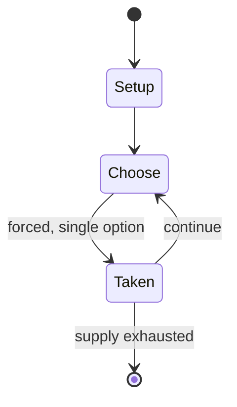

# Surakarta (game)

`surakarta_game` &nbsp; state: **DEEPENED** &nbsp; method: **heuristic**

## Found layer (recorded, not trusted)

| field | value |
| --- | --- |
| wikidata | Q601529 |
| wikipedia | Surakarta (game) |
| genres (source) | -- |
| instance of (source) | -- |
| country of origin | -- |

## Declared layer (orders bench work)

| field | value |
| --- | --- |
| year created | 1970 |
| epoch | DIGITAL |
| region | -- |
| media | BOARD |
| players | 2 |
| age band | -- |
| exogenous process | -- |
| loss shape | -- |
| live axes | SPATIAL |
| horizon | -- |
| scoring shape | SET_COLLECTION_CONVEX |
| information | -- |
| interaction | SOLITAIRE |
| turn structure | -- |
| tractability | SAMPLING_ONLY |
| randomness | -- |
| luck factor | 0.35 |
| rules complexity | 2.08 |
| strategic depth | 2.25 |
| novelty | 0.5069 |
| solved status | -- |
| strategies | set_collection |
| algorithms | -- |

## Object model

```
Episode
  players      : 2
  turn_structure: ?
  horizon       : ?
  scoring       : SET_COLLECTION_CONVEX

Board          -- spatial substrate; cells carry position and occupancy
Piece          -- movable token owned by a player
Placement      -- position subject to geometric legality
```

## State transition diagram



## Research item -- turn trace

```
# Surakarta (game) -- simulated turn events
# generated from the DECLARED vector, not from a rulebook.
# structure: exo=None loss=None horizon=None scoring=SET_COLLECTION_CONVEX axes=SPATIAL

t=0    SETUP        players=2  pot=0  capacity=6
t=1    FORCED       p1 single legal option taken (pot_gain=+1.6)
t=2    FORCED       p1 single legal option taken (pot_gain=+1.3)
t=3    FORCED       p1 single legal option taken (pot_gain=+0.9)
t=4    SPATIAL      p1 places at (5,4); adjacency legal
t=5    FORCED       p1 single legal option taken (pot_gain=+0.7)
t=6    FORCED       p1 single legal option taken (pot_gain=+1.5)
t=7    SPATIAL      p1 places at (5,3); adjacency legal
t=8    FORCED       p1 single legal option taken (pot_gain=+1.2)
t=9    FORCED       p1 single legal option taken (pot_gain=+1.8)
t=10   FORCED       p1 single legal option taken (pot_gain=+1.8)
t=11   SPATIAL      p1 places at (5,1); adjacency legal
t=12   FORCED       p1 single legal option taken (pot_gain=+1.2)
t=13   SPATIAL      p1 places at (5,4); adjacency legal
t=14   FORCED       p1 single legal option taken (pot_gain=+1.4)
t=15   FORCED       p1 single legal option taken (pot_gain=+1.1)
t=16   SPATIAL      p1 places at (1,7); adjacency legal
t=17   FORCED       p1 single legal option taken (pot_gain=+0.8)
t=18   SPATIAL      p1 places at (0,4); adjacency legal
t=19   FORCED       p1 single legal option taken (pot_gain=+1.8)
t=20   SPATIAL      p1 places at (4,6); adjacency legal
t=21   FORCED       p1 single legal option taken (pot_gain=+1.0)
t=22   SPATIAL      p1 places at (0,7); adjacency legal
t=23   FORCED       p1 single legal option taken (pot_gain=+1.6)
t=24   FORCED       p1 single legal option taken (pot_gain=+0.7)
t=25   FORCED       p1 single legal option taken (pot_gain=+1.6)
t=26   SPATIAL      p1 places at (7,6); adjacency legal

terminal: VARIABLE
```

## Conditions

| kind | threshold | effect | trigger |
| --- | --- | --- | --- |
| ELIMINATE | -- | removed | Captured pieces are removed from the game. |
| BOUNDARY | -- | -- | A capturing move consists of traversing along an inner or outer circuit (coloured blue and green in the diagram, but red and blue in the photo) around at least one of the eight corner loops of the board, followed by land |

## Source extract

Surakarta is an Indonesian abstract strategy board game for two players, named after Surakarta,
Central Java. The game features an unusual method of capture which is "possibly unique" and "not
known to exist in any other recorded board game". Little is known about its history. The name of
the game in Indonesian is permainan, which simply translates as "the game". In Java, the game is
also called dam-daman. It was first published in France in 1970 as "Surakarta". The game is
called "Roundabouts" in Sid Sackson's The Book of Classic Board Games.   == Equipment ==
Traditional Indonesian game pieces are shells versus pebbles or stones, with the board grid
inscribed in sand or volcanic ash. But any easily distinguished sets of pieces may be used (e.g.
counters distinguished by colour, as shown). Players begin the game with 12 pieces each.   ==
Rules == Players decide who moves first, then turns alternate. The object of the game is to
capture all 12 of the opponent's pieces; or, if no further captures are possible, to have more
pieces remaining in play than the opponent. Pieces always rest on the points of intersection of
the board's grid lines. On a turn, a player either moves one of t

<sub>Wikipedia, CC BY-SA. Retained as evidence for the structural
classification above. Every rule inferred from it is HYPOTHESIZED
until audited against a rulebook.</sub>
