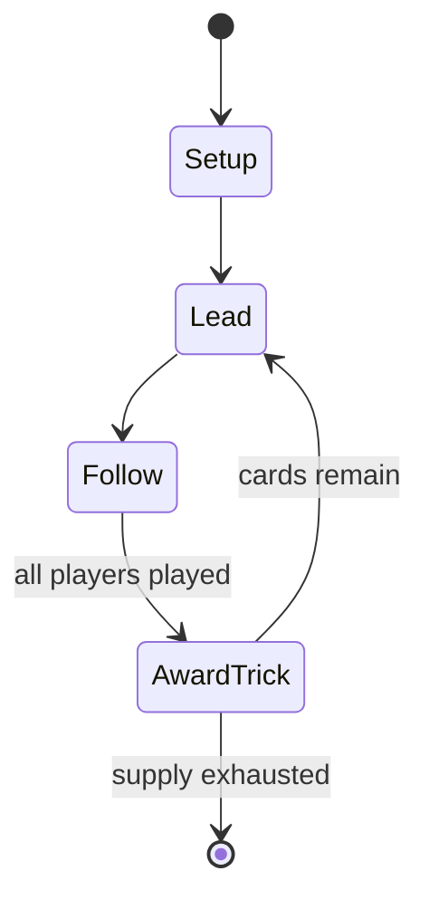

# Swedish whist

*card game*

`swedish_whist` &nbsp; state: **DEEPENED** &nbsp; method: **heuristic**

## Found layer (recorded, not trusted)

| field | value |
| --- | --- |
| wikidata | Q10500636 |
| wikipedia | Swedish whist |
| genres (source) | -- |
| instance of (source) | card game, trick-taking game |
| country of origin | -- |

## Declared layer (orders bench work)

| field | value |
| --- | --- |
| year created | -- |
| epoch | -- |
| region | -- |
| media | CARD, TRICK_TAKING |
| players | -- |
| age band | -- |
| exogenous process | -- |
| loss shape | -- |
| live axes | BID |
| horizon | -- |
| scoring shape | -- |
| information | -- |
| interaction | TEAM |
| turn structure | TRICK_ROUND |
| tractability | SAMPLING_ONLY |
| randomness | -- |
| luck factor | 0.35 |
| rules complexity | 2.09 |
| strategic depth | 2.25 |
| novelty | 0.6122 |
| solved status | -- |
| strategies | spatial_packing |
| algorithms | -- |

## Object model

```
Episode
  players      : ?
  turn_structure: TRICK_ROUND
  horizon       : ?
  scoring       : ?

Deck           -- ordered multiset, drawn without replacement
Hand           -- private multiset held by one player
DiscardPile    -- public accumulation of spent cards
Trick          -- one card per player; a winner is determined
Trump          -- suit that dominates the ordering
Auction        -- priced competition resolving to one winner
```

## State transition diagram



## Research item -- turn trace

```
# Swedish whist -- simulated turn events
# generated from the DECLARED vector, not from a rulebook.
# structure: exo=None loss=None horizon=None scoring=None axes=BID

t=0    SETUP        players=2  pot=0  capacity=4
t=1    FORCED       p1 single legal option taken (pot_gain=+0.8)
t=2    BID          p1 sealed bid of 7 against 1 rivals
t=3    FORCED       p1 single legal option taken (pot_gain=+0.7)
t=4    BID          p1 sealed bid of 8 against 1 rivals
t=5    ENDTURN      turn passes to p2
t=6    FORCED       p2 single legal option taken (pot_gain=+1.6)
t=7    BID          p2 sealed bid of 1 against 1 rivals
t=8    FORCED       p2 single legal option taken (pot_gain=+1.9)
t=9    FORCED       p2 single legal option taken (pot_gain=+1.4)
t=10   ENDTURN      turn passes to p1
t=11   FORCED       p1 single legal option taken (pot_gain=+1.7)
t=12   FORCED       p1 single legal option taken (pot_gain=+1.5)
t=13   BID          p1 sealed bid of 6 against 1 rivals
t=14   FORCED       p1 single legal option taken (pot_gain=+1.0)
t=15   FORCED       p1 single legal option taken (pot_gain=+1.0)
t=16   FORCED       p1 single legal option taken (pot_gain=+1.6)
t=17   BID          p1 sealed bid of 5 against 1 rivals
t=18   ENDTURN      turn passes to p2
t=19   FORCED       p2 single legal option taken (pot_gain=+1.3)
t=20   FORCED       p2 single legal option taken (pot_gain=+1.5)
t=21   FORCED       p2 single legal option taken (pot_gain=+1.8)
t=22   ENDTURN      turn passes to p1
t=23   FORCED       p1 single legal option taken (pot_gain=+1.2)
t=24   FORCED       p1 single legal option taken (pot_gain=+1.6)
t=25   ENDTURN      turn passes to p2
t=26   FORCED       p2 single legal option taken (pot_gain=+0.5)

terminal: VARIABLE
```

## Conditions

| kind | threshold | effect | trigger |
| --- | --- | --- | --- |
| PENALTY | -- | -- | Players indicate their choice by placing a red card (of the suit of hearts or diamonds) or a black card (of the suit of clubs or spades) at the bottom of their cards, bearing in mind that all players may see this card du |
| PENALTY | -- | -- | As soon as a player reveals a red card, it is the equivalent of announcing "play" (spel). |

## Source extract

Swedish whist (Swedish: svensk whist), also called Fyrmanswhist ("Four-hand whist") or,
regionally, just whist, is a Swedish trick-taking card game. Knowing four-player whist is useful
for playing other card games because it was the prototype for trick-taking games.   == History
== The game emerged in the 1950s in Sweden, but first appeared in the literature in 1967. It may
be a derivative of the classic Swedish game of Priffe. Swedish whist was very popular in Sweden
in the 1970s and 1980s.   == Description == Swedish whist is played by four players in teams of
two using a standard 52-card pack, typically of the Modern Swedish pattern. Cards rank in their
natural order, aces high. The first dealer is chosen by lot and then rotates after each deal.
The dealer deals all the cards, one by one. Players examine their hands and decide whether to
play 'red' or 'black', i.e., whether they want to take as many tricks as possible (red) or as
few as possible (black). Players indicate their choice by placing a red card (of the suit of
hearts or diamonds) or a black card (of the suit of clubs or spades) at the bottom of their
cards, bearing in mind that all players may see this card during the

<sub>Wikipedia, CC BY-SA. Retained as evidence for the structural
classification above. Every rule inferred from it is HYPOTHESIZED
until audited against a rulebook.</sub>
