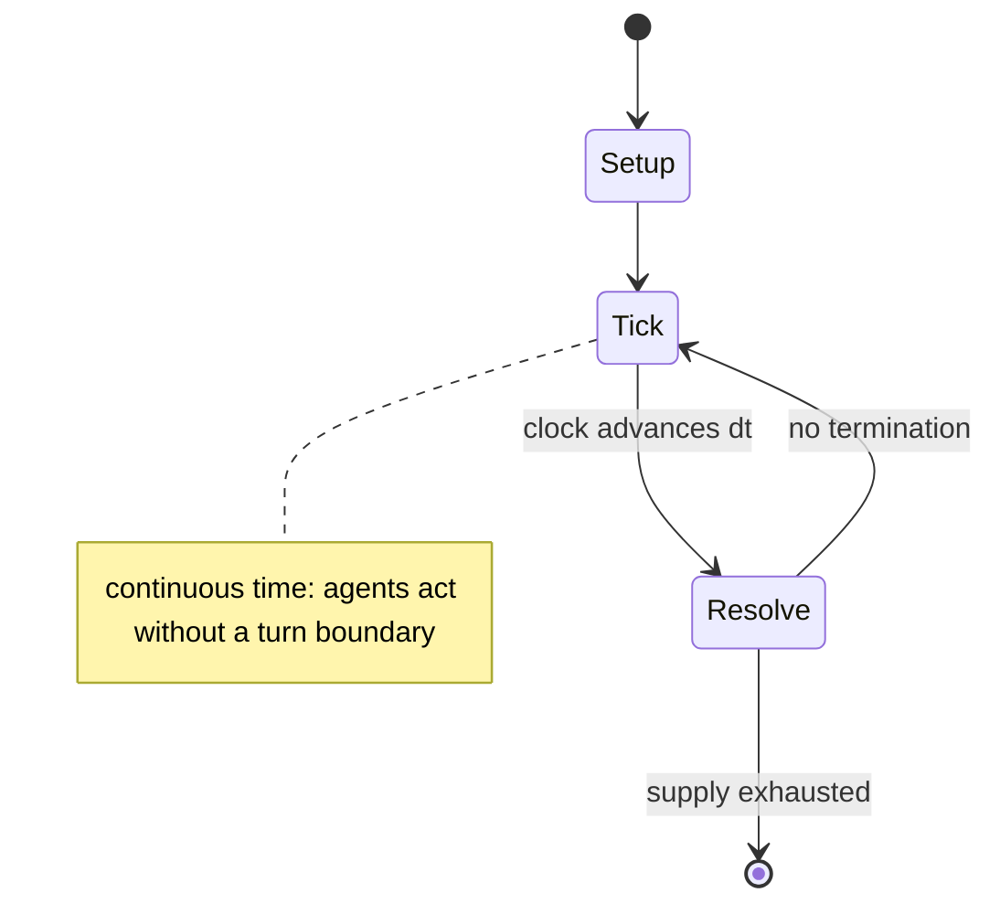

# Sword Girls

*Korean digital card game*

`sword_girls` &nbsp; state: **DEEPENED** &nbsp; method: **heuristic**

## Found layer (recorded, not trusted)

| field | value |
| --- | --- |
| wikidata | Q12602446 |
| wikipedia | Sword Girls |
| genres (source) | -- |
| instance of (source) | board game |
| country of origin | -- |

## Declared layer (orders bench work)

| field | value |
| --- | --- |
| year created | 2011 |
| epoch | CONTEMPORARY |
| region | -- |
| media | CARD, COLLECTIBLE |
| players | -- |
| age band | -- |
| exogenous process | CONTINUOUS_TIME |
| loss shape | -- |
| live axes | TRADE |
| horizon | -- |
| scoring shape | -- |
| information | -- |
| interaction | COMPETITIVE |
| turn structure | REAL_TIME |
| tractability | SAMPLING_ONLY |
| randomness | REAL_TIME_PHYSICAL |
| luck factor | 0.3 |
| rules complexity | 1.74 |
| strategic depth | 2.0 |
| novelty | 0.6401 |
| solved status | -- |
| strategies | opponent_modelling, spatial_packing |
| algorithms | -- |

## Object model

```
Episode
  players      : ?
  turn_structure: REAL_TIME
  horizon       : ?
  scoring       : ?

Deck           -- ordered multiset, drawn without replacement
Hand           -- private multiset held by one player
DiscardPile    -- public accumulation of spent cards
Offer          -- proposed exchange between two agents
```

## State transition diagram



## Research item -- clock trace

```
# Sword Girls -- simulated clock trace (no turn boundary)
# generated from the DECLARED vector, not from a rulebook.
# structure: exo=CONTINUOUS_TIME loss=None horizon=None scoring=None axes=TRADE

clk=0.000s  START        agents=4  clock=free running
clk=1.473s  INFRACTION   a4 commits infraction (count=1)
clk=4.155s  ACTION       a2 acts continuously; no turn boundary crossed
clk=6.452s  ACTION       a4 acts continuously; no turn boundary crossed
clk=6.762s  ACTION       a3 acts continuously; no turn boundary crossed
clk=7.398s  CONTEST      a4 and a1 contend for the same resource
clk=7.820s  INFRACTION   a1 commits infraction (count=1)
clk=8.170s  STOPPAGE     clock halts; state frozen
clk=8.984s  ACTION       a2 acts continuously; no turn boundary crossed
clk=9.561s  ACTION       a2 acts continuously; no turn boundary crossed
clk=10.939s  ACTION       a1 acts continuously; no turn boundary crossed
clk=12.194s  STOPPAGE     clock halts; state frozen
clk=12.519s  ACTION       a4 acts continuously; no turn boundary crossed
clk=15.420s  ACTION       a2 acts continuously; no turn boundary crossed
clk=16.902s  INFRACTION   a1 commits infraction (count=2)
clk=17.730s  ACTION       a3 acts continuously; no turn boundary crossed
clk=18.250s  ACTION       a3 acts continuously; no turn boundary crossed
clk=19.569s  SCORE        a4 scores (+2)
clk=21.248s  ACTION       a1 acts continuously; no turn boundary crossed
clk=23.641s  CONTEST      a1 and a2 contend for the same resource
clk=25.256s  INFRACTION   a3 commits infraction (count=1)
clk=27.063s  ACTION       a1 acts continuously; no turn boundary crossed
clk=29.064s  SCORE        a4 scores (+2)
clk=30.098s  SCORE        a1 scores (+1)
clk=30.340s  SCORE        a1 scores (+3)
clk=30.671s  STOPPAGE     clock halts; state frozen
clk=32.567s  ACTION       a1 acts continuously; no turn boundary crossed

note: elapsed time, not move count, is the episode's ordering variable.
```

## Source extract

Sword Girls was a Korean digital collectible card game developed by Zeonix that was released in
2011. The game art was influenced by manga art style. It has been defunct since 2017.  The game
also had an offline version in the form of a regular collectible card game published in
2012–2013.    == Summary == The four main factions in the game are the girls' public school life
of the republic Vita, the royal kingdom's main Power Academy, the justice-upholding knight
nation of Crux, and the mixed faction of night-dwellers and witches Darklore, and their
interactions with and against each other, which all take place in the background of a continuing
war against the technology-driven Empire of Lazion and the unfolding mysteries of otherworldly
entities. There are also neutral cards that are not associated with any of the factions.  In the
continuing Korean version, later story episode releases introduced a fifth new faction, Empire
of Lazion. The online game's card lore each tell a part of the story of various girls in
different factions, ranging widely in story content such as from a Vita tennis club member's
daily life to a Darklore vampire family's internal power struggle. The online

<sub>Wikipedia, CC BY-SA. Retained as evidence for the structural
classification above. Every rule inferred from it is HYPOTHESIZED
until audited against a rulebook.</sub>
