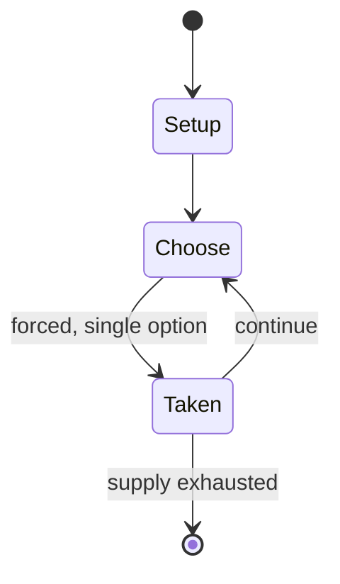

# Sygo

*abstract strategy game*

`sygo` &nbsp; state: **DEEPENED** &nbsp; method: **heuristic**

## Found layer (recorded, not trusted)

| field | value |
| --- | --- |
| wikidata | Q10463847 |
| wikipedia | Sygo |
| genres (source) | -- |
| instance of (source) | go variant |
| country of origin | -- |

## Declared layer (orders bench work)

| field | value |
| --- | --- |
| year created | 2010 |
| epoch | CONTEMPORARY |
| region | -- |
| media | ABSTRACT |
| players | -- |
| age band | -- |
| exogenous process | NONE |
| loss shape | OPPORTUNITY_ONLY |
| live axes | SPATIAL |
| horizon | -- |
| scoring shape | -- |
| information | PERFECT |
| interaction | COMPETITIVE |
| turn structure | PHASE_STRUCTURED |
| tractability | EXACT_WITH_CUT |
| randomness | NONE |
| luck factor | 0.02 |
| rules complexity | 2.87 |
| strategic depth | 2.4 |
| novelty | 0.7814 |
| solved status | -- |
| strategies | -- |
| algorithms | -- |

## Object model

```
Episode
  players      : ?
  turn_structure: PHASE_STRUCTURED
  horizon       : ?
  scoring       : ?

Placement      -- position subject to geometric legality
```

## State transition diagram



## Research item -- turn trace

```
# Sygo -- simulated turn events
# generated from the DECLARED vector, not from a rulebook.
# structure: exo=NONE loss=OPPORTUNITY_ONLY horizon=None scoring=None axes=SPATIAL

t=0    SETUP        players=2  pot=0  capacity=7
t=1    FORCED       p1 single legal option taken (pot_gain=+1.6)
t=2    SPATIAL      p1 places at (3,2); adjacency legal
t=3    FORCED       p1 single legal option taken (pot_gain=+1.5)
t=4    SPATIAL      p1 places at (7,6); adjacency legal
t=5    FORCED       p1 single legal option taken (pot_gain=+1.0)
t=6    FORCED       p1 single legal option taken (pot_gain=+1.0)
t=7    SPATIAL      p1 places at (5,3); adjacency legal
t=8    FORCED       p1 single legal option taken (pot_gain=+1.8)
t=9    SPATIAL      p1 places at (2,7); adjacency legal
t=10   FORCED       p1 single legal option taken (pot_gain=+0.8)
t=11   ENDTURN      turn passes to p2
t=12   FORCED       p2 single legal option taken (pot_gain=+1.1)
t=13   SPATIAL      p2 places at (2,4); adjacency legal
t=14   FORCED       p2 single legal option taken (pot_gain=+1.1)
t=15   FORCED       p2 single legal option taken (pot_gain=+1.5)
t=16   FORCED       p2 single legal option taken (pot_gain=+0.6)
t=17   FORCED       p2 single legal option taken (pot_gain=+0.9)
t=18   FORCED       p2 single legal option taken (pot_gain=+2.0)
t=19   FORCED       p2 single legal option taken (pot_gain=+1.2)
t=20   SPATIAL      p2 places at (6,7); adjacency legal
t=21   FORCED       p2 single legal option taken (pot_gain=+1.5)
t=22   FORCED       p2 single legal option taken (pot_gain=+1.4)
t=23   SPATIAL      p2 places at (3,6); adjacency legal
t=24   FORCED       p2 single legal option taken (pot_gain=+1.4)
t=25   SPATIAL      p2 places at (7,0); adjacency legal
t=26   FORCED       p2 single legal option taken (pot_gain=+1.9)
t=27   SPATIAL      p2 places at (2,6); adjacency legal

terminal: VARIABLE
```

## Conditions

| kind | threshold | effect | trigger |
| --- | --- | --- | --- |
| TERMINATE | 1 player | -- | The game ends either when one player resigns or both players pass on successive turns. |

## Source extract

Sygo is a two player abstract strategy game created in 2010 by Christian Freeling.  It is a
variant of Go.  Sygo is played on a 19x19 grid of lines. It differs from Go in that captured
stones change colors instead of being removed from the board, similar to Reversi/Othello.
Additionally, each turn, players may either place a new stone, or else grow all of their
existing groups of stones by placing a new stone adjacent to each group, similar to Symple,
another of Christian Freeling's games. The goal of Sygo is to control the most territory on the
board as determined by the number of a player's stones on the board as well as empty points
surrounded by the players stones. The game ends either when one player resigns or both players
pass on successive turns.   == Rules ==   === Movement === Each player has one of two color
stones, black or white. The game set up starts with an empty board. Each turn a player may
either:  Grow all of their groups of stones. Put a stone on a vacant cell unconnected to any
other friendly group. A group is defined as any one or more stones connected orthogonally (up,
down, left, or right) with no spaces in between. Groups are grown by placing a single sto

<sub>Wikipedia, CC BY-SA. Retained as evidence for the structural
classification above. Every rule inferred from it is HYPOTHESIZED
until audited against a rulebook.</sub>
