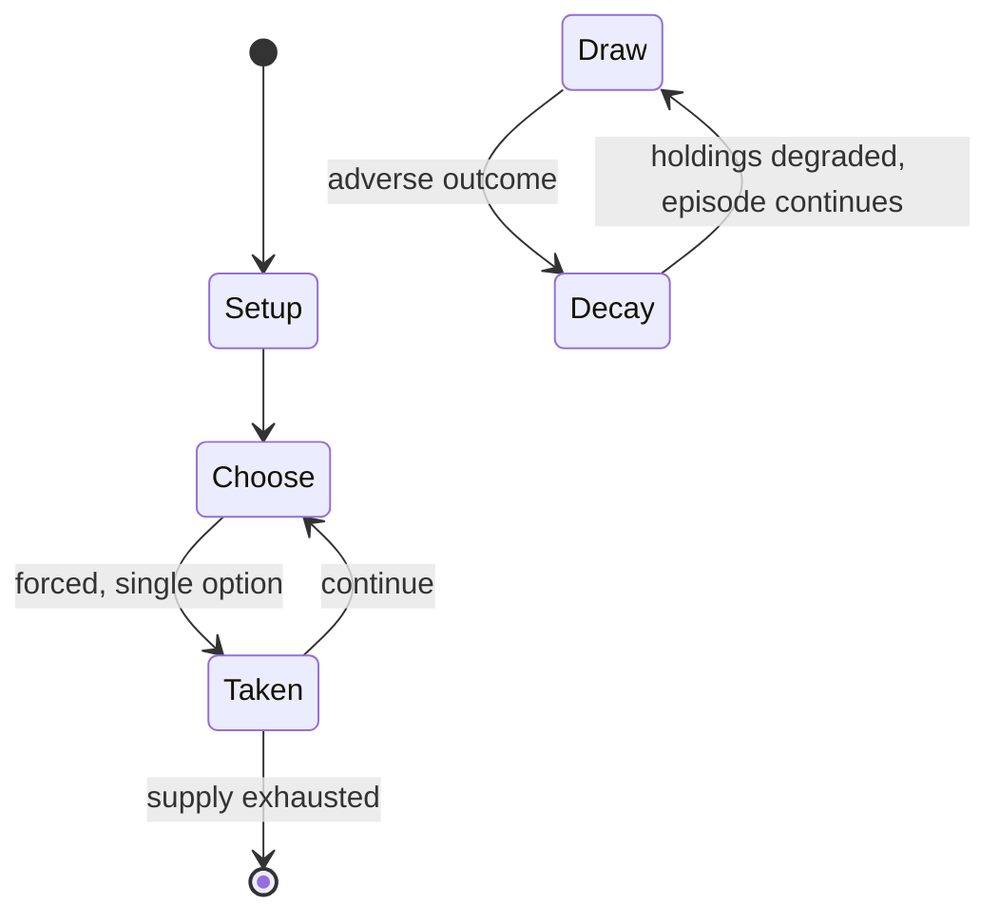

# Symple

*abstract strategy game*

`symple` &nbsp; state: **DEEPENED** &nbsp; method: **heuristic**

## Found layer (recorded, not trusted)

| field | value |
| --- | --- |
| wikidata | Q104854265 |
| wikipedia | Symple (game) |
| genres (source) | -- |
| instance of (source) | go variant |
| country of origin | -- |

## Declared layer (orders bench work)

| field | value |
| --- | --- |
| year created | 2010 |
| epoch | CONTEMPORARY |
| region | -- |
| media | ABSTRACT, BOARD, DEXTERITY |
| players | -- |
| age band | -- |
| exogenous process | NONE |
| loss shape | PARTIAL_DECAY |
| live axes | SPATIAL |
| horizon | -- |
| scoring shape | -- |
| information | PERFECT |
| interaction | COMPETITIVE |
| turn structure | -- |
| tractability | EXACT_WITH_CUT |
| randomness | NONE |
| luck factor | 0.02 |
| rules complexity | 2.12 |
| strategic depth | 2.4 |
| novelty | 0.7615 |
| solved status | -- |
| strategies | -- |
| algorithms | -- |

## Object model

```
Episode
  players      : ?
  turn_structure: ?
  horizon       : ?
  scoring       : ?

Board          -- spatial substrate; cells carry position and occupancy
Piece          -- movable token owned by a player
Placement      -- position subject to geometric legality
```

## State transition diagram



## Research item -- turn trace

```
# Symple -- simulated turn events
# generated from the DECLARED vector, not from a rulebook.
# structure: exo=NONE loss=PARTIAL_DECAY horizon=None scoring=None axes=SPATIAL

t=0    SETUP        players=2  pot=0  capacity=7
t=1    FORCED       p1 single legal option taken (pot_gain=+0.9)
t=2    SPATIAL      p1 places at (6,7); adjacency legal
t=3    FORCED       p1 single legal option taken (pot_gain=+1.9)
t=4    SPATIAL      p1 places at (1,0); adjacency legal
t=5    FORCED       p1 single legal option taken (pot_gain=+1.8)
t=6    FORCED       p1 single legal option taken (pot_gain=+1.1)
t=7    SPATIAL      p1 places at (2,3); adjacency legal
t=8    FORCED       p1 single legal option taken (pot_gain=+1.9)
t=9    SPATIAL      p1 places at (6,4); adjacency legal
t=10   FORCED       p1 single legal option taken (pot_gain=+1.3)
t=11   FORCED       p1 single legal option taken (pot_gain=+1.3)
t=12   FORCED       p1 single legal option taken (pot_gain=+0.6)
t=13   FORCED       p1 single legal option taken (pot_gain=+1.9)
t=14   SPATIAL      p1 places at (4,3); adjacency legal
t=15   FORCED       p1 single legal option taken (pot_gain=+1.4)
t=16   FORCED       p1 single legal option taken (pot_gain=+0.8)
t=17   FORCED       p1 single legal option taken (pot_gain=+0.9)
t=18   SPATIAL      p1 places at (7,2); adjacency legal
t=19   FORCED       p1 single legal option taken (pot_gain=+1.6)
t=20   SPATIAL      p1 places at (3,2); adjacency legal
t=21   FORCED       p1 single legal option taken (pot_gain=+1.5)
t=22   FORCED       p1 single legal option taken (pot_gain=+0.7)
t=23   SPATIAL      p1 places at (1,1); adjacency legal
t=24   FORCED       p1 single legal option taken (pot_gain=+1.0)
t=25   ENDTURN      turn passes to p2
t=26   FORCED       p2 single legal option taken (pot_gain=+0.7)

terminal: VARIABLE
```

## Conditions

| kind | threshold | effect | trigger |
| --- | --- | --- | --- |
| TERMINATE | 1 player | -- | Symple ends when one player resigns or when the game board is full. |
| PENALTY | -- | -- | The goal of Symple is to end the game with the highest score, with score being determined via points for controlling territory on the board less a penalty for each separate group of stones. |
| PENALTY | -- | -- | There's also the possibility that the opponent who grows early can cut off your groups and force you to accept the group penalty at the end of the game. |

## Source extract

Symple is a two-player abstract strategy game created in 2010 by Christian Freeling and Benedikt
Rosenau. The goal of Symple is to end the game with the highest score, with score being
determined via points for controlling territory on the board less a penalty for each separate
group of stones. Like Go, Symple is played on a 19x19 grid of lines; unlike Go, there are no
mechanics allowing capture of stones once placed. Symple is a drawless finite perfect
information game.    == Rules ==   === Movement === Each player has one of two color stones, one
darker and one lighter, often black and white. The game set up starts with an empty board. Each
turn a player must either:  Grow all of their groups of stones. Put a stone on a vacant cell
unconnected to any other friendly group. A group is defined as any one or more stones connected
orthogonally (up, down, left, or right) with no spaces in between. Groups are grown by placing a
single stone on a space orthogonally adjacent to any stone within a group. Each group may only
grow by one stone per turn. If a stone connects two or more different groups during a growth
phase both groups are considered to have been grown by the single stone. If

<sub>Wikipedia, CC BY-SA. Retained as evidence for the structural
classification above. Every rule inferred from it is HYPOTHESIZED
until audited against a rulebook.</sub>
