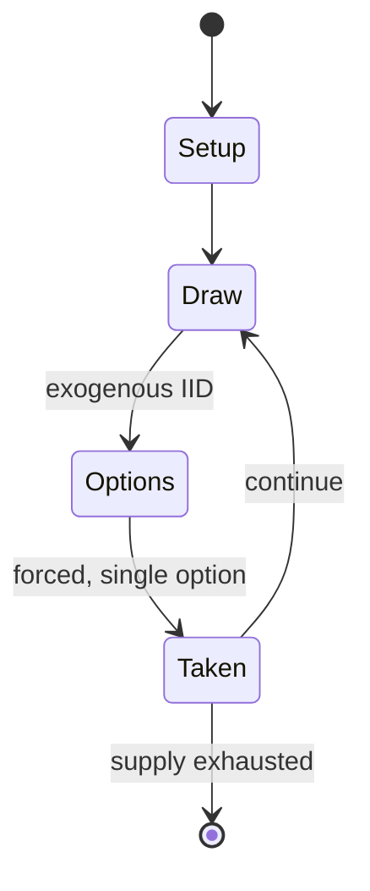

# Tâb

`t_b` &nbsp; state: **DEEPENED** &nbsp; method: **heuristic**

## Found layer (recorded, not trusted)

| field | value |
| --- | --- |
| wikidata | Q4994692 |
| wikipedia | Tâb |
| genres (source) | -- |
| instance of (source) | -- |
| country of origin | -- |

## Declared layer (orders bench work)

| field | value |
| --- | --- |
| year created | -- |
| epoch | -- |
| region | -- |
| media | BOARD, DICE |
| players | -- |
| age band | -- |
| exogenous process | IID |
| loss shape | -- |
| live axes | - |
| horizon | -- |
| scoring shape | -- |
| information | -- |
| interaction | SOLITAIRE |
| turn structure | -- |
| tractability | EXACT_WITH_CUT |
| randomness | DICE |
| luck factor | 0.58 |
| rules complexity | 1.9 |
| strategic depth | 1.87 |
| novelty | 0.6401 |
| solved status | -- |
| strategies | -- |
| algorithms | -- |

## Object model

```
Episode
  players      : ?
  turn_structure: ?
  horizon       : ?
  scoring       : ?

Board          -- spatial substrate; cells carry position and occupancy
Piece          -- movable token owned by a player
DicePool       -- n dice, each an iid categorical draw
Roll           -- realised outcome of a pool
```

## State transition diagram



## Research item -- turn trace

```
# Tâb -- simulated turn events
# generated from the DECLARED vector, not from a rulebook.
# structure: exo=IID loss=None horizon=None scoring=None axes=-

t=0    SETUP        players=2  pot=0  capacity=3
t=1    DRAW         p1 roll from d6 pool -> outcome #1  (p=0.182)
t=2    FORCED       p1 single legal option taken (pot_gain=+1.7)
t=3    ENDTURN      turn passes to p2
t=4    DRAW         p2 roll from d6 pool -> outcome #2  (p=0.076)
t=5    FORCED       p2 single legal option taken (pot_gain=+1.1)
t=6    ENDTURN      turn passes to p1
t=7    DRAW         p1 roll from d6 pool -> outcome #5  (p=0.106)
t=8    FORCED       p1 single legal option taken (pot_gain=+1.1)
t=9    DRAW         p1 roll from d6 pool -> outcome #6  (p=0.087)
t=10   FORCED       p1 single legal option taken (pot_gain=+0.6)
t=11   DRAW         p1 roll from d6 pool -> outcome #3  (p=0.265)
t=12   FORCED       p1 single legal option taken (pot_gain=+1.4)
t=13   DRAW         p1 roll from d6 pool -> outcome #6  (p=0.251)
t=14   FORCED       p1 single legal option taken (pot_gain=+1.1)
t=15   ENDTURN      turn passes to p2
t=16   DRAW         p2 roll from d6 pool -> outcome #6  (p=0.169)
t=17   FORCED       p2 single legal option taken (pot_gain=+1.4)
t=18   DRAW         p2 roll from d6 pool -> outcome #1  (p=0.203)
t=19   FORCED       p2 single legal option taken (pot_gain=+0.7)
t=20   ENDTURN      turn passes to p1
t=21   DRAW         p1 roll from d6 pool -> outcome #3  (p=0.225)
t=22   FORCED       p1 single legal option taken (pot_gain=+1.9)
t=23   DRAW         p1 roll from d6 pool -> outcome #1  (p=0.226)
t=24   FORCED       p1 single legal option taken (pot_gain=+1.8)
t=25   ENDTURN      turn passes to p2
t=26   DRAW         p2 roll from d6 pool -> outcome #2  (p=0.119)
t=27   FORCED       p2 single legal option taken (pot_gain=+1.2)
t=28   ENDTURN      turn passes to p1

terminal: VARIABLE
```

## Source extract

Tâb (Egyptian Arabic: طاب, romanized: ṭāb) is the name of a running-fight board game played in
several Muslim (mostly Arab) countries, and a family of similar board games played in North
Africa (as اللعبه السيق, romanized: sîg) and West Asia, from Iran to West Africa and from Turkey
to Somalia, where a variant called deleb is played. The rules and boards can vary widely across
the region though almost all consist of boards with three or four rows. A reference to "al-tâb
wa-l-dukk" (likely a similar game) occurs in a poem of 1310.   == Gameplay == The game described
here was recorded by Edward William Lane in Egypt in the 1820s. Egyptian tâb is played by two
players on a board, often delineated at the ground. The board is four squares wide, and usually
an odd number of squares long, usually from 7 to 15, but formerly up to 29 squares. Numbering
the four rows 1, 2, 3 and 4, from the start one player has one (nominally) white piece in each
field of row 1, and the other a (nominally) black piece in each field of row 4. The pieces may
be stones or made from burnt clay. In Egypt, the pieces are referred to as kelb, meaning dog. As
in the Ancient Egyptian game Senet and the Korean game Yu

<sub>Wikipedia, CC BY-SA. Retained as evidence for the structural
classification above. Every rule inferred from it is HYPOTHESIZED
until audited against a rulebook.</sub>
