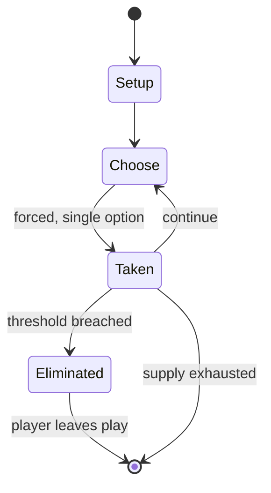

# Tag (game)

`tag_game` &nbsp; state: **DEEPENED** &nbsp; method: **heuristic**

## Found layer (recorded, not trusted)

| field | value |
| --- | --- |
| wikidata | Q656619 |
| wikipedia | Tag (game) |
| genres (source) | -- |
| instance of (source) | -- |
| country of origin | -- |

## Declared layer (orders bench work)

| field | value |
| --- | --- |
| year created | -- |
| epoch | -- |
| region | -- |
| media | PLAYGROUND |
| players | -- |
| age band | CHILD |
| exogenous process | -- |
| loss shape | ELIMINATION |
| live axes | - |
| horizon | VARIABLE |
| scoring shape | -- |
| information | -- |
| interaction | -- |
| turn structure | TICK_BASED |
| tractability | SAMPLING_ONLY |
| randomness | -- |
| luck factor | 0.35 |
| rules complexity | 1.76 |
| strategic depth | 2.0 |
| novelty | 0.6893 |
| solved status | -- |
| strategies | -- |
| algorithms | -- |

## Object model

```
Episode
  players      : ?
  turn_structure: TICK_BASED
  horizon       : VARIABLE
  scoring       : ?

State          -- opaque; no medium or axis evidence was found
Player         -- an agent that selects among legal successors
```

## State transition diagram



## Research item -- clock trace

```
# Tag (game) -- simulated clock trace (no turn boundary)
# generated from the DECLARED vector, not from a rulebook.
# structure: exo=None loss=ELIMINATION horizon=VARIABLE scoring=None axes=-

clk=0.000s  START        agents=4  clock=free running
clk=0.588s  ACTION       a1 acts continuously; no turn boundary crossed
clk=3.229s  ACTION       a4 acts continuously; no turn boundary crossed
clk=5.448s  SCORE        a3 scores (+1)
clk=7.288s  ACTION       a2 acts continuously; no turn boundary crossed
clk=9.889s  ACTION       a3 acts continuously; no turn boundary crossed
clk=10.334s  STOPPAGE     clock halts; state frozen
clk=10.866s  CONTEST      a1 and a2 contend for the same resource
clk=13.149s  ACTION       a2 acts continuously; no turn boundary crossed
clk=14.994s  CONTEST      a1 and a2 contend for the same resource
clk=16.693s  STOPPAGE     clock halts; state frozen
clk=17.016s  CONTEST      a1 and a2 contend for the same resource
clk=17.525s  ACTION       a1 acts continuously; no turn boundary crossed
clk=20.454s  ACTION       a2 acts continuously; no turn boundary crossed
clk=21.738s  ACTION       a3 acts continuously; no turn boundary crossed
clk=24.213s  ACTION       a3 acts continuously; no turn boundary crossed
clk=25.497s  ACTION       a3 acts continuously; no turn boundary crossed
clk=26.753s  STOPPAGE     clock halts; state frozen
clk=27.298s  SCORE        a3 scores (+2)
clk=30.036s  INFRACTION   a2 commits infraction (count=1)
clk=30.592s  CONTEST      a3 and a4 contend for the same resource
clk=33.219s  SCORE        a3 scores (+1)
clk=33.899s  STOPPAGE     clock halts; state frozen
clk=36.167s  CONTEST      a2 and a3 contend for the same resource
clk=36.998s  CONTEST      a1 and a2 contend for the same resource
clk=38.615s  INFRACTION   a1 commits infraction (count=1)
clk=38.989s  STOPPAGE     clock halts; state frozen

note: elapsed time, not move count, is the episode's ordering variable.
```

## Conditions

| kind | threshold | effect | trigger |
| --- | --- | --- | --- |
| ELIMINATE | 3 players | eliminated | In parts of Asia, variations of a game known as pugam pugai or Saa Boo Three in India are played; in one variation, a group of three players are asked to face one of their hands upward or downward, and if one of them fac |
| TERMINATE | 1 player | -- | The game ends when all but one player is "down". |
| BOUNDARY | 4 players | -- | Surr is played by two teams of at least four players, in a field divided by two perpendicular "lines of defense" (lanes) into four quadrants. |
| ELIMINATE | -- | -- | A simple variation makes tag an elimination game, so that tagged players drop out of play. |
| ELIMINATE | -- | -- | This process then repeats with other players until finally, the last player eliminated in the final group of three is made to be "it". |
| ELIMINATE | -- | -- | A dislike of elimination games is another reason for banning tag. |
| ELIMINATE | -- | -- | While outside of that area, the players can be tagged and eliminated. |
| ELIMINATE | -- | -- | The goal of the attacking team is to have their players cross as many trenches as possible without being eliminated by a touch from any of the nine defensive players, each of whom stands in one of the trenches. |
| ELIMINATE | -- | -- | In the bat-and-ball game of baseball, the offensive team's players try to score by advancing around four bases without being put out (eliminated) by players on the defensive team. |
| WIN | -- | -- | The last player is the winner and starts as "bulldog" in the next game. |
| TERMINATE | -- | -- | In some variations, the previous "it" is no longer "it" and the game can continue indefinitely, while in others, both players remain "it" and the game ends when all players have become "it". |
| TERMINATE | -- | -- | The game ends when "it" freezes all but one of the players who is then typically "it" during the next game. |
| TERMINATE | -- | -- | The game ends if all the robbers are in jail. |
| TERMINATE | -- | -- | In these variants, the game ends when all of one team is in the other's "jail". |
| TERMINATE | -- | -- | The game is over when all players are out. |
| TERMINATE | -- | -- | That version ends when all players who are not safe are out. |
| TERMINATE | -- | -- | The game ends once all players have been tagged, with the last person tagged being the winner. |
| BOUNDARY | -- | -- | Tag-like games have been played throughout history since as far back as at least the fourth century BC. |
| BOUNDARY | -- | -- | Kho-kho has been played since at least the fourth century BC. |
| BOUNDARY | -- | -- | Major modern competitions for tag-like games ("major competitions" being those with at least 100 million views) include World Chase Tag, Pro Kabaddi League, and Ultimate Kho Kho. |
| PENALTY | -- | -- | The equipment often has built-in scoring systems and various penalties for taking hits. |

## Source extract

Tag (also called chase, tig, it, tiggy, tips, tick, on-on and tip) is a playground game
involving one or more players chasing other players in an attempt to "tag" and mark them out of
play, typically by touching with a hand. There are many variations; most forms have no teams,
scores, or equipment. Usually when a person is tagged, the tagger says, "It!", "Tag, you're
'It'!" or "Tag". The last one tagged during tag is "It" for the next round. The game is known by
other names in various parts of the world, including "running and catching" in India,  "catch
and cook" in the Middle East, "lelu" in Vanuatu, and "berek" in Poland.   == Origin of name ==
The game has many different names in different parts of the UK: 'tig' in Yorkshire, Scotland,
and in the North West of England; and 'it' in the South of England. In the United States the
game is usually called 'tag', and in Australia it is sometimes called 'chasey' or 'tips'. In
2018, the internet meme "How old were you when you found out ____" began circulating, which
stated that the origin of the word tag was an acronym meaning 'touch and go'. Investigation by
snopes.com found this to be false. According to the Merriam-Webster dictionar

<sub>Wikipedia, CC BY-SA. Retained as evidence for the structural
classification above. Every rule inferred from it is HYPOTHESIZED
until audited against a rulebook.</sub>
