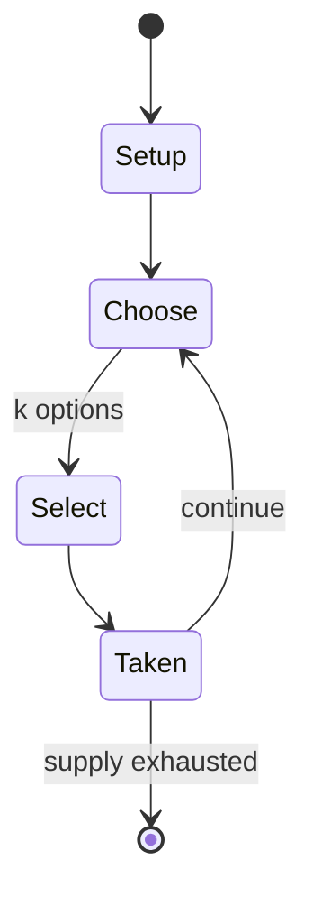

# Tai shogi

*25x25 grid variant of Japanese chess*

`tai_shogi` &nbsp; state: **DEEPENED** &nbsp; method: **heuristic**

## Found layer (recorded, not trusted)

| field | value |
| --- | --- |
| wikidata | Q850680 |
| wikipedia | Tai shogi |
| genres (source) | -- |
| instance of (source) | shogi variant |
| country of origin | Japan |

## Declared layer (orders bench work)

| field | value |
| --- | --- |
| year created | -- |
| epoch | -- |
| region | EAST_ASIA |
| media | BOARD |
| players | 2 |
| age band | -- |
| exogenous process | NONE |
| loss shape | OPPORTUNITY_ONLY |
| live axes | SELECT, SPATIAL |
| horizon | -- |
| scoring shape | WINNER_TAKE_ALL |
| information | PERFECT |
| interaction | SOLITAIRE |
| turn structure | -- |
| tractability | EXACT_WITH_CUT |
| randomness | NONE |
| luck factor | 0.02 |
| rules complexity | 2.87 |
| strategic depth | 3.15 |
| novelty | 0.7995 |
| solved status | -- |
| strategies | memory_recall, set_collection, signalling |
| algorithms | -- |

## Object model

```
Episode
  players      : 2
  turn_structure: ?
  horizon       : ?
  scoring       : WINNER_TAKE_ALL

Board          -- spatial substrate; cells carry position and occupancy
Piece          -- movable token owned by a player
OptionSet      -- the choices available after an exogenous draw
Placement      -- position subject to geometric legality
```

## State transition diagram



## Research item -- turn trace

```
# Tai shogi -- simulated turn events
# generated from the DECLARED vector, not from a rulebook.
# structure: exo=NONE loss=OPPORTUNITY_ONLY horizon=None scoring=WINNER_TAKE_ALL axes=SELECT,SPATIAL

t=0    SETUP        players=2  pot=0  capacity=7
t=1    SELECT       p1 2 options; take #2  (pot_gain=+1.7, capacity=-0)
t=2    SELECT       p1 2 options; take #2  (pot_gain=+1.2, capacity=-1)
t=3    SPATIAL      p1 places at (2,7); adjacency legal
t=4    SELECT       p1 2 options; take #2  (pot_gain=+2.6, capacity=-2)
t=5    SELECT       p1 1 options; take #1  (pot_gain=+2.0, capacity=-1)
t=6    SPATIAL      p1 places at (6,0); adjacency legal
t=7    SELECT       p1 3 options; take #3  (pot_gain=+3.4, capacity=-2)
t=8    SELECT       p1 3 options; take #3  (pot_gain=+1.3, capacity=-2)
t=9    SELECT       p1 1 options; take #1  (pot_gain=+0.9, capacity=-1)
t=10   SELECT       p1 4 options; take #4  (pot_gain=+3.4, capacity=-0)
t=11   ENDTURN      turn passes to p2
t=12   SELECT       p2 2 options; take #2  (pot_gain=+3.4, capacity=-0)
t=13   SPATIAL      p2 places at (6,4); adjacency legal
t=14   ENDTURN      turn passes to p1
t=15   SELECT       p1 3 options; take #3  (pot_gain=+2.1, capacity=-0)
t=16   ENDTURN      turn passes to p2
t=17   SELECT       p2 4 options; take #2  (pot_gain=+1.4, capacity=-0)
t=18   SELECT       p2 2 options; take #1  (pot_gain=+2.6, capacity=-0)
t=19   SELECT       p2 2 options; take #1  (pot_gain=+1.7, capacity=-2)
t=20   ENDTURN      turn passes to p1
t=21   SELECT       p1 3 options; take #2  (pot_gain=+2.8, capacity=-1)
t=22   SELECT       p1 1 options; take #1  (pot_gain=+1.6, capacity=-2)
t=23   SPATIAL      p1 places at (3,4); adjacency legal
t=24   ENDTURN      turn passes to p2
t=25   SELECT       p2 4 options; take #1  (pot_gain=+2.5, capacity=-1)
t=26   SPATIAL      p2 places at (3,5); adjacency legal

terminal: VARIABLE
```

## Conditions

| kind | threshold | effect | trigger |
| --- | --- | --- | --- |
| WIN | -- | -- | If a player's emperor or prince is in check and no legal move by that player will get the emperor or prince out of check, the checking move is also a mate, and effectively wins the game. |
| WIN | -- | -- | A player who captures the opponent's sole remaining emperor or prince wins the game. |
| TERMINATE | -- | -- | When the last of these is captured, the game ends. |

## Source extract

Tai shogi (泰将棋 tai shōgi or 無上泰将棋 mujō tai shōgi "grand chess", renamed from 無上大将棋 mujō dai
shōgi "supreme chess" to avoid confusion with 大将棋 dai shōgi) is a large board variant of shogi
(Japanese chess).  The game dates to the 15th century and is based on earlier large-board shogi
games.  Before the discovery of taikyoku shogi in 1997, tai shogi was believed to be the largest
playable chess variant, if not board game, ever.  One game may be played over several long
sessions and require each player to make over a thousand moves. It was never a popular game;
indeed, a single production of six game sets in the early 17th century was a notable event.
Like other large-board variants, but unlike standard shogi, the game is played without drops,
and uses a promotion-by-capture rule. Because of the terse and often incomplete wording of the
historical sources for the large shogi variants, except for chu shogi and to a lesser extent dai
shogi (which were at some points of time the most prestigious forms of shogi being played), the
historical rules of tai shogi are not clear. Different sources often differ significantly in the
moves attributed to the pieces, and the degree of contradiction

<sub>Wikipedia, CC BY-SA. Retained as evidence for the structural
classification above. Every rule inferred from it is HYPOTHESIZED
until audited against a rulebook.</sub>
