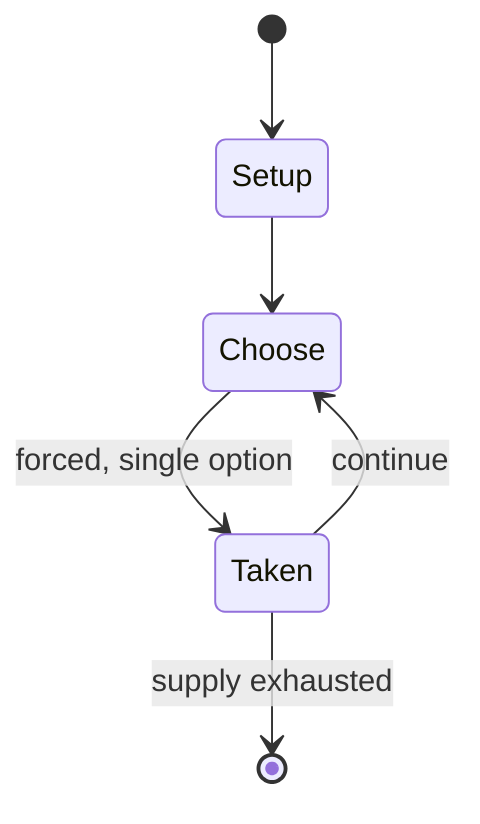

# Taikyoku shogi

*36×36 grid variant of Japanese chess*

`taikyoku_shogi` &nbsp; state: **DEEPENED** &nbsp; method: **heuristic**

## Found layer (recorded, not trusted)

| field | value |
| --- | --- |
| wikidata | Q7676055 |
| wikipedia | Taikyoku shogi |
| genres (source) | -- |
| instance of (source) | shogi variant |
| country of origin | Japan |

## Declared layer (orders bench work)

| field | value |
| --- | --- |
| year created | -- |
| epoch | -- |
| region | EAST_ASIA |
| media | - |
| players | 2 |
| age band | -- |
| exogenous process | NONE |
| loss shape | OPPORTUNITY_ONLY |
| live axes | SPATIAL |
| horizon | -- |
| scoring shape | SET_COLLECTION_CONVEX |
| information | PERFECT |
| interaction | SOLITAIRE |
| turn structure | -- |
| tractability | EXACT_WITH_CUT |
| randomness | NONE |
| luck factor | 0.02 |
| rules complexity | 2.28 |
| strategic depth | 2.65 |
| novelty | 0.7608 |
| solved status | -- |
| strategies | set_collection |
| algorithms | -- |

## Object model

```
Episode
  players      : 2
  turn_structure: ?
  horizon       : ?
  scoring       : SET_COLLECTION_CONVEX

Placement      -- position subject to geometric legality
```

## State transition diagram



## Research item -- turn trace

```
# Taikyoku shogi -- simulated turn events
# generated from the DECLARED vector, not from a rulebook.
# structure: exo=NONE loss=OPPORTUNITY_ONLY horizon=None scoring=SET_COLLECTION_CONVEX axes=SPATIAL

t=0    SETUP        players=2  pot=0  capacity=7
t=1    FORCED       p1 single legal option taken (pot_gain=+1.5)
t=2    SPATIAL      p1 places at (2,0); adjacency legal
t=3    FORCED       p1 single legal option taken (pot_gain=+0.7)
t=4    ENDTURN      turn passes to p2
t=5    FORCED       p2 single legal option taken (pot_gain=+1.6)
t=6    SPATIAL      p2 places at (5,2); adjacency legal
t=7    FORCED       p2 single legal option taken (pot_gain=+0.7)
t=8    ENDTURN      turn passes to p1
t=9    FORCED       p1 single legal option taken (pot_gain=+1.6)
t=10   FORCED       p1 single legal option taken (pot_gain=+0.8)
t=11   SPATIAL      p1 places at (0,5); adjacency legal
t=12   FORCED       p1 single legal option taken (pot_gain=+1.1)
t=13   SPATIAL      p1 places at (3,0); adjacency legal
t=14   FORCED       p1 single legal option taken (pot_gain=+1.9)
t=15   SPATIAL      p1 places at (4,7); adjacency legal
t=16   FORCED       p1 single legal option taken (pot_gain=+0.9)
t=17   SPATIAL      p1 places at (4,3); adjacency legal
t=18   FORCED       p1 single legal option taken (pot_gain=+0.7)
t=19   FORCED       p1 single legal option taken (pot_gain=+1.8)
t=20   SPATIAL      p1 places at (1,0); adjacency legal
t=21   ENDTURN      turn passes to p2
t=22   FORCED       p2 single legal option taken (pot_gain=+1.5)
t=23   ENDTURN      turn passes to p1
t=24   FORCED       p1 single legal option taken (pot_gain=+1.9)
t=25   ENDTURN      turn passes to p2
t=26   FORCED       p2 single legal option taken (pot_gain=+1.5)

terminal: VARIABLE
```

## Conditions

| kind | threshold | effect | trigger |
| --- | --- | --- | --- |
| TERMINATE | -- | -- | When the last of these is captured, the game ends. |

## Source extract

Taikyoku shōgi (Japanese: 大局将棋; lit. "ultimate shogi") is the largest known variant of shogi
(Japanese chess). The game was created around the mid-16th or 17th centuries (presumably by
priests) and is based on earlier large board shogi games. Before the rediscovery of taikyoku
shogi in 1997, tai shogi was believed to be the largest physically playable chess variant ever.
It has not been shown that taikyoku shogi was ever widely played. There are only two sets of
restored taikyoku shogi pieces, one of which is held at Osaka University of Commerce. The only
played game in recent history was played in 2004 for the Japanese television show The Fountain
of Trivia (Fuji Television), which took 32 hours and 41 minutes, spanning over three days, and a
total of 3,805 moves. Because the game was found only recently after centuries of obscurity, it
is difficult to say exactly what all the rules were. Several documents describing the game have
been found; however, there are differences between them. It is not clear how accurate the rules
given by modern sources for the game are, because many of the pieces appear in other shogi
variants with a consistent move there, but are given different move

<sub>Wikipedia, CC BY-SA. Retained as evidence for the structural
classification above. Every rule inferred from it is HYPOTHESIZED
until audited against a rulebook.</sub>
