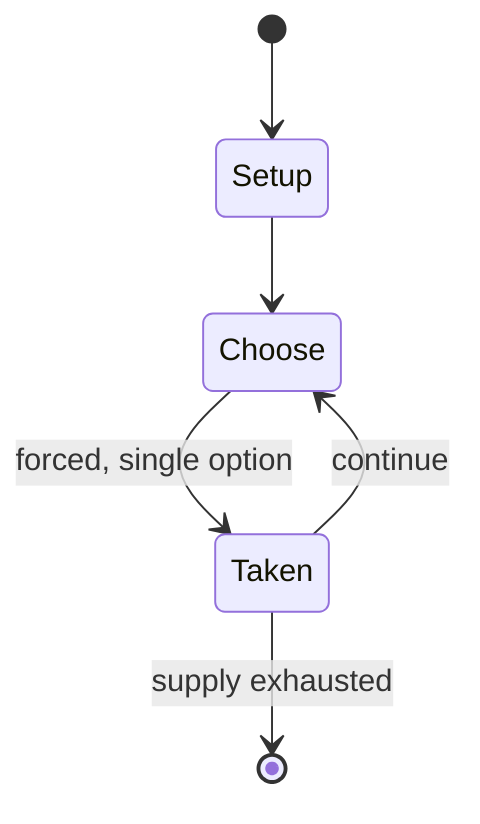

# Take It Easy (game)

`take_it_easy_game` &nbsp; state: **DEEPENED** &nbsp; method: **heuristic**

## Found layer (recorded, not trusted)

| field | value |
| --- | --- |
| wikidata | Q373777 |
| wikipedia | Take It Easy (game) |
| genres (source) | -- |
| instance of (source) | -- |
| country of origin | -- |

## Declared layer (orders bench work)

| field | value |
| --- | --- |
| year created | -- |
| epoch | -- |
| region | -- |
| media | BOARD, TILE |
| players | -- |
| age band | -- |
| exogenous process | -- |
| loss shape | -- |
| live axes | ORDER |
| horizon | -- |
| scoring shape | SET_COLLECTION_CONVEX |
| information | -- |
| interaction | SOLITAIRE |
| turn structure | -- |
| tractability | SAMPLING_ONLY |
| randomness | -- |
| luck factor | 0.35 |
| rules complexity | 2.09 |
| strategic depth | 2.25 |
| novelty | 0.5069 |
| solved status | -- |
| strategies | set_collection |
| algorithms | -- |

## Object model

```
Episode
  players      : ?
  turn_structure: ?
  horizon       : ?
  scoring       : SET_COLLECTION_CONVEX

Board          -- spatial substrate; cells carry position and occupancy
Piece          -- movable token owned by a player
TileBag        -- unordered draw source
Layout         -- placed tiles and their adjacencies
Sequence       -- the permutation under the player's control
```

## State transition diagram



## Research item -- turn trace

```
# Take It Easy (game) -- simulated turn events
# generated from the DECLARED vector, not from a rulebook.
# structure: exo=None loss=None horizon=None scoring=SET_COLLECTION_CONVEX axes=ORDER

t=0    SETUP        players=2  pot=0  capacity=3
t=1    FORCED       p1 single legal option taken (pot_gain=+1.3)
t=2    ENDTURN      turn passes to p2
t=3    FORCED       p2 single legal option taken (pot_gain=+1.6)
t=4    FORCED       p2 single legal option taken (pot_gain=+0.6)
t=5    FORCED       p2 single legal option taken (pot_gain=+1.0)
t=6    FORCED       p2 single legal option taken (pot_gain=+1.3)
t=7    ENDTURN      turn passes to p1
t=8    FORCED       p1 single legal option taken (pot_gain=+1.6)
t=9    FORCED       p1 single legal option taken (pot_gain=+1.2)
t=10   FORCED       p1 single legal option taken (pot_gain=+1.7)
t=11   FORCED       p1 single legal option taken (pot_gain=+1.2)
t=12   FORCED       p1 single legal option taken (pot_gain=+0.8)
t=13   ENDTURN      turn passes to p2
t=14   FORCED       p2 single legal option taken (pot_gain=+0.9)
t=15   FORCED       p2 single legal option taken (pot_gain=+0.5)
t=16   FORCED       p2 single legal option taken (pot_gain=+1.7)
t=17   ENDTURN      turn passes to p1
t=18   FORCED       p1 single legal option taken (pot_gain=+0.5)
t=19   FORCED       p1 single legal option taken (pot_gain=+1.3)
t=20   FORCED       p1 single legal option taken (pot_gain=+0.9)
t=21   ENDTURN      turn passes to p2
t=22   FORCED       p2 single legal option taken (pot_gain=+0.7)
t=23   FORCED       p2 single legal option taken (pot_gain=+0.5)
t=24   FORCED       p2 single legal option taken (pot_gain=+0.9)
t=25   ENDTURN      turn passes to p1
t=26   FORCED       p1 single legal option taken (pot_gain=+1.4)

terminal: VARIABLE
```

## Conditions

| kind | threshold | effect | trigger |
| --- | --- | --- | --- |
| WIN | 4 rounds | -- | The player with the highest cumulative score after four rounds is the winner. |
| BOUNDARY | 45 points | -- | When a contiguous path is completed from edge to edge, the score of the contiguous path is the number of tiles multiplied by the line value, so the maximum single-line score is 45 points (=5×9 vertical tiles along the ce |
| BOUNDARY | 307 points | -- | The maximum possible combined score for all lines is 307 points; there are sixteen possible configurations that achieve this score. |

## Source extract

Take It Easy is an abstract strategy board game created by Peter Burley. It can be characterized
as a strategic bingo-like game, and has been published by Ravensburger and subsequently by
several other publishers since 1983.   == Gameplay ==  To start, each player takes a board with
19 hexagonal cells arranged as a 3×3 hexagon. Additionally, each player takes a set of 27 tiles
which have different combinations of colored/numbered paths; the paths are arranged as a triple-
cross, linking opposite sides (Van Ness Serpentiles notation 300). The color of the board's
playing field matches the background of the tiles for each player.  One player, designated as
the caller, draws a tile randomly and then announces to the others which tile was drawn by
declaring the three-digit combination (e.g., "5-7-4" would refer to the value of the vertical
path, the value of the path crossing from lower left to upper right, and the value of the path
crossing from upper left to lower right, in that sequence). Each player then puts their copy of
that tile on their board in any available spot. Tiles must be placed so the numbers remain
upright (e.g., the 1-, 5-, and 9-series lines must always be vertical).

<sub>Wikipedia, CC BY-SA. Retained as evidence for the structural
classification above. Every rule inferred from it is HYPOTHESIZED
until audited against a rulebook.</sub>
