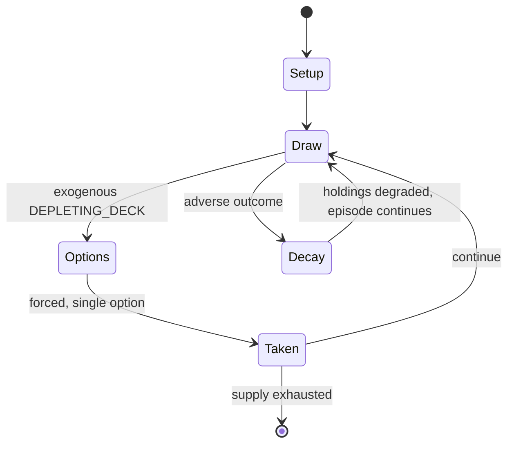

# TAKI

*Israeli card game similar to Uno*

`taki` &nbsp; state: **DEEPENED** &nbsp; method: **heuristic**

## Found layer (recorded, not trusted)

| field | value |
| --- | --- |
| wikidata | Q2911658 |
| wikipedia | Taki (card game) |
| genres (source) | -- |
| instance of (source) | dedicated deck card game |
| country of origin | Israel |

## Declared layer (orders bench work)

| field | value |
| --- | --- |
| year created | 1983 |
| epoch | DIGITAL |
| region | WEST_ASIA |
| media | CARD |
| players | 2-10 |
| age band | -- |
| exogenous process | DEPLETING_DECK |
| loss shape | PARTIAL_DECAY |
| live axes | DISCARD |
| horizon | VARIABLE |
| scoring shape | NEGATIVE_AVOIDANCE |
| information | -- |
| interaction | -- |
| turn structure | -- |
| tractability | EXACT_WITH_CUT |
| randomness | DECK_SHUFFLE |
| luck factor | 0.48 |
| rules complexity | 2.36 |
| strategic depth | 2.0 |
| novelty | 0.811 |
| solved status | -- |
| strategies | set_collection |
| algorithms | -- |

## Object model

```
Episode
  players      : 2-10
  turn_structure: ?
  horizon       : VARIABLE
  scoring       : NEGATIVE_AVOIDANCE

Deck           -- ordered multiset, drawn without replacement
Hand           -- private multiset held by one player
DiscardPile    -- public accumulation of spent cards
DiscardChoice  -- what is given up to satisfy a limit
```

## State transition diagram



## Research item -- turn trace

```
# TAKI -- simulated turn events
# generated from the DECLARED vector, not from a rulebook.
# structure: exo=DEPLETING_DECK loss=PARTIAL_DECAY horizon=VARIABLE scoring=NEGATIVE_AVOIDANCE axes=DISCARD

t=0    SETUP        players=2  pot=0  capacity=6
t=1    DRAW         p1 draw from deck -> outcome #1  (p=0.154)
t=2    FORCED       p1 single legal option taken (pot_gain=+1.0)
t=3    DISCARD      p1 discards to hand limit
t=4    DRAW         p1 draw from deck -> outcome #3  (p=0.203)
t=5    FORCED       p1 single legal option taken (pot_gain=+0.8)
t=6    DRAW         p1 draw from deck -> outcome #3  (p=0.070)
t=7    FORCED       p1 single legal option taken (pot_gain=+1.6)
t=8    DRAW         p1 draw from deck -> outcome #5  (p=0.015)
t=9    FORCED       p1 single legal option taken (pot_gain=+0.6)
t=10   DRAW         p1 draw from deck -> outcome #6  (p=0.041)
t=11   FORCED       p1 single legal option taken (pot_gain=+1.1)
t=12   ENDTURN      turn passes to p2
t=13   DRAW         p2 draw from deck -> outcome #5  (p=0.293)
t=14   FORCED       p2 single legal option taken (pot_gain=+1.5)
t=15   ENDTURN      turn passes to p1
t=16   DRAW         p1 draw from deck -> outcome #3  (p=0.197)
t=17   FORCED       p1 single legal option taken (pot_gain=+2.0)
t=18   ENDTURN      turn passes to p2
t=19   DRAW         p2 draw from deck -> outcome #6  (p=0.272)
t=20   FORCED       p2 single legal option taken (pot_gain=+1.6)
t=21   DRAW         p2 draw from deck -> outcome #4  (p=0.029)
t=22   FORCED       p2 single legal option taken (pot_gain=+1.9)
t=23   DISCARD      p2 discards to hand limit
t=24   ENDTURN      turn passes to p1
t=25   DRAW         p1 draw from deck -> outcome #6  (p=0.241)
t=26   FORCED       p1 single legal option taken (pot_gain=+0.9)
t=27   ENDTURN      turn passes to p2

terminal: VARIABLE
```

## Conditions

| kind | threshold | effect | trigger |
| --- | --- | --- | --- |
| WIN | -- | -- | The first player to empty their hand is the winner. |
| TERMINATE | -- | -- | The game ends when the first player has discarded their last card. |
| PENALTY | -- | -- | The points scored are penalty points. |

## Source extract

TAKI (Hebrew: טאקי) is a card game developed by Israeli game producer Haim Shafir. The game is
an advanced variant of Crazy Eights (which is played with regular deck of playing cards), played
with a special card deck and extended game options. In its basic form it resembles UNO which was
published in the late 70's. It was introduced in 1983 by Shafir Games. The game cards were
designed by Israeli artist Ari Ron. The word "Taki" is the Japanese word for waterfall, as
playing the Taki card lets the player pile on cards of the same colour.   == Game overview ==
Each player follows the preceding card, adding to the discard pile on the table, with a card of
the same color or figure. Special cards may change the direction of play, skip a player's turn,
make other players draw cards, change the color or allow a player to discard more than one card.
The game includes 112 cards (2 identical sets of 56). The object of the game is to discard all
the cards in your hand.   == Rules == The cards are shuffled and each player receives eight. The
rest of the deck becomes the draw pile. The top card in the draw pile is turned over and placed
face up next to the draw pile to form a discard pile. The

<sub>Wikipedia, CC BY-SA. Retained as evidence for the structural
classification above. Every rule inferred from it is HYPOTHESIZED
until audited against a rulebook.</sub>
