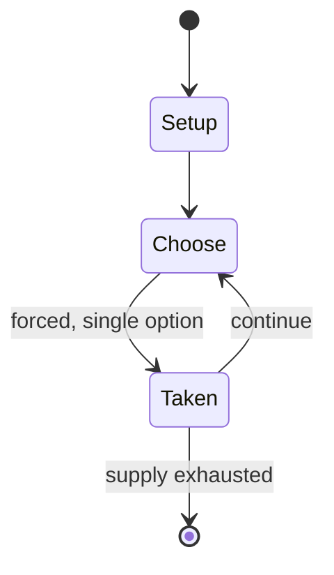

# Talisman City

*expansion to Talisman board game*

`talisman_city` &nbsp; state: **DEEPENED** &nbsp; method: **heuristic**

## Found layer (recorded, not trusted)

| field | value |
| --- | --- |
| wikidata | Q102227151 |
| wikipedia | Talisman City |
| genres (source) | -- |
| instance of (source) | board game |
| country of origin | -- |

## Declared layer (orders bench work)

| field | value |
| --- | --- |
| year created | 1989 |
| epoch | DIGITAL |
| region | -- |
| media | BOARD |
| players | -- |
| age band | -- |
| exogenous process | -- |
| loss shape | -- |
| live axes | - |
| horizon | -- |
| scoring shape | -- |
| information | -- |
| interaction | -- |
| turn structure | -- |
| tractability | SAMPLING_ONLY |
| randomness | -- |
| luck factor | 0.35 |
| rules complexity | 2.1 |
| strategic depth | 2.0 |
| novelty | 0.0866 |
| solved status | -- |
| strategies | -- |
| algorithms | -- |

## Object model

```
Episode
  players      : ?
  turn_structure: ?
  horizon       : ?
  scoring       : ?

Board          -- spatial substrate; cells carry position and occupancy
Piece          -- movable token owned by a player
```

## State transition diagram



## Research item -- turn trace

```
# Talisman City -- simulated turn events
# generated from the DECLARED vector, not from a rulebook.
# structure: exo=None loss=None horizon=None scoring=None axes=-

t=0    SETUP        players=2  pot=0  capacity=4
t=1    FORCED       p1 single legal option taken (pot_gain=+1.5)
t=2    ENDTURN      turn passes to p2
t=3    FORCED       p2 single legal option taken (pot_gain=+1.1)
t=4    ENDTURN      turn passes to p1
t=5    FORCED       p1 single legal option taken (pot_gain=+1.8)
t=6    FORCED       p1 single legal option taken (pot_gain=+1.9)
t=7    FORCED       p1 single legal option taken (pot_gain=+0.6)
t=8    ENDTURN      turn passes to p2
t=9    FORCED       p2 single legal option taken (pot_gain=+1.3)
t=10   FORCED       p2 single legal option taken (pot_gain=+1.1)
t=11   FORCED       p2 single legal option taken (pot_gain=+1.7)
t=12   ENDTURN      turn passes to p1
t=13   FORCED       p1 single legal option taken (pot_gain=+0.6)
t=14   FORCED       p1 single legal option taken (pot_gain=+0.7)
t=15   FORCED       p1 single legal option taken (pot_gain=+1.9)
t=16   FORCED       p1 single legal option taken (pot_gain=+0.6)
t=17   FORCED       p1 single legal option taken (pot_gain=+1.6)
t=18   FORCED       p1 single legal option taken (pot_gain=+1.1)
t=19   FORCED       p1 single legal option taken (pot_gain=+1.1)
t=20   ENDTURN      turn passes to p2
t=21   FORCED       p2 single legal option taken (pot_gain=+1.8)
t=22   FORCED       p2 single legal option taken (pot_gain=+1.7)
t=23   ENDTURN      turn passes to p1
t=24   FORCED       p1 single legal option taken (pot_gain=+1.5)
t=25   FORCED       p1 single legal option taken (pot_gain=+1.0)
t=26   FORCED       p1 single legal option taken (pot_gain=+2.0)

terminal: VARIABLE
```

## Conditions

| kind | threshold | effect | trigger |
| --- | --- | --- | --- |
| BOUNDARY | -- | -- | All characters visiting the city must always own at least one gold; an arrest warrant is issued for a penniless character, and if that character encounters the Patrol or Watch, the character is arrested and thrown into t |

## Source extract

Talisman City is an expansion to the Talisman board game. It was published in 1989 by Games
Workshop.   == Description == Talisman City provides 72 new Encounter cards, 7 new Adventure
cards, 3 new Dungeon cards, 20 new Purchase cards, 10 new Spells, 6 new Characters, and an
additional board that represents Talisman City. The Talisman City expansion replaces the city
space in the Outer Region on the original Talisman game board, where there are more places to
visit and additional items to purchase.   === Special rules === All characters visiting the city
must always own at least one gold; an arrest warrant is issued for a penniless character, and if
that character encounters the Patrol or Watch, the character is arrested and thrown into the
Dungeon. Combat within the City also results in an arrest warrant.   == New characters == Two of
the new characters, the Minotaur and the Valkyrie, are regular characters. The four others
(Sheriff, Archmage, King's Champion and Master Thief)  are "titles" or "offices" that a
character can acquire. If the character accepts one of these titles, the player hands in the
original character card and receives the new position with all its attributes an

<sub>Wikipedia, CC BY-SA. Retained as evidence for the structural
classification above. Every rule inferred from it is HYPOTHESIZED
until audited against a rulebook.</sub>
