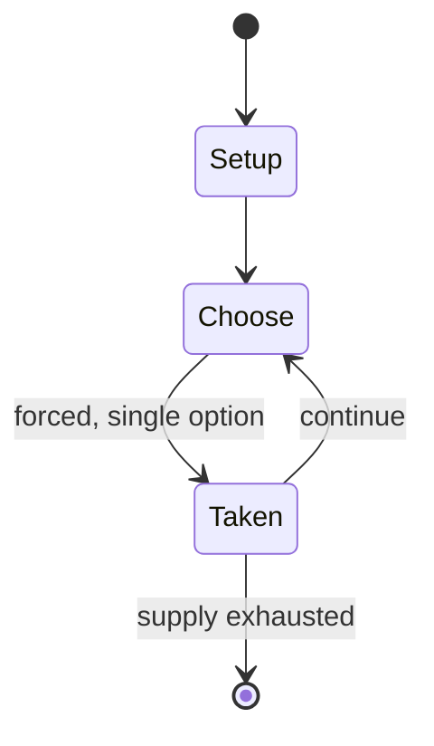

# Talisman The Adventure

*expansion to Talisman board game*

`talisman_the_adventure` &nbsp; state: **DEEPENED** &nbsp; method: **heuristic**

## Found layer (recorded, not trusted)

| field | value |
| --- | --- |
| wikidata | Q102227152 |
| wikipedia | Talisman The Adventure |
| genres (source) | -- |
| instance of (source) | board game |
| country of origin | -- |

## Declared layer (orders bench work)

| field | value |
| --- | --- |
| year created | -- |
| epoch | -- |
| region | -- |
| media | BOARD |
| players | -- |
| age band | -- |
| exogenous process | -- |
| loss shape | -- |
| live axes | - |
| horizon | -- |
| scoring shape | -- |
| information | -- |
| interaction | -- |
| turn structure | -- |
| tractability | SAMPLING_ONLY |
| randomness | -- |
| luck factor | 0.35 |
| rules complexity | 2.11 |
| strategic depth | 2.0 |
| novelty | 0.0866 |
| solved status | -- |
| strategies | -- |
| algorithms | -- |

## Object model

```
Episode
  players      : ?
  turn_structure: ?
  horizon       : ?
  scoring       : ?

Board          -- spatial substrate; cells carry position and occupancy
Piece          -- movable token owned by a player
```

## State transition diagram



## Research item -- turn trace

```
# Talisman The Adventure -- simulated turn events
# generated from the DECLARED vector, not from a rulebook.
# structure: exo=None loss=None horizon=None scoring=None axes=-

t=0    SETUP        players=2  pot=0  capacity=8
t=1    FORCED       p1 single legal option taken (pot_gain=+0.8)
t=2    FORCED       p1 single legal option taken (pot_gain=+1.1)
t=3    ENDTURN      turn passes to p2
t=4    FORCED       p2 single legal option taken (pot_gain=+1.5)
t=5    FORCED       p2 single legal option taken (pot_gain=+0.7)
t=6    FORCED       p2 single legal option taken (pot_gain=+1.8)
t=7    FORCED       p2 single legal option taken (pot_gain=+1.3)
t=8    FORCED       p2 single legal option taken (pot_gain=+1.1)
t=9    FORCED       p2 single legal option taken (pot_gain=+1.7)
t=10   FORCED       p2 single legal option taken (pot_gain=+1.1)
t=11   ENDTURN      turn passes to p1
t=12   FORCED       p1 single legal option taken (pot_gain=+1.4)
t=13   FORCED       p1 single legal option taken (pot_gain=+0.6)
t=14   FORCED       p1 single legal option taken (pot_gain=+1.3)
t=15   FORCED       p1 single legal option taken (pot_gain=+1.7)
t=16   ENDTURN      turn passes to p2
t=17   FORCED       p2 single legal option taken (pot_gain=+0.6)
t=18   ENDTURN      turn passes to p1
t=19   FORCED       p1 single legal option taken (pot_gain=+1.8)
t=20   FORCED       p1 single legal option taken (pot_gain=+1.9)
t=21   FORCED       p1 single legal option taken (pot_gain=+1.9)
t=22   FORCED       p1 single legal option taken (pot_gain=+0.6)
t=23   FORCED       p1 single legal option taken (pot_gain=+1.9)
t=24   FORCED       p1 single legal option taken (pot_gain=+1.0)
t=25   FORCED       p1 single legal option taken (pot_gain=+1.2)
t=26   FORCED       p1 single legal option taken (pot_gain=+0.6)
t=27   ENDTURN      turn passes to p2

terminal: VARIABLE
```

## Conditions

| kind | threshold | effect | trigger |
| --- | --- | --- | --- |
| WIN | -- | -- | If the player defeats the Demon Lord, the player wins the game. |
| WIN | -- | -- | Crown of Command: as in the original version, the player wins the game. |

## Source extract

Talisman The Adventure is a 1986 expansion to the Talisman board game, both produced by Games
Workshop.  The Adventure, which  requires the original Second Edition board game, is
incompatible with and has no counterpart for subsequent editions.   == Description ==   ===
Contents === This expansion includes    37 new Adventure cards 11 new spells 8 new character
cards Centaur Ninja Ork Samurai Soldier Warrior of Chaos Witch Doctor Woodsman 6 Alternate
endings (See "Victory conditions") 6 character record sheets with which to organize character's
attributes, followers and objects. rules sheet   === Victory conditions === In the original
game, the character who reached the Crown of Command first was the winner. In this supplement,
when the player reaches the inner sanctum, the player draws an alternate ending card and
encounters one of the following:   Demon Lord: a powerful demonic being with Craft 12 and 4
Lives. If the player defeats the Demon Lord, the player wins the game. Otherwise, play
continues. Pandora's Box: the character draws Adventure and spell cards to be used against his
or her foes. Play continues. Hercules' Belt: a powerful artifact which gives the character 12
Stren

<sub>Wikipedia, CC BY-SA. Retained as evidence for the structural
classification above. Every rule inferred from it is HYPOTHESIZED
until audited against a rulebook.</sub>
