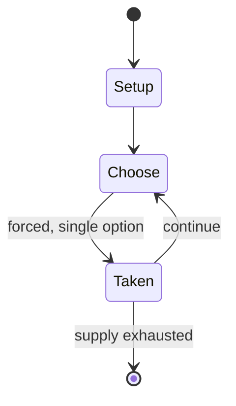

# Talking Angela

*2012 chatbotter app*

`talking_angela` &nbsp; state: **DEEPENED** &nbsp; method: **heuristic**

## Found layer (recorded, not trusted)

| field | value |
| --- | --- |
| wikidata | Q16927849 |
| wikipedia | Talking Angela |
| genres (source) | -- |
| instance of (source) | application software, artificial intelligence model, chatbot, video game |
| country of origin | -- |

## Declared layer (orders bench work)

| field | value |
| --- | --- |
| year created | 2012 |
| epoch | CONTEMPORARY |
| region | -- |
| media | VIDEO |
| players | -- |
| age band | -- |
| exogenous process | -- |
| loss shape | -- |
| live axes | - |
| horizon | -- |
| scoring shape | -- |
| information | -- |
| interaction | -- |
| turn structure | -- |
| tractability | SAMPLING_ONLY |
| randomness | HIDDEN_INFO |
| luck factor | 0.35 |
| rules complexity | 1.75 |
| strategic depth | 2.0 |
| novelty | 0.0896 |
| solved status | -- |
| strategies | -- |
| algorithms | -- |

## Object model

```
Episode
  players      : ?
  turn_structure: ?
  horizon       : ?
  scoring       : ?

WorldState     -- simulation state advanced by the engine
Avatar         -- player-controlled agent
Clock          -- frame or tick counter
```

## State transition diagram



## Research item -- turn trace

```
# Talking Angela -- simulated turn events
# generated from the DECLARED vector, not from a rulebook.
# structure: exo=None loss=None horizon=None scoring=None axes=-

t=0    SETUP        players=2  pot=0  capacity=8
t=1    FORCED       p1 single legal option taken (pot_gain=+1.4)
t=2    FORCED       p1 single legal option taken (pot_gain=+0.7)
t=3    FORCED       p1 single legal option taken (pot_gain=+2.0)
t=4    FORCED       p1 single legal option taken (pot_gain=+0.7)
t=5    ENDTURN      turn passes to p2
t=6    FORCED       p2 single legal option taken (pot_gain=+0.5)
t=7    FORCED       p2 single legal option taken (pot_gain=+0.6)
t=8    FORCED       p2 single legal option taken (pot_gain=+1.7)
t=9    FORCED       p2 single legal option taken (pot_gain=+1.0)
t=10   FORCED       p2 single legal option taken (pot_gain=+1.9)
t=11   FORCED       p2 single legal option taken (pot_gain=+0.9)
t=12   ENDTURN      turn passes to p1
t=13   FORCED       p1 single legal option taken (pot_gain=+1.5)
t=14   FORCED       p1 single legal option taken (pot_gain=+0.6)
t=15   FORCED       p1 single legal option taken (pot_gain=+0.8)
t=16   FORCED       p1 single legal option taken (pot_gain=+1.4)
t=17   FORCED       p1 single legal option taken (pot_gain=+0.5)
t=18   ENDTURN      turn passes to p2
t=19   FORCED       p2 single legal option taken (pot_gain=+1.3)
t=20   ENDTURN      turn passes to p1
t=21   FORCED       p1 single legal option taken (pot_gain=+1.2)
t=22   ENDTURN      turn passes to p2
t=23   FORCED       p2 single legal option taken (pot_gain=+1.1)
t=24   ENDTURN      turn passes to p1
t=25   FORCED       p1 single legal option taken (pot_gain=+1.8)
t=26   ENDTURN      turn passes to p2

terminal: VARIABLE
```

## Source extract

Talking Angela is a mobile game (formerly a chatbot), developed by Slovenian studio Outfit7 as
part of the Talking Tom & Friends series. It was released on 13 November 2012 and December 2012
for iPhone, iPod and iPad, January 2013 for Android, and January 2014 for Google Play. The
game's successor, the My Talking Angela game, was released in December 2014. The game takes
place in a café in Paris and allows players to interact with Angela, an anthropomorphic white
cat in different ways. Players can use coins to purchase makeup, accessories and items, as well
as drinks that will trigger different visual effects. The fortune cookie button causes Angela to
read out a fortune cookie, while the bird icon will prompt birds to fly around the screen, or
have Angela feed them. Players can also pet or poke Angela, as well the café's sign.  Prior to
their removal, the game featured a chat system and a camera button. Users can engage in
conversations with Angela, ask for quizzes or initiate a short snippet of the song "That's
Falling In Love". If the player was to type in "Who is an idiot?", Angela would respond with a
random swear word. Additionally, inquiring Angela about sexual topics would

<sub>Wikipedia, CC BY-SA. Retained as evidence for the structural
classification above. Every rule inferred from it is HYPOTHESIZED
until audited against a rulebook.</sub>
