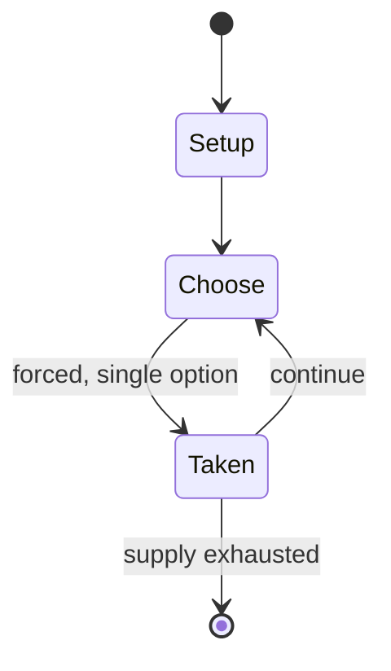

# Talkman

*2005 video game*

`talkman` &nbsp; state: **DEEPENED** &nbsp; method: **heuristic**

## Found layer (recorded, not trusted)

| field | value |
| --- | --- |
| wikidata | Q2012847 |
| wikipedia | Talkman |
| genres (source) | machine translation |
| instance of (source) | video game |
| country of origin | -- |

## Declared layer (orders bench work)

| field | value |
| --- | --- |
| year created | 2005 |
| epoch | CONTEMPORARY |
| region | -- |
| media | VIDEO |
| players | -- |
| age band | -- |
| exogenous process | -- |
| loss shape | -- |
| live axes | - |
| horizon | -- |
| scoring shape | -- |
| information | -- |
| interaction | -- |
| turn structure | -- |
| tractability | SAMPLING_ONLY |
| randomness | -- |
| luck factor | 0.35 |
| rules complexity | 1.75 |
| strategic depth | 2.25 |
| novelty | 0.0896 |
| solved status | -- |
| strategies | spatial_packing |
| algorithms | -- |

## Object model

```
Episode
  players      : ?
  turn_structure: ?
  horizon       : ?
  scoring       : ?

WorldState     -- simulation state advanced by the engine
Avatar         -- player-controlled agent
Clock          -- frame or tick counter
```

## State transition diagram



## Research item -- turn trace

```
# Talkman -- simulated turn events
# generated from the DECLARED vector, not from a rulebook.
# structure: exo=None loss=None horizon=None scoring=None axes=-

t=0    SETUP        players=2  pot=0  capacity=4
t=1    FORCED       p1 single legal option taken (pot_gain=+1.6)
t=2    FORCED       p1 single legal option taken (pot_gain=+1.5)
t=3    ENDTURN      turn passes to p2
t=4    FORCED       p2 single legal option taken (pot_gain=+1.6)
t=5    ENDTURN      turn passes to p1
t=6    FORCED       p1 single legal option taken (pot_gain=+1.8)
t=7    FORCED       p1 single legal option taken (pot_gain=+1.0)
t=8    FORCED       p1 single legal option taken (pot_gain=+1.0)
t=9    ENDTURN      turn passes to p2
t=10   FORCED       p2 single legal option taken (pot_gain=+1.5)
t=11   FORCED       p2 single legal option taken (pot_gain=+1.6)
t=12   ENDTURN      turn passes to p1
t=13   FORCED       p1 single legal option taken (pot_gain=+1.2)
t=14   FORCED       p1 single legal option taken (pot_gain=+1.9)
t=15   FORCED       p1 single legal option taken (pot_gain=+1.1)
t=16   ENDTURN      turn passes to p2
t=17   FORCED       p2 single legal option taken (pot_gain=+1.0)
t=18   ENDTURN      turn passes to p1
t=19   FORCED       p1 single legal option taken (pot_gain=+1.0)
t=20   ENDTURN      turn passes to p2
t=21   FORCED       p2 single legal option taken (pot_gain=+1.9)
t=22   FORCED       p2 single legal option taken (pot_gain=+1.6)
t=23   FORCED       p2 single legal option taken (pot_gain=+1.3)
t=24   ENDTURN      turn passes to p1
t=25   FORCED       p1 single legal option taken (pot_gain=+1.7)
t=26   FORCED       p1 single legal option taken (pot_gain=+0.6)

terminal: VARIABLE
```

## Source extract

Talkman is an edutainment video game developed and published by Sony Computer Entertainment for
the PlayStation Portable. It utilizes voice-activated translation software that operates in four
languages, Japanese, English, Korean, and Mandarin Chinese. The name "Talkman" is a reference to
Sony's Walkman line of portable audio products. It was released in Japan on November 17, 2005,
and in America on August 5, 2008 (via the PlayStation Store), as Talkman Travel. In America,
however, instead of receiving all the languages included in the Japanese version in one package,
single-language packs are available for $2.99 each. Available packs are: Paris (French), Rome
(Italian), and Tokyo (Japanese). The software is designed for travelers and entertainment,
mostly containing slang and useful travel phrases. While originally sold in and designed for the
Japanese market for Japanese users, its translation function operates between all four
languages. In Japan, the software has proven popular with the middle-aged female demographic due
to an interest in South Korean products, and Korean-language soap operas and movies; and as a
fun English education aid for children. Outside of pure translati

<sub>Wikipedia, CC BY-SA. Retained as evidence for the structural
classification above. Every rule inferred from it is HYPOTHESIZED
until audited against a rulebook.</sub>
