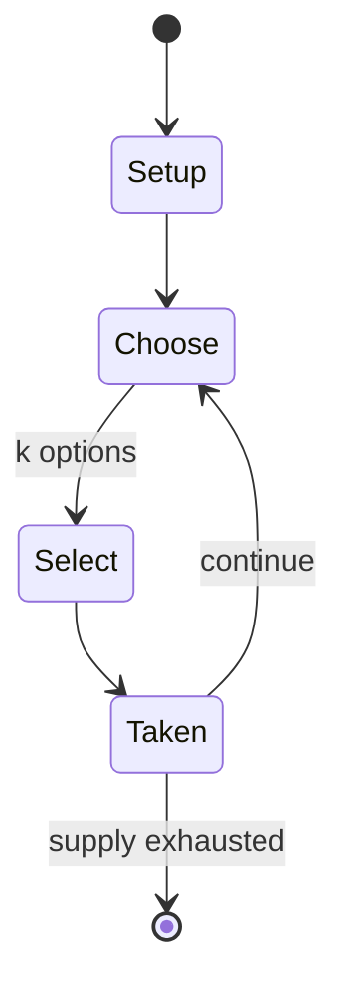

# Tamagotchi

*handheld digital pet*

`tamagotchi` &nbsp; state: **DEEPENED** &nbsp; method: **heuristic**

## Found layer (recorded, not trusted)

| field | value |
| --- | --- |
| wikidata | Q207786 |
| wikipedia | Tamagotchi |
| genres (source) | virtual pet video game |
| instance of (source) | brand, video game |
| country of origin | Japan |

## Declared layer (orders bench work)

| field | value |
| --- | --- |
| year created | 1996 |
| epoch | DIGITAL |
| region | EAST_ASIA |
| media | VIDEO |
| players | -- |
| age band | -- |
| exogenous process | -- |
| loss shape | -- |
| live axes | SELECT |
| horizon | -- |
| scoring shape | -- |
| information | -- |
| interaction | -- |
| turn structure | -- |
| tractability | SAMPLING_ONLY |
| randomness | DICE |
| luck factor | 0.58 |
| rules complexity | 2.3 |
| strategic depth | 1.87 |
| novelty | 0.0914 |
| solved status | -- |
| strategies | -- |
| algorithms | -- |

## Object model

```
Episode
  players      : ?
  turn_structure: ?
  horizon       : ?
  scoring       : ?

WorldState     -- simulation state advanced by the engine
Avatar         -- player-controlled agent
Clock          -- frame or tick counter
OptionSet      -- the choices available after an exogenous draw
```

## State transition diagram



## Research item -- turn trace

```
# Tamagotchi -- simulated turn events
# generated from the DECLARED vector, not from a rulebook.
# structure: exo=None loss=None horizon=None scoring=None axes=SELECT

t=0    SETUP        players=2  pot=0  capacity=4
t=1    SELECT       p1 1 options; take #1  (pot_gain=+1.2, capacity=-1)
t=2    SELECT       p1 4 options; take #2  (pot_gain=+3.0, capacity=-1)
t=3    SELECT       p1 1 options; take #1  (pot_gain=+1.0, capacity=-1)
t=4    SELECT       p1 3 options; take #2  (pot_gain=+0.9, capacity=-1)
t=5    ENDTURN      turn passes to p2
t=6    SELECT       p2 1 options; take #1  (pot_gain=+1.5, capacity=-0)
t=7    SELECT       p2 3 options; take #3  (pot_gain=+0.6, capacity=-0)
t=8    SELECT       p2 4 options; take #2  (pot_gain=+1.5, capacity=-2)
t=9    ENDTURN      turn passes to p1
t=10   SELECT       p1 1 options; take #1  (pot_gain=+2.6, capacity=-2)
t=11   ENDTURN      turn passes to p2
t=12   SELECT       p2 4 options; take #2  (pot_gain=+2.2, capacity=-2)
t=13   ENDTURN      turn passes to p1
t=14   SELECT       p1 2 options; take #1  (pot_gain=+2.1, capacity=-1)
t=15   ENDTURN      turn passes to p2
t=16   SELECT       p2 3 options; take #2  (pot_gain=+2.1, capacity=-2)
t=17   SELECT       p2 2 options; take #1  (pot_gain=+3.2, capacity=-1)
t=18   SELECT       p2 4 options; take #3  (pot_gain=+1.9, capacity=-1)
t=19   ENDTURN      turn passes to p1
t=20   SELECT       p1 2 options; take #2  (pot_gain=+1.7, capacity=-1)
t=21   SELECT       p1 2 options; take #1  (pot_gain=+2.2, capacity=-2)
t=22   SELECT       p1 3 options; take #3  (pot_gain=+2.3, capacity=-2)
t=23   SELECT       p1 1 options; take #1  (pot_gain=+3.5, capacity=-2)
t=24   SELECT       p1 2 options; take #1  (pot_gain=+1.0, capacity=-2)
t=25   SELECT       p1 4 options; take #3  (pot_gain=+2.5, capacity=-1)
t=26   SELECT       p1 4 options; take #1  (pot_gain=+1.4, capacity=-0)

terminal: VARIABLE
```

## Conditions

| kind | threshold | effect | trigger |
| --- | --- | --- | --- |
| BOUNDARY | -- | -- | At least 50 different Tamagotchi versions have been released since their creation, several of which were only released in Japan. |

## Source extract

Tamagotchi (Japanese: たまごっち; IPA: [tamaɡotꜜtɕi], "Egg Watch") is a brand of handheld digital
pets marketed since 1996 by Japanese toymaker Bandai, a division of Bandai Namco Holdings. Most
Tamagotchi are housed in a small egg-shaped handheld video game with an interface consisting of
three buttons, with the goal of raising the pet as it goes through different life stages. The
original Tamagotchi, released locally in 1996 and worldwide in 1997, quickly became a major
global toy fad for a period of time. Tamagotchi was brought back in 2004 and since then has
received more new versions while Bandai has also expanded the franchise to other media and
merchandise. As of 2025, over 98 million units have been sold worldwide. It has been a staple
children's toy in Japan since its early years. According to Bandai, the name is a portmanteau
combining the two Japanese words tamago (たまご), which means "egg", and uotchi (ウオッチ) "watch".
After the original English spelling of watch, the name is sometimes romanized as Tamagotch
without the "i" in Japan. Most Tamagotchi characters' names end in tchi or chi (ち) in Japanese,
with few exceptions. "Mametchi", present since the original release, became a

<sub>Wikipedia, CC BY-SA. Retained as evidence for the structural
classification above. Every rule inferred from it is HYPOTHESIZED
until audited against a rulebook.</sub>
