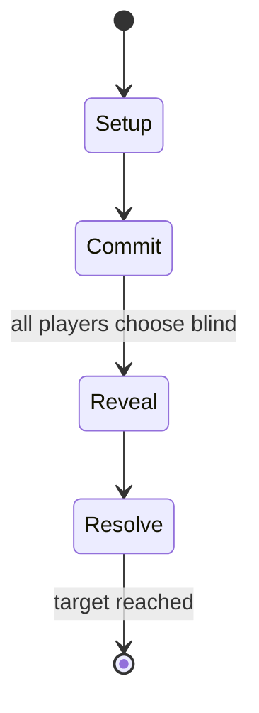

# Te ano

*traditional sport in the South Pacific*

`te_ano` &nbsp; state: **DEEPENED** &nbsp; method: **heuristic**

## Found layer (recorded, not trusted)

| field | value |
| --- | --- |
| wikidata | Q108597762 |
| wikipedia | Te ano |
| genres (source) | -- |
| instance of (source) | traditional sport |
| country of origin | Tuvalu |

## Declared layer (orders bench work)

| field | value |
| --- | --- |
| year created | -- |
| epoch | -- |
| region | -- |
| media | SPORT |
| players | -- |
| age band | -- |
| exogenous process | -- |
| loss shape | -- |
| live axes | COMMIT_BLIND |
| horizon | RACE_TO_TARGET |
| scoring shape | -- |
| information | SIMULTANEOUS |
| interaction | -- |
| turn structure | SIMULTANEOUS |
| tractability | SAMPLING_ONLY |
| randomness | SIMULTANEOUS_CHOICE |
| luck factor | 0.3 |
| rules complexity | 2.13 |
| strategic depth | 2.0 |
| novelty | 0.703 |
| solved status | -- |
| strategies | -- |
| algorithms | -- |

## Object model

```
Episode
  players      : ?
  turn_structure: SIMULTANEOUS
  horizon       : RACE_TO_TARGET
  scoring       : ?

Pitch          -- bounded physical region
Player         -- embodied agent with a foul count
Clock          -- counts down; stoppages are rule events
Official       -- detects infractions and applies penalties
SealedChoice   -- irrevocable choice made without observation
```

## State transition diagram



## Research item -- turn trace

```
# Te ano -- simulated turn events
# generated from the DECLARED vector, not from a rulebook.
# structure: exo=None loss=None horizon=RACE_TO_TARGET scoring=None axes=COMMIT_BLIND

t=0    SETUP        players=2  pot=0  capacity=6
t=1    FORCED       p1 single legal option taken (pot_gain=+1.1)
t=2    ENDTURN      turn passes to p2
t=3    FORCED       p2 single legal option taken (pot_gain=+0.7)
t=4    FORCED       p2 single legal option taken (pot_gain=+1.8)
t=5    FORCED       p2 single legal option taken (pot_gain=+0.5)
t=6    FORCED       p2 single legal option taken (pot_gain=+1.4)
t=7    ENDTURN      turn passes to p1
t=8    FORCED       p1 single legal option taken (pot_gain=+1.6)
t=9    FORCED       p1 single legal option taken (pot_gain=+2.0)
t=10   FORCED       p1 single legal option taken (pot_gain=+1.2)
t=11   FORCED       p1 single legal option taken (pot_gain=+0.6)
t=12   FORCED       p1 single legal option taken (pot_gain=+1.0)
t=13   FORCED       p1 single legal option taken (pot_gain=+1.3)
t=14   FORCED       p1 single legal option taken (pot_gain=+1.3)
t=15   FORCED       p1 single legal option taken (pot_gain=+0.6)
t=16   FORCED       p1 single legal option taken (pot_gain=+1.1)
t=17   FORCED       p1 single legal option taken (pot_gain=+1.4)
t=18   ENDTURN      turn passes to p2
t=19   FORCED       p2 single legal option taken (pot_gain=+1.7)
t=20   FORCED       p2 single legal option taken (pot_gain=+1.4)
t=21   FORCED       p2 single legal option taken (pot_gain=+0.8)
t=22   ENDTURN      turn passes to p1
t=23   FORCED       p1 single legal option taken (pot_gain=+1.8)
t=24   ENDTURN      turn passes to p2
t=25   FORCED       p2 single legal option taken (pot_gain=+1.6)
t=26   FORCED       p2 single legal option taken (pot_gain=+0.7)

terminal: RACE_TO_TARGET
```

## Conditions

| kind | threshold | effect | trigger |
| --- | --- | --- | --- |
| WIN | 10 points | -- | When either ball falls to the ground the other team scores a point, and the first team to score 10 points wins the game. |

## Source extract

Te ano is a team sport played with 2 balls in which two teams face each other about 7 metres (23
ft) apart on a malae (meeting ground or playing field). Two balls are used simultaneously in the
game with each ball being about 12 centimetres (4.7 in) in diameter,  It is a traditional game
played in Tuvalu, and also in the Pacific Islands of Tokelau & Sikaiana. The team members stand
in parallel rows of about six people behind two central players on their team, the captain and
catcher. The alovaka (captain) and tino pukepuke (catcher) stand in front of each team, who are
the vaka.  A game starts on the call of an elder spectator, both catchers of each team throw a
ball to their captain, who in turn hits it towards the other team. Each team tries to score
points by forcing the grounding of a ball in the other team's court. A tactic is to target the
less skilful members of the other team. Using their hand, a player hits a ball to another player
on their team, with the receiver needing to stop the ball from hitting the ground, but without
catching the ball, with the aim of hitting the ball to another player on the team, and
eventually to the catcher of the team. Only the catcher can thr

<sub>Wikipedia, CC BY-SA. Retained as evidence for the structural
classification above. Every rule inferred from it is HYPOTHESIZED
until audited against a rulebook.</sub>
