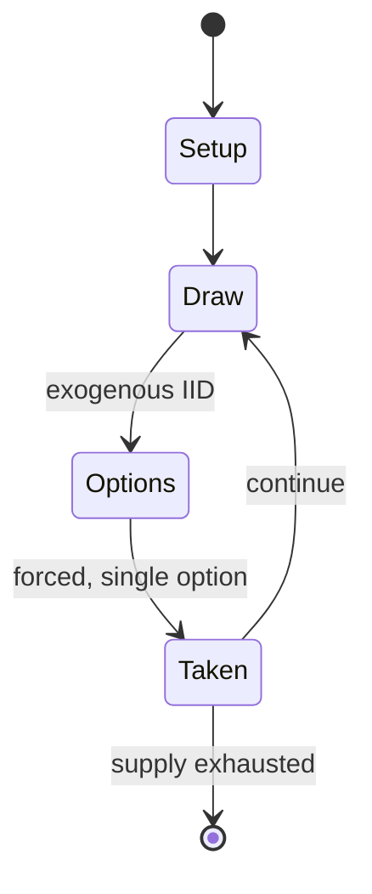

# TEG

*Argentine strategy board game, inspired in the game Risk.*

`teg` &nbsp; state: **DEEPENED** &nbsp; method: **heuristic**

## Found layer (recorded, not trusted)

| field | value |
| --- | --- |
| wikidata | Q7669973 |
| wikipedia | Plan Táctico y Estratégico de la Guerra |
| genres (source) | board wargame |
| instance of (source) | board game |
| country of origin | Argentina |

## Declared layer (orders bench work)

| field | value |
| --- | --- |
| year created | 1976 |
| epoch | DIGITAL |
| region | SOUTH_AMERICA |
| media | BOARD, WARGAME |
| players | -- |
| age band | -- |
| exogenous process | IID |
| loss shape | -- |
| live axes | BLUFF |
| horizon | -- |
| scoring shape | -- |
| information | HIDDEN_PRIVATE |
| interaction | -- |
| turn structure | -- |
| tractability | EXACT_WITH_CUT |
| randomness | DICE |
| luck factor | 0.58 |
| rules complexity | 3.21 |
| strategic depth | 1.87 |
| novelty | 0.7802 |
| solved status | -- |
| strategies | -- |
| algorithms | -- |

## Object model

```
Episode
  players      : ?
  turn_structure: ?
  horizon       : ?
  scoring       : ?

Board          -- spatial substrate; cells carry position and occupancy
Piece          -- movable token owned by a player
Belief         -- what an observer is induced to think is true
```

## State transition diagram



## Research item -- turn trace

```
# TEG -- simulated turn events
# generated from the DECLARED vector, not from a rulebook.
# structure: exo=IID loss=None horizon=None scoring=None axes=BLUFF

t=0    SETUP        players=2  pot=0  capacity=8
t=1    DRAW         p1 roll from d6 pool -> outcome #6  (p=0.192)
t=2    FORCED       p1 single legal option taken (pot_gain=+1.9)
t=3    DRAW         p1 roll from d6 pool -> outcome #5  (p=0.056)
t=4    FORCED       p1 single legal option taken (pot_gain=+1.3)
t=5    BLUFF        p1 represents a holding it does not have
t=6    DRAW         p1 roll from d6 pool -> outcome #2  (p=0.031)
t=7    FORCED       p1 single legal option taken (pot_gain=+1.2)
t=8    DRAW         p1 roll from d6 pool -> outcome #3  (p=0.084)
t=9    FORCED       p1 single legal option taken (pot_gain=+1.0)
t=10   DRAW         p1 roll from d6 pool -> outcome #1  (p=0.275)
t=11   FORCED       p1 single legal option taken (pot_gain=+1.2)
t=12   BLUFF        p1 represents a holding it does not have
t=13   DRAW         p1 roll from d6 pool -> outcome #3  (p=0.175)
t=14   FORCED       p1 single legal option taken (pot_gain=+0.6)
t=15   BLUFF        p1 represents a holding it does not have
t=16   ENDTURN      turn passes to p2
t=17   DRAW         p2 roll from d6 pool -> outcome #3  (p=0.040)
t=18   FORCED       p2 single legal option taken (pot_gain=+1.9)
t=19   DRAW         p2 roll from d6 pool -> outcome #4  (p=0.195)
t=20   FORCED       p2 single legal option taken (pot_gain=+1.0)
t=21   DRAW         p2 roll from d6 pool -> outcome #2  (p=0.150)
t=22   FORCED       p2 single legal option taken (pot_gain=+0.7)
t=23   ENDTURN      turn passes to p1
t=24   DRAW         p1 roll from d6 pool -> outcome #6  (p=0.075)
t=25   FORCED       p1 single legal option taken (pot_gain=+1.5)
t=26   BLUFF        p1 represents a holding it does not have
t=27   ENDTURN      turn passes to p2

terminal: VARIABLE
```

## Conditions

| kind | threshold | effect | trigger |
| --- | --- | --- | --- |
| WIN | -- | -- | Kamchatka is the Russian northeastern state which a character uses as his last resort to win the game, thus alluding to the family situation of hiding away from the government. |

## Source extract

Plan Táctico y Estratégico de la Guerra (commonly referred to as TEG) is an Argentinian strategy
board wargame published in 1976, based on the game Risk. The name is Spanish for Tactical and
Strategical War Plan.   == Gameplay == TEG follows a gameplay quite similar to the strategy
board game Risk, since it also features a board divided in many different regions and sub-
regions along with the implementation of dice to decide battle results.   === Goal === The goal
of the game is to be the first player to fulfill the requisites of an objective,  without
mattering whether it is the common objective or the secret objective.   ==== Common Objective
==== The Common objective is to conquer 30 countries; this objective is the same for all
players.   ==== Secret Objective ==== Apart from the common objective, players have a secret
objective; unlike the common objective, the secret objective is:  Hidden to other players
Unique, it varies per player   === Board === The board is divided into six continents which
consist of a certain number of countries each; the total number of countries present in the game
board is 50. These countries were randomly selected, and continents are slightly misre

<sub>Wikipedia, CC BY-SA. Retained as evidence for the structural
classification above. Every rule inferred from it is HYPOTHESIZED
until audited against a rulebook.</sub>
