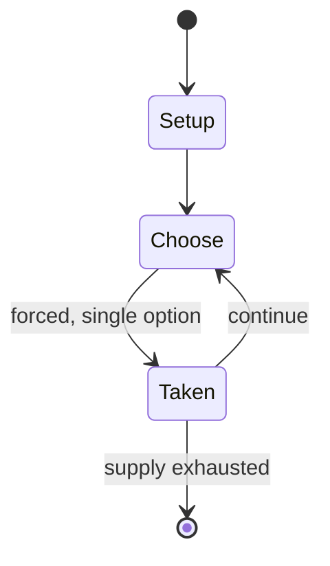

# telephone game

*game involving whispering*

`telephone_game` &nbsp; state: **DEEPENED** &nbsp; method: **heuristic**

## Found layer (recorded, not trusted)

| field | value |
| --- | --- |
| wikidata | Q151939 |
| wikipedia | Telephone game |
| genres (source) | -- |
| instance of (source) | children's game, word game |
| country of origin | -- |

## Declared layer (orders bench work)

| field | value |
| --- | --- |
| year created | 2012 |
| epoch | CONTEMPORARY |
| region | -- |
| media | PARTY, PLAYGROUND, WORD |
| players | -- |
| age band | CHILD |
| exogenous process | -- |
| loss shape | -- |
| live axes | ORDER, TIMING |
| horizon | -- |
| scoring shape | LINEAR_ACCUMULATION |
| information | -- |
| interaction | TEAM |
| turn structure | -- |
| tractability | SAMPLING_ONLY |
| randomness | DICE |
| luck factor | 0.35 |
| rules complexity | 1.76 |
| strategic depth | 2.0 |
| novelty | 0.4958 |
| solved status | -- |
| strategies | tempo |
| algorithms | -- |

## Object model

```
Episode
  players      : ?
  turn_structure: ?
  horizon       : ?
  scoring       : LINEAR_ACCUMULATION

Sequence       -- the permutation under the player's control
Initiative     -- who acts, and when, relative to others
```

## State transition diagram



## Research item -- turn trace

```
# telephone game -- simulated turn events
# generated from the DECLARED vector, not from a rulebook.
# structure: exo=None loss=None horizon=None scoring=LINEAR_ACCUMULATION axes=ORDER,TIMING

t=0    SETUP        players=2  pot=0  capacity=7
t=1    FORCED       p1 single legal option taken (pot_gain=+1.1)
t=2    FORCED       p1 single legal option taken (pot_gain=+0.5)
t=3    FORCED       p1 single legal option taken (pot_gain=+1.6)
t=4    FORCED       p1 single legal option taken (pot_gain=+1.6)
t=5    FORCED       p1 single legal option taken (pot_gain=+1.5)
t=6    FORCED       p1 single legal option taken (pot_gain=+1.4)
t=7    ENDTURN      turn passes to p2
t=8    FORCED       p2 single legal option taken (pot_gain=+1.1)
t=9    FORCED       p2 single legal option taken (pot_gain=+1.7)
t=10   FORCED       p2 single legal option taken (pot_gain=+1.2)
t=11   FORCED       p2 single legal option taken (pot_gain=+1.7)
t=12   FORCED       p2 single legal option taken (pot_gain=+0.7)
t=13   FORCED       p2 single legal option taken (pot_gain=+1.3)
t=14   ENDTURN      turn passes to p1
t=15   FORCED       p1 single legal option taken (pot_gain=+1.7)
t=16   FORCED       p1 single legal option taken (pot_gain=+0.8)
t=17   FORCED       p1 single legal option taken (pot_gain=+1.8)
t=18   FORCED       p1 single legal option taken (pot_gain=+1.2)
t=19   FORCED       p1 single legal option taken (pot_gain=+1.0)
t=20   FORCED       p1 single legal option taken (pot_gain=+1.1)
t=21   FORCED       p1 single legal option taken (pot_gain=+2.0)
t=22   ENDTURN      turn passes to p2
t=23   FORCED       p2 single legal option taken (pot_gain=+1.1)
t=24   FORCED       p2 single legal option taken (pot_gain=+1.7)
t=25   ENDTURN      turn passes to p1
t=26   FORCED       p1 single legal option taken (pot_gain=+0.8)
t=27   ENDTURN      turn passes to p2

terminal: VARIABLE
```

## Conditions

| kind | threshold | effect | trigger |
| --- | --- | --- | --- |
| BOUNDARY | 11 rounds | -- | It consists of at least 11 rounds in which players alternate between writing descriptions and creating drawings based on previous contributions. |
| BOUNDARY | 10 minutes | -- | Each player has a maximum of ten minutes to submit their description or drawing. |

## Source extract

Telephone (American English and Canadian English), or Chinese whispers (some Commonwealth
English), is an internationally popular children's game in which messages are whispered from
person to person and then the original and final messages are compared. This sequential
modification of information is called transmission chaining in the context of cultural evolution
research, and is primarily used to identify the type of information that is more easily passed
on from one person to another. In a game of Telephone, players form a line or circle, and the
first player comes up with a message and whispers it to the ear of the second person in the
line. The second player repeats the message to the third player, and so on. When the last player
is reached, they announce the message they just heard, to the entire group. The first person
then compares the original message with the final version. Although the objective is to pass
around the message without it becoming garbled along the way, part of the enjoyment is that,
regardless, this usually ends up happening. Errors typically accumulate in the retellings, so
the statement announced by the last player differs significantly from that of the

<sub>Wikipedia, CC BY-SA. Retained as evidence for the structural
classification above. Every rule inferred from it is HYPOTHESIZED
until audited against a rulebook.</sub>
