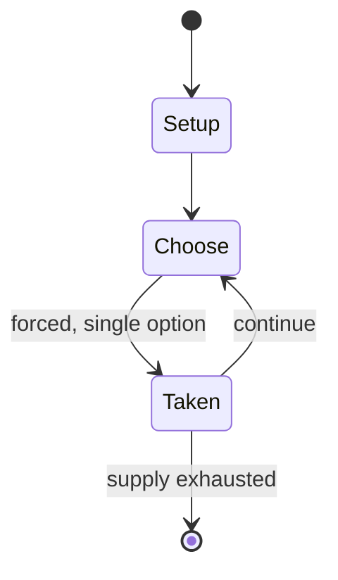

# Terminator 2: Judgment Day

*pinball machine based on the movie*

`terminator_2_judgment_day` &nbsp; state: **DEEPENED** &nbsp; method: **heuristic**

## Found layer (recorded, not trusted)

| field | value |
| --- | --- |
| wikidata | Q10693357 |
| wikipedia | Terminator 2: Judgment Day (pinball) |
| genres (source) | -- |
| instance of (source) | pinball machine game, video game |
| country of origin | -- |

## Declared layer (orders bench work)

| field | value |
| --- | --- |
| year created | 1991 |
| epoch | DIGITAL |
| region | -- |
| media | VIDEO |
| players | -- |
| age band | -- |
| exogenous process | -- |
| loss shape | -- |
| live axes | TRADE |
| horizon | -- |
| scoring shape | NONLINEAR |
| information | -- |
| interaction | -- |
| turn structure | PHASE_STRUCTURED |
| tractability | SAMPLING_ONLY |
| randomness | -- |
| luck factor | 0.35 |
| rules complexity | 3.07 |
| strategic depth | 2.25 |
| novelty | 0.651 |
| solved status | -- |
| strategies | signalling |
| algorithms | -- |

## Object model

```
Episode
  players      : ?
  turn_structure: PHASE_STRUCTURED
  horizon       : ?
  scoring       : NONLINEAR

WorldState     -- simulation state advanced by the engine
Avatar         -- player-controlled agent
Clock          -- frame or tick counter
Offer          -- proposed exchange between two agents
```

## State transition diagram



## Research item -- turn trace

```
# Terminator 2: Judgment Day -- simulated turn events
# generated from the DECLARED vector, not from a rulebook.
# structure: exo=None loss=None horizon=None scoring=NONLINEAR axes=TRADE

t=0    SETUP        players=2  pot=0  capacity=4
t=1    FORCED       p1 single legal option taken (pot_gain=+0.9)
t=2    TRADE        p1 offers 2:1 exchange to p2
t=3    FORCED       p1 single legal option taken (pot_gain=+2.0)
t=4    TRADE        p1 offers 2:1 exchange to p2
t=5    ENDTURN      turn passes to p2
t=6    FORCED       p2 single legal option taken (pot_gain=+1.7)
t=7    FORCED       p2 single legal option taken (pot_gain=+1.9)
t=8    TRADE        p2 offers 2:1 exchange to p1
t=9    FORCED       p2 single legal option taken (pot_gain=+0.7)
t=10   TRADE        p2 offers 2:1 exchange to p1
t=11   FORCED       p2 single legal option taken (pot_gain=+2.0)
t=12   TRADE        p2 offers 2:1 exchange to p1
t=13   FORCED       p2 single legal option taken (pot_gain=+0.9)
t=14   ENDTURN      turn passes to p1
t=15   FORCED       p1 single legal option taken (pot_gain=+1.1)
t=16   FORCED       p1 single legal option taken (pot_gain=+0.5)
t=17   FORCED       p1 single legal option taken (pot_gain=+0.8)
t=18   TRADE        p1 offers 2:1 exchange to p2
t=19   ENDTURN      turn passes to p2
t=20   FORCED       p2 single legal option taken (pot_gain=+1.4)
t=21   TRADE        p2 offers 2:1 exchange to p1
t=22   ENDTURN      turn passes to p1
t=23   FORCED       p1 single legal option taken (pot_gain=+0.8)
t=24   FORCED       p1 single legal option taken (pot_gain=+1.3)
t=25   TRADE        p1 offers 2:1 exchange to p2
t=26   FORCED       p1 single legal option taken (pot_gain=+1.6)

terminal: VARIABLE
```

## Conditions

| kind | threshold | effect | trigger |
| --- | --- | --- | --- |
| TERMINATE | -- | -- | A short "video game" is played on the DMD consisting of Terminators which must be shot by the player controlling a cross hair with the flippers, and ends when a Terminator shoots the player. |

## Source extract

Terminator 2: Judgment Day is a 1991 pinball machine designed by Steve Ritchie and released by
Williams Electronics. It is based on the motion picture of the same name.   == Overview and
design ==  The Terminator was one of Steve Ritchie's favourite movies. Williams license
agreement with Carolco Licensing gave them access to photos and videos early in the production
of the movie from late 1990. During the design of this game Steve Ritchie met Jim Cameron and
Stan Winston and gained access to pre-production art, and props including the skull and
microchip which were used in the game. The table is the first Williams WPC machine designed to
feature a dot-matrix display(DMD). But due to the long design phase, Gilligan's Island is the
first manufactured with a DMD. Terminator 2: Judgment Day is the first game to feature an
autoplunger (replacing the traditional plunger) with a patent-protected trigger mechanism, as
well as a patent-protected ball-firing cannon (dubbed, "Gun Grip Ball Launcher") and a metallic
T-800 skull. Terminator 2 is also the first game to feature a video mode, a mini video game
featured on the DMD. Arnold Schwarzenegger provided voices for the game. Some playfield

<sub>Wikipedia, CC BY-SA. Retained as evidence for the structural
classification above. Every rule inferred from it is HYPOTHESIZED
until audited against a rulebook.</sub>
