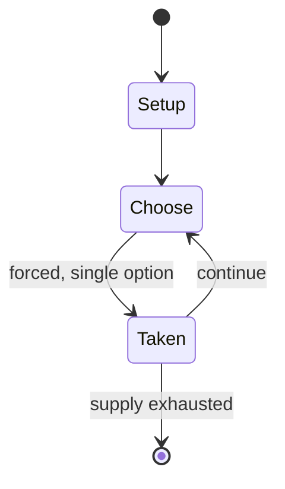

# Tetris

`tetris` &nbsp; state: **DEEPENED** &nbsp; method: **heuristic**

## Found layer (recorded, not trusted)

| field | value |
| --- | --- |
| wikidata | Q71910 |
| wikipedia | Tetris |
| genres (source) | -- |
| instance of (source) | -- |
| country of origin | -- |

## Declared layer (orders bench work)

| field | value |
| --- | --- |
| year created | 1988 |
| epoch | DIGITAL |
| region | -- |
| media | PUZZLE, VIDEO |
| players | -- |
| age band | -- |
| exogenous process | NONE |
| loss shape | OPPORTUNITY_ONLY |
| live axes | NEGOTIATE |
| horizon | -- |
| scoring shape | LINEAR_ACCUMULATION |
| information | PERFECT |
| interaction | COMPETITIVE |
| turn structure | -- |
| tractability | SAMPLING_ONLY |
| randomness | NONE |
| luck factor | 0.02 |
| rules complexity | 2.3 |
| strategic depth | 2.4 |
| novelty | 0.6986 |
| solved status | -- |
| strategies | -- |
| algorithms | -- |

## Object model

```
Episode
  players      : ?
  turn_structure: ?
  horizon       : ?
  scoring       : LINEAR_ACCUMULATION

Configuration  -- the arrangement to be resolved
Constraint     -- predicate a legal configuration must satisfy
WorldState     -- simulation state advanced by the engine
Avatar         -- player-controlled agent
Clock          -- frame or tick counter
Agreement      -- non-binding or binding commitment between agents
```

## State transition diagram



## Research item -- turn trace

```
# Tetris -- simulated turn events
# generated from the DECLARED vector, not from a rulebook.
# structure: exo=NONE loss=OPPORTUNITY_ONLY horizon=None scoring=LINEAR_ACCUMULATION axes=NEGOTIATE

t=0    SETUP        players=2  pot=0  capacity=8
t=1    FORCED       p1 single legal option taken (pot_gain=+0.9)
t=2    FORCED       p1 single legal option taken (pot_gain=+0.8)
t=3    FORCED       p1 single legal option taken (pot_gain=+1.8)
t=4    FORCED       p1 single legal option taken (pot_gain=+0.9)
t=5    FORCED       p1 single legal option taken (pot_gain=+1.3)
t=6    ENDTURN      turn passes to p2
t=7    FORCED       p2 single legal option taken (pot_gain=+1.9)
t=8    FORCED       p2 single legal option taken (pot_gain=+1.1)
t=9    FORCED       p2 single legal option taken (pot_gain=+1.9)
t=10   FORCED       p2 single legal option taken (pot_gain=+1.0)
t=11   ENDTURN      turn passes to p1
t=12   FORCED       p1 single legal option taken (pot_gain=+1.6)
t=13   ENDTURN      turn passes to p2
t=14   FORCED       p2 single legal option taken (pot_gain=+1.5)
t=15   FORCED       p2 single legal option taken (pot_gain=+0.9)
t=16   FORCED       p2 single legal option taken (pot_gain=+1.2)
t=17   FORCED       p2 single legal option taken (pot_gain=+1.0)
t=18   ENDTURN      turn passes to p1
t=19   FORCED       p1 single legal option taken (pot_gain=+1.3)
t=20   ENDTURN      turn passes to p2
t=21   FORCED       p2 single legal option taken (pot_gain=+1.9)
t=22   FORCED       p2 single legal option taken (pot_gain=+0.8)
t=23   FORCED       p2 single legal option taken (pot_gain=+1.0)
t=24   ENDTURN      turn passes to p1
t=25   FORCED       p1 single legal option taken (pot_gain=+0.9)
t=26   FORCED       p1 single legal option taken (pot_gain=+1.7)
t=27   ENDTURN      turn passes to p2

terminal: VARIABLE
```

## Conditions

| kind | threshold | effect | trigger |
| --- | --- | --- | --- |
| TERMINATE | -- | -- | The game ends if the accumulated pieces in the field block other pieces from entering the field, a process known as "topping out". |
| BOUNDARY | -- | -- | This gameplay has been used in approximately 220 versions across at least 70 platforms. |
| BOUNDARY | -- | -- | Guinness World Records recognizes Tetris as the most ported video game, having appeared on at least 70 platforms, and as the video game with the most distinct versions (approximately 220 official), each featuring unique  |

## Source extract

Tetris (Russian: Тетрис) is a puzzle video game created by Alexey Pajitnov, a Soviet software
engineer, in the mid-1980s. In Tetris, falling pieces consisting of four connected blocks, known
as tetrominoes, must be sorted into a pile. Once a horizontal line of the playfield is filled
with blocks, the line disappears, granting points and preventing the pile from reaching the top.
This gameplay has been used in approximately 220 versions across at least 70 platforms. Newer
versions frequently add game mechanics, some of which have become standard.  In the mid-1980s,
Pajitnov created Tetris in his spare time while working at the Dorodnitsyn Computing Center of
the Academy of Sciences. He initially programmed it in Pascal for the Elektronika 60 in about
three weeks, then spent over two months porting it to the IBM PC using Turbo Pascal with help
from Dmitry Pavlovsky and Vadim Gerasimov. Floppy disk copies were distributed freely throughout
Moscow before spreading to Eastern Europe. Robert Stein of Andromeda Software saw Tetris in
Hungary and contacted the Dorodnitsyn Computing Center to secure a license to release it
commercially. Stein sublicensed it to Mirrorsoft in the UK and Spect

<sub>Wikipedia, CC BY-SA. Retained as evidence for the structural
classification above. Every rule inferred from it is HYPOTHESIZED
until audited against a rulebook.</sub>
