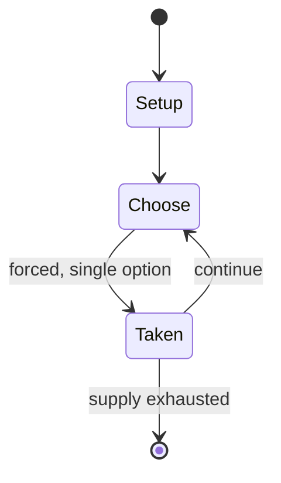

# Tetris Online, Inc.

*American online video game developer (2006–2019)*

`tetris_online_inc` &nbsp; state: **DEEPENED** &nbsp; method: **heuristic**

## Found layer (recorded, not trusted)

| field | value |
| --- | --- |
| wikidata | Q14947375 |
| wikipedia | Tetris Online, Inc. |
| genres (source) | -- |
| instance of (source) | business, online game |
| country of origin | -- |

## Declared layer (orders bench work)

| field | value |
| --- | --- |
| year created | 2006 |
| epoch | CONTEMPORARY |
| region | -- |
| media | VIDEO |
| players | -- |
| age band | -- |
| exogenous process | -- |
| loss shape | -- |
| live axes | - |
| horizon | -- |
| scoring shape | -- |
| information | -- |
| interaction | -- |
| turn structure | -- |
| tractability | SAMPLING_ONLY |
| randomness | -- |
| luck factor | 0.35 |
| rules complexity | 1.67 |
| strategic depth | 2.0 |
| novelty | 0.0896 |
| solved status | -- |
| strategies | -- |
| algorithms | -- |

## Object model

```
Episode
  players      : ?
  turn_structure: ?
  horizon       : ?
  scoring       : ?

WorldState     -- simulation state advanced by the engine
Avatar         -- player-controlled agent
Clock          -- frame or tick counter
```

## State transition diagram



## Research item -- turn trace

```
# Tetris Online, Inc. -- simulated turn events
# generated from the DECLARED vector, not from a rulebook.
# structure: exo=None loss=None horizon=None scoring=None axes=-

t=0    SETUP        players=2  pot=0  capacity=3
t=1    FORCED       p1 single legal option taken (pot_gain=+1.8)
t=2    ENDTURN      turn passes to p2
t=3    FORCED       p2 single legal option taken (pot_gain=+1.2)
t=4    ENDTURN      turn passes to p1
t=5    FORCED       p1 single legal option taken (pot_gain=+0.6)
t=6    ENDTURN      turn passes to p2
t=7    FORCED       p2 single legal option taken (pot_gain=+1.4)
t=8    ENDTURN      turn passes to p1
t=9    FORCED       p1 single legal option taken (pot_gain=+1.7)
t=10   FORCED       p1 single legal option taken (pot_gain=+1.3)
t=11   FORCED       p1 single legal option taken (pot_gain=+1.4)
t=12   FORCED       p1 single legal option taken (pot_gain=+1.7)
t=13   FORCED       p1 single legal option taken (pot_gain=+1.8)
t=14   FORCED       p1 single legal option taken (pot_gain=+0.9)
t=15   FORCED       p1 single legal option taken (pot_gain=+0.7)
t=16   ENDTURN      turn passes to p2
t=17   FORCED       p2 single legal option taken (pot_gain=+1.2)
t=18   FORCED       p2 single legal option taken (pot_gain=+0.9)
t=19   FORCED       p2 single legal option taken (pot_gain=+0.6)
t=20   FORCED       p2 single legal option taken (pot_gain=+1.6)
t=21   FORCED       p2 single legal option taken (pot_gain=+1.8)
t=22   ENDTURN      turn passes to p1
t=23   FORCED       p1 single legal option taken (pot_gain=+1.7)
t=24   FORCED       p1 single legal option taken (pot_gain=+1.2)
t=25   FORCED       p1 single legal option taken (pot_gain=+1.5)
t=26   FORCED       p1 single legal option taken (pot_gain=+2.0)

terminal: VARIABLE
```

## Source extract

Tetris Online, Inc. (Russian: Тетрис Онлайн, Инк.) was an American video game developer and
publisher. The company was the exclusive online licensee of Tetris in North America and Europe.
It was founded in January 2006 by Nintendo of America founder and former president Minoru
Arakawa, video game designer and publisher Henk Rogers and Tetris creator Alexey Pajitnov.
Tetris Online, Inc. is the developer of social games Tetris Battle and Tetris Friends.  In March
2013, Tetris Online, Inc. laid off 40% of its staff. The company ceased all operations on May
31, 2019. Along with this shutdown, Tetris Friends also ceased all operations.   == Games ==
Tetris Online, Inc. developed and published the following games for consoles, handheld devices,
online, and download from its inception in 2006 to its shutdown in 2019.   == Notes ==   ==
References ==   == External links == Official website Tetris Friends online Tetris Battle Online
Official website of The Tetris Company

<sub>Wikipedia, CC BY-SA. Retained as evidence for the structural
classification above. Every rule inferred from it is HYPOTHESIZED
until audited against a rulebook.</sub>
