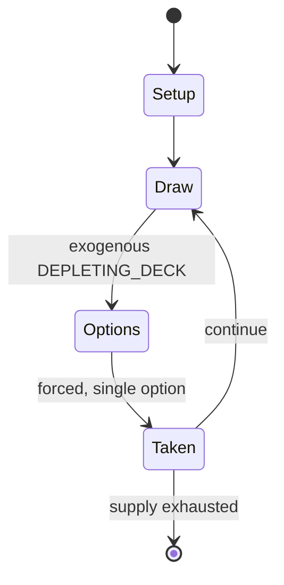

# Texas hold 'em

`texas_hold_em` &nbsp; state: **DEEPENED** &nbsp; method: **heuristic**

## Found layer (recorded, not trusted)

| field | value |
| --- | --- |
| wikidata | Q214536 |
| wikipedia | Texas hold 'em |
| genres (source) | -- |
| instance of (source) | -- |
| country of origin | -- |

## Declared layer (orders bench work)

| field | value |
| --- | --- |
| year created | -- |
| epoch | -- |
| region | -- |
| media | CARD, GAMBLING |
| players | -- |
| age band | -- |
| exogenous process | DEPLETING_DECK |
| loss shape | -- |
| live axes | BLUFF, COMMIT_BLIND |
| horizon | -- |
| scoring shape | -- |
| information | IMPERFECT |
| interaction | SOLITAIRE |
| turn structure | -- |
| tractability | EXACT_WITH_CUT |
| randomness | DECK_SHUFFLE |
| luck factor | 0.48 |
| rules complexity | 2.77 |
| strategic depth | 2.55 |
| novelty | 0.0938 |
| solved status | -- |
| strategies | bluffing |
| algorithms | counterfactual_regret_minimisation |

## Object model

```
Episode
  players      : ?
  turn_structure: ?
  horizon       : ?
  scoring       : ?

Deck           -- ordered multiset, drawn without replacement
Hand           -- private multiset held by one player
DiscardPile    -- public accumulation of spent cards
Belief         -- what an observer is induced to think is true
SealedChoice   -- irrevocable choice made without observation
```

## State transition diagram



## Research item -- turn trace

```
# Texas hold 'em -- simulated turn events
# generated from the DECLARED vector, not from a rulebook.
# structure: exo=DEPLETING_DECK loss=None horizon=None scoring=None axes=BLUFF,COMMIT_BLIND

t=0    SETUP        players=2  pot=0  capacity=3
t=1    DRAW         p1 draw from deck -> outcome #5  (p=0.280)
t=2    FORCED       p1 single legal option taken (pot_gain=+1.6)
t=3    BLUFF        p1 represents a holding it does not have
t=4    DRAW         p1 draw from deck -> outcome #4  (p=0.067)
t=5    FORCED       p1 single legal option taken (pot_gain=+1.3)
t=6    BLUFF        p1 represents a holding it does not have
t=7    DRAW         p1 draw from deck -> outcome #6  (p=0.015)
t=8    FORCED       p1 single legal option taken (pot_gain=+0.9)
t=9    BLUFF        p1 represents a holding it does not have
t=10   DRAW         p1 draw from deck -> outcome #1  (p=0.017)
t=11   FORCED       p1 single legal option taken (pot_gain=+0.6)
t=12   DRAW         p1 draw from deck -> outcome #4  (p=0.134)
t=13   FORCED       p1 single legal option taken (pot_gain=+1.5)
t=14   ENDTURN      turn passes to p2
t=15   DRAW         p2 draw from deck -> outcome #3  (p=0.246)
t=16   FORCED       p2 single legal option taken (pot_gain=+1.3)
t=17   DRAW         p2 draw from deck -> outcome #6  (p=0.122)
t=18   FORCED       p2 single legal option taken (pot_gain=+0.5)
t=19   BLUFF        p2 represents a holding it does not have
t=20   DRAW         p2 draw from deck -> outcome #1  (p=0.211)
t=21   FORCED       p2 single legal option taken (pot_gain=+1.9)
t=22   DRAW         p2 draw from deck -> outcome #5  (p=0.075)
t=23   FORCED       p2 single legal option taken (pot_gain=+1.0)
t=24   BLUFF        p2 represents a holding it does not have
t=25   DRAW         p2 draw from deck -> outcome #2  (p=0.010)
t=26   FORCED       p2 single legal option taken (pot_gain=+1.1)

terminal: VARIABLE
```

## Conditions

| kind | threshold | effect | trigger |
| --- | --- | --- | --- |
| BOUNDARY | 2 players | -- | After the pre-flop betting round, assuming there remain at least two players taking part in the hand, the dealer deals a flop: three face-up community cards. |
| WIN | -- | -- | Calculators are poker tools that calculate the odds of a hand (combined with the cards on the table if there are any) to win the game. |
| BOUNDARY | -- | -- | If someone wishes to re-raise, they must raise at least the amount of the previous raise. |
| BOUNDARY | -- | -- | For example, if the big blind is $2 and there is a raise of $6 to a total of $8, a re-raise must be at least $6 more for a total of $14. |
| BOUNDARY | -- | -- | In pot-limit hold 'em, the maximum raise is the current size of the pot (including the amount needed to call). |

## Source extract

Texas hold 'em (also known as Texas holdem, hold 'em, and holdem) is a popular variant of the
card game of poker.  Two cards, known as hole cards, are dealt face down to each player, and
then five community cards are dealt face up in three stages. The stages consist of a series of
three cards ("the flop" or "third street"), later an additional single card ("the turn" or
"fourth street"), and a final card ("the river" or "fifth street"). Each player seeks the best
five-card poker hand from any combination of the seven cards: the five community cards and their
two hole cards. Players have betting options to check, call, raise, or fold. Rounds of betting
take place before the flop is dealt and after each subsequent deal. The player who has the best
hand and has not folded by the end of all betting rounds wins all the money bet for the hand,
known as the pot. In certain situations, a "split pot" or "tie" can occur when two players have
hands of equivalent value. This is also called "chop the pot". Texas hold 'em is also the H game
featured in HORSE and HOSE.   == Objective == In Texas hold 'em, as in all variants of poker,
individuals compete for an amount of money or chips contributed

<sub>Wikipedia, CC BY-SA. Retained as evidence for the structural
classification above. Every rule inferred from it is HYPOTHESIZED
until audited against a rulebook.</sub>
