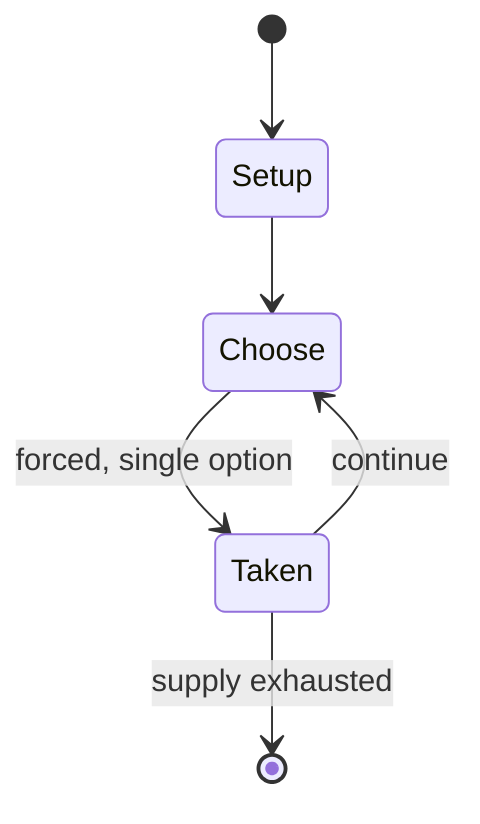

# The American Civil War: 1861–1865

*strategic simulation board game*

`the_american_civil_war_1861_1865` &nbsp; state: **DEEPENED** &nbsp; method: **heuristic**

## Found layer (recorded, not trusted)

| field | value |
| --- | --- |
| wikidata | Q111972992 |
| wikipedia | The American Civil War: 1861–1865 |
| genres (source) | -- |
| instance of (source) | board game, board wargame |
| country of origin | -- |

## Declared layer (orders bench work)

| field | value |
| --- | --- |
| year created | -- |
| epoch | -- |
| region | -- |
| media | BOARD, WARGAME |
| players | 2 |
| age band | -- |
| exogenous process | -- |
| loss shape | -- |
| live axes | SPATIAL |
| horizon | -- |
| scoring shape | -- |
| information | -- |
| interaction | COMPETITIVE |
| turn structure | PHASE_STRUCTURED |
| tractability | SAMPLING_ONLY |
| randomness | DICE |
| luck factor | 0.58 |
| rules complexity | 3.91 |
| strategic depth | 1.87 |
| novelty | 0.5217 |
| solved status | -- |
| strategies | -- |
| algorithms | -- |

## Object model

```
Episode
  players      : 2
  turn_structure: PHASE_STRUCTURED
  horizon       : ?
  scoring       : ?

Board          -- spatial substrate; cells carry position and occupancy
Piece          -- movable token owned by a player
Placement      -- position subject to geometric legality
```

## State transition diagram



## Research item -- turn trace

```
# The American Civil War: 1861–1865 -- simulated turn events
# generated from the DECLARED vector, not from a rulebook.
# structure: exo=None loss=None horizon=None scoring=None axes=SPATIAL

t=0    SETUP        players=2  pot=0  capacity=3
t=1    FORCED       p1 single legal option taken (pot_gain=+1.2)
t=2    ENDTURN      turn passes to p2
t=3    FORCED       p2 single legal option taken (pot_gain=+0.7)
t=4    ENDTURN      turn passes to p1
t=5    FORCED       p1 single legal option taken (pot_gain=+1.2)
t=6    FORCED       p1 single legal option taken (pot_gain=+1.9)
t=7    ENDTURN      turn passes to p2
t=8    FORCED       p2 single legal option taken (pot_gain=+0.8)
t=9    SPATIAL      p2 places at (0,0); adjacency legal
t=10   FORCED       p2 single legal option taken (pot_gain=+0.7)
t=11   FORCED       p2 single legal option taken (pot_gain=+0.8)
t=12   SPATIAL      p2 places at (7,2); adjacency legal
t=13   FORCED       p2 single legal option taken (pot_gain=+0.7)
t=14   SPATIAL      p2 places at (6,7); adjacency legal
t=15   FORCED       p2 single legal option taken (pot_gain=+0.6)
t=16   ENDTURN      turn passes to p1
t=17   FORCED       p1 single legal option taken (pot_gain=+2.0)
t=18   FORCED       p1 single legal option taken (pot_gain=+1.5)
t=19   SPATIAL      p1 places at (6,7); adjacency legal
t=20   ENDTURN      turn passes to p2
t=21   FORCED       p2 single legal option taken (pot_gain=+1.5)
t=22   FORCED       p2 single legal option taken (pot_gain=+1.0)
t=23   FORCED       p2 single legal option taken (pot_gain=+1.7)
t=24   SPATIAL      p2 places at (7,7); adjacency legal
t=25   FORCED       p2 single legal option taken (pot_gain=+1.5)
t=26   ENDTURN      turn passes to p1

terminal: VARIABLE
```

## Source extract

The American Civil War: 1861–1865 is a board wargame published by Simulations Publications Inc.
(SPI) in 1974 that is a strategic simulation of the American Civil War.   == Description == The
American Civil War is a two-player game in which one player takes the role of Abraham Lincoln,
controlling the Union forces, and the other player takes the role of Jefferson Davis,
controlling the Confederate forces.   === Components === The magazine pull-out edition contains:
22" x 34" paper hex grid map of American states in 1861 200 die-cut counters map-fold rule set
The boxed edition also includes a six-sided die   === Scenarios === In addition to the
historical game covering the entire Civil War, the rules also include a number of "what-if":
scenarios, such as "What if Robert E. Lee had commanded the Union army?"   === Gameplay === The
game uses a traditional "I Go, You Go" format, where one player completes all the phases of a
turn, and then the other player completes the same phases. The phases are:  Reinforcement
Attrition Phase Command Control Supply Judgment Movement Combat Phase Supply Attrition Phase
Although the focus is on land combat and Command Control and Supply prove vital t

<sub>Wikipedia, CC BY-SA. Retained as evidence for the structural
classification above. Every rule inferred from it is HYPOTHESIZED
until audited against a rulebook.</sub>
