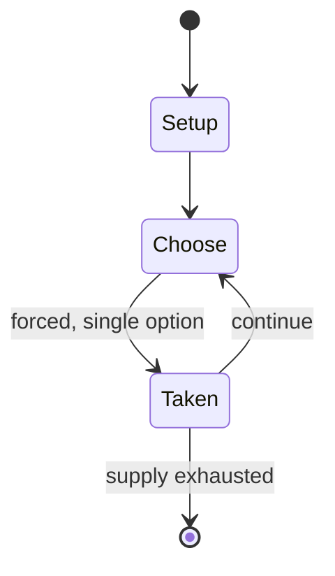

# The Art of Siege

*board wargame published in 1979*

`the_art_of_siege` &nbsp; state: **DEEPENED** &nbsp; method: **heuristic**

## Found layer (recorded, not trusted)

| field | value |
| --- | --- |
| wikidata | Q110413297 |
| wikipedia | The Art of Siege |
| genres (source) | -- |
| instance of (source) | board wargame |
| country of origin | -- |

## Declared layer (orders bench work)

| field | value |
| --- | --- |
| year created | -322 |
| epoch | ANCIENT |
| region | -- |
| media | WARGAME |
| players | -- |
| age band | -- |
| exogenous process | NONE |
| loss shape | OPPORTUNITY_ONLY |
| live axes | SPATIAL |
| horizon | -- |
| scoring shape | SET_COLLECTION_CONVEX |
| information | PERFECT |
| interaction | -- |
| turn structure | PHASE_STRUCTURED |
| tractability | EXACT_WITH_CUT |
| randomness | NONE |
| luck factor | 0.02 |
| rules complexity | 4.09 |
| strategic depth | 2.65 |
| novelty | 0.813 |
| solved status | -- |
| strategies | set_collection |
| algorithms | -- |

## Object model

```
Episode
  players      : ?
  turn_structure: PHASE_STRUCTURED
  horizon       : ?
  scoring       : SET_COLLECTION_CONVEX

Placement      -- position subject to geometric legality
```

## State transition diagram



## Research item -- turn trace

```
# The Art of Siege -- simulated turn events
# generated from the DECLARED vector, not from a rulebook.
# structure: exo=NONE loss=OPPORTUNITY_ONLY horizon=None scoring=SET_COLLECTION_CONVEX axes=SPATIAL

t=0    SETUP        players=2  pot=0  capacity=5
t=1    FORCED       p1 single legal option taken (pot_gain=+0.9)
t=2    SPATIAL      p1 places at (6,6); adjacency legal
t=3    FORCED       p1 single legal option taken (pot_gain=+0.9)
t=4    SPATIAL      p1 places at (5,2); adjacency legal
t=5    FORCED       p1 single legal option taken (pot_gain=+0.6)
t=6    FORCED       p1 single legal option taken (pot_gain=+1.3)
t=7    ENDTURN      turn passes to p2
t=8    FORCED       p2 single legal option taken (pot_gain=+2.0)
t=9    FORCED       p2 single legal option taken (pot_gain=+1.0)
t=10   ENDTURN      turn passes to p1
t=11   FORCED       p1 single legal option taken (pot_gain=+2.0)
t=12   SPATIAL      p1 places at (4,5); adjacency legal
t=13   FORCED       p1 single legal option taken (pot_gain=+1.3)
t=14   ENDTURN      turn passes to p2
t=15   FORCED       p2 single legal option taken (pot_gain=+1.4)
t=16   ENDTURN      turn passes to p1
t=17   FORCED       p1 single legal option taken (pot_gain=+0.8)
t=18   FORCED       p1 single legal option taken (pot_gain=+1.2)
t=19   FORCED       p1 single legal option taken (pot_gain=+1.9)
t=20   FORCED       p1 single legal option taken (pot_gain=+1.3)
t=21   FORCED       p1 single legal option taken (pot_gain=+1.3)
t=22   FORCED       p1 single legal option taken (pot_gain=+1.2)
t=23   FORCED       p1 single legal option taken (pot_gain=+1.7)
t=24   SPATIAL      p1 places at (3,4); adjacency legal
t=25   FORCED       p1 single legal option taken (pot_gain=+0.8)
t=26   SPATIAL      p1 places at (7,0); adjacency legal

terminal: VARIABLE
```

## Conditions

| kind | threshold | effect | trigger |
| --- | --- | --- | --- |
| TERMINATE | -- | -- | (If both sides claim victory at the end of an Assault phase, then the game ends in a draw.) |
| LOSE | -- | -- | Once the Greeks launch their attack, they have 16 impulses to take both the Agrendium and the Temple of Hercules or they lose the game. |
| BOUNDARY | -- | -- | The French/English player must capture two bastions — at least one of them a major bastion — before the end of the game to win. |

## Source extract

The Art of Siege, subtitled "Four Great Siege Battles", is a collection of four board wargames
published by Simulations Publications Inc. (SPI) in 1979 that simulates four famous sieges.   ==
Description == The Art of Siege is a "quadrigame" — a set of four games in the same box — that
simulate four famous historical sieges:  Acre: Richard Lionheart's Siege (1191): The siege of
Acre by Crusader armies (designed by Phil Kosnett). Tyre: Alexander's Siege and Assault (322
BC): The amphibious assault on the island fortress of Tyre by Alexander the Great (designed by
Mark Herman). Lille: The Classic Vauban Siege (1708): The siege of the French fortress by the
Anglo-Dutch forces of the Duke of Marlborough (designed by David Werden). Sevastapol: The First
Modern Siege (1854–55): The siege of the Russian fortress by the British and French during the
Crimean War (designed by Rob Mosca).   === Components === Each of the four games has its own set
of components, which includes a paper hex grid map and 200 double-sided cardboard counters.
Unlike previous SPI quadrigames that featured a common set of rules used by all four games in
the box, each game in The Art of Siege has its own unique rules

<sub>Wikipedia, CC BY-SA. Retained as evidence for the structural
classification above. Every rule inferred from it is HYPOTHESIZED
until audited against a rulebook.</sub>
