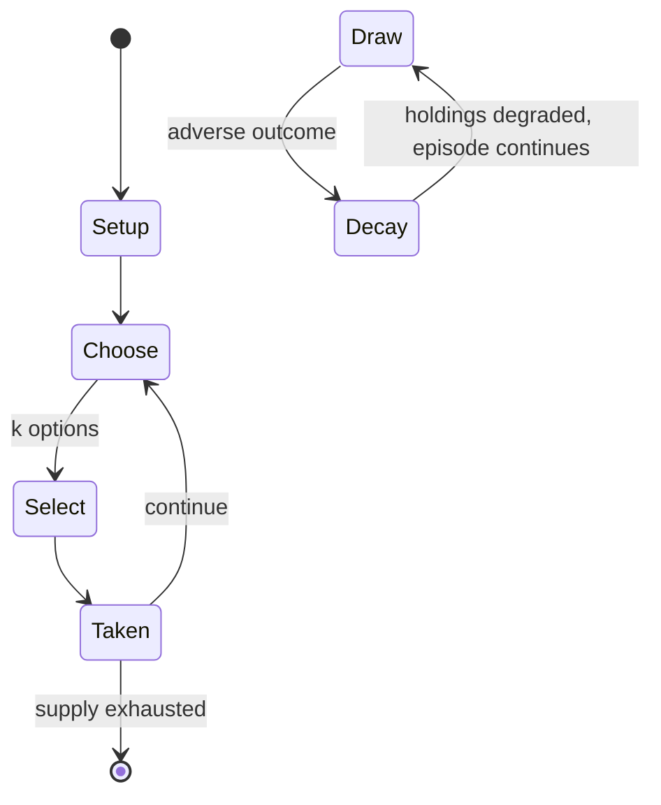

# The Chameleon (party game)

`the_chameleon_party_game` &nbsp; state: **DEEPENED** &nbsp; method: **heuristic**

## Found layer (recorded, not trusted)

| field | value |
| --- | --- |
| wikidata | Q116233173 |
| wikipedia | The Chameleon (party game) |
| genres (source) | -- |
| instance of (source) | -- |
| country of origin | -- |

## Declared layer (orders bench work)

| field | value |
| --- | --- |
| year created | 2017 |
| epoch | CONTEMPORARY |
| region | -- |
| media | PARTY |
| players | -- |
| age band | -- |
| exogenous process | -- |
| loss shape | PARTIAL_DECAY |
| live axes | SELECT |
| horizon | -- |
| scoring shape | -- |
| information | IMPERFECT |
| interaction | TRAITOR |
| turn structure | -- |
| tractability | SAMPLING_ONLY |
| randomness | DICE, HIDDEN_INFO |
| luck factor | 0.63 |
| rules complexity | 2.6 |
| strategic depth | 2.04 |
| novelty | 0.7624 |
| solved status | -- |
| strategies | deduction |
| algorithms | -- |

## Object model

```
Episode
  players      : ?
  turn_structure: ?
  horizon       : ?
  scoring       : ?

OptionSet      -- the choices available after an exogenous draw
```

## State transition diagram



## Research item -- turn trace

```
# The Chameleon (party game) -- simulated turn events
# generated from the DECLARED vector, not from a rulebook.
# structure: exo=None loss=PARTIAL_DECAY horizon=None scoring=None axes=SELECT

t=0    SETUP        players=2  pot=0  capacity=7
t=1    SELECT       p1 1 options; take #1  (pot_gain=+2.2, capacity=-2)
t=2    SELECT       p1 3 options; take #3  (pot_gain=+1.7, capacity=-0)
t=3    SELECT       p1 4 options; take #1  (pot_gain=+2.9, capacity=-2)
t=4    SELECT       p1 3 options; take #1  (pot_gain=+1.0, capacity=-0)
t=5    ENDTURN      turn passes to p2
t=6    SELECT       p2 1 options; take #1  (pot_gain=+2.4, capacity=-1)
t=7    SELECT       p2 4 options; take #2  (pot_gain=+2.0, capacity=-0)
t=8    SELECT       p2 1 options; take #1  (pot_gain=+1.4, capacity=-1)
t=9    SELECT       p2 1 options; take #1  (pot_gain=+3.1, capacity=-0)
t=10   SELECT       p2 4 options; take #2  (pot_gain=+3.0, capacity=-0)
t=11   SELECT       p2 2 options; take #1  (pot_gain=+3.2, capacity=-0)
t=12   ENDTURN      turn passes to p1
t=13   SELECT       p1 4 options; take #2  (pot_gain=+1.1, capacity=-0)
t=14   ENDTURN      turn passes to p2
t=15   SELECT       p2 4 options; take #2  (pot_gain=+2.6, capacity=-1)
t=16   SELECT       p2 1 options; take #1  (pot_gain=+1.9, capacity=-1)
t=17   ENDTURN      turn passes to p1
t=18   SELECT       p1 2 options; take #2  (pot_gain=+3.4, capacity=-0)
t=19   SELECT       p1 4 options; take #2  (pot_gain=+0.7, capacity=-0)
t=20   ENDTURN      turn passes to p2
t=21   SELECT       p2 4 options; take #2  (pot_gain=+2.4, capacity=-0)
t=22   SELECT       p2 4 options; take #3  (pot_gain=+2.3, capacity=-0)
t=23   ENDTURN      turn passes to p1
t=24   SELECT       p1 3 options; take #3  (pot_gain=+2.0, capacity=-0)
t=25   SELECT       p1 2 options; take #1  (pot_gain=+3.2, capacity=-2)
t=26   SELECT       p1 4 options; take #3  (pot_gain=+2.4, capacity=-2)

terminal: VARIABLE
```

## Conditions

| kind | threshold | effect | trigger |
| --- | --- | --- | --- |
| WIN | -- | -- | If the card flipped is a Code Card, the Chameleon wins the round. |

## Source extract

The Chameleon is a social deduction based party game designed by Rikki Tahta and published in
2017 by Big Potato Games. All players except one—the "Chameleon"—are given a secret topic and
attempt to identify the Chameleon, while the Chameleon attempts to identify the topic, using
social deduction.   == Gameplay == At the start of each round, a Topic Card containing different
topics is placed in the middle for all players to see. Each player is given a Code Card which
contains coordinate values. A yellow six-sided die and a blue eight-sided die are rolled. The
values correspond to a coordinate on the Code Cards, which can then be used to locate a secret
topic on the Topic Card. One player secretly receives a Chameleon card instead of a Code Card,
and does not know the secret topic. Every player takes a turn saying a word related to the Topic
Card, including the Chameleon. Players debate and vote on the Chameleon's identity based on the
words given and the player with the most votes flips over their card. If the card flipped is a
Code Card, the Chameleon wins the round. If it is a Chameleon Card, the Chameleon gets a chance
to guess the secret topic. They win if their guess is correc

<sub>Wikipedia, CC BY-SA. Retained as evidence for the structural
classification above. Every rule inferred from it is HYPOTHESIZED
until audited against a rulebook.</sub>
