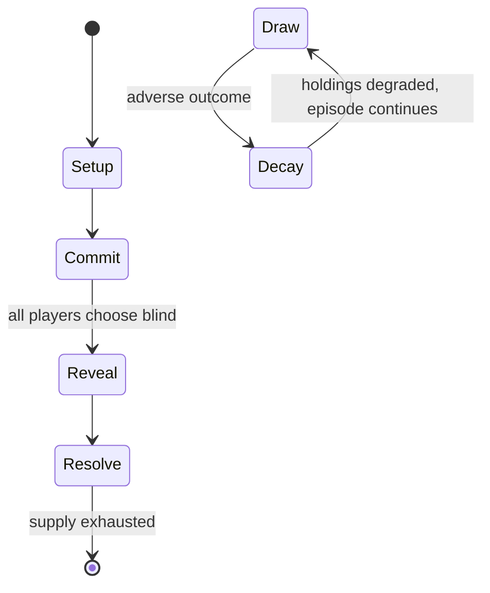

# The Champion Pub

*pinball game*

`the_champion_pub` &nbsp; state: **DEEPENED** &nbsp; method: **heuristic**

## Found layer (recorded, not trusted)

| field | value |
| --- | --- |
| wikidata | Q10695452 |
| wikipedia | The Champion Pub |
| genres (source) | pinball machine game |
| instance of (source) | video game |
| country of origin | -- |

## Declared layer (orders bench work)

| field | value |
| --- | --- |
| year created | 1998 |
| epoch | DIGITAL |
| region | -- |
| media | GAMBLING, VIDEO |
| players | -- |
| age band | -- |
| exogenous process | -- |
| loss shape | PARTIAL_DECAY |
| live axes | COMMIT_BLIND |
| horizon | -- |
| scoring shape | -- |
| information | SIMULTANEOUS |
| interaction | COMPETITIVE |
| turn structure | SIMULTANEOUS |
| tractability | SAMPLING_ONLY |
| randomness | SIMULTANEOUS_CHOICE |
| luck factor | 0.3 |
| rules complexity | 2.23 |
| strategic depth | 2.25 |
| novelty | 0.6687 |
| solved status | -- |
| strategies | deduction |
| algorithms | -- |

## Object model

```
Episode
  players      : ?
  turn_structure: SIMULTANEOUS
  horizon       : ?
  scoring       : ?

WorldState     -- simulation state advanced by the engine
Avatar         -- player-controlled agent
Clock          -- frame or tick counter
SealedChoice   -- irrevocable choice made without observation
```

## State transition diagram



## Research item -- turn trace

```
# The Champion Pub -- simulated turn events
# generated from the DECLARED vector, not from a rulebook.
# structure: exo=None loss=PARTIAL_DECAY horizon=None scoring=None axes=COMMIT_BLIND

t=0    SETUP        players=2  pot=0  capacity=3
t=1    FORCED       p1 single legal option taken (pot_gain=+1.4)
t=2    FORCED       p1 single legal option taken (pot_gain=+1.6)
t=3    FORCED       p1 single legal option taken (pot_gain=+1.2)
t=4    FORCED       p1 single legal option taken (pot_gain=+0.7)
t=5    FORCED       p1 single legal option taken (pot_gain=+0.5)
t=6    ENDTURN      turn passes to p2
t=7    FORCED       p2 single legal option taken (pot_gain=+2.0)
t=8    ENDTURN      turn passes to p1
t=9    FORCED       p1 single legal option taken (pot_gain=+1.4)
t=10   FORCED       p1 single legal option taken (pot_gain=+0.7)
t=11   ENDTURN      turn passes to p2
t=12   FORCED       p2 single legal option taken (pot_gain=+0.7)
t=13   FORCED       p2 single legal option taken (pot_gain=+0.8)
t=14   FORCED       p2 single legal option taken (pot_gain=+1.9)
t=15   FORCED       p2 single legal option taken (pot_gain=+1.5)
t=16   FORCED       p2 single legal option taken (pot_gain=+1.1)
t=17   ENDTURN      turn passes to p1
t=18   FORCED       p1 single legal option taken (pot_gain=+1.1)
t=19   FORCED       p1 single legal option taken (pot_gain=+1.6)
t=20   FORCED       p1 single legal option taken (pot_gain=+2.0)
t=21   FORCED       p1 single legal option taken (pot_gain=+1.6)
t=22   FORCED       p1 single legal option taken (pot_gain=+1.7)
t=23   FORCED       p1 single legal option taken (pot_gain=+1.8)
t=24   ENDTURN      turn passes to p2
t=25   FORCED       p2 single legal option taken (pot_gain=+0.9)
t=26   ENDTURN      turn passes to p1

terminal: VARIABLE
```

## Conditions

| kind | threshold | effect | trigger |
| --- | --- | --- | --- |
| BOUNDARY | -- | -- | All targets are worth a set value, which increases with every hit up to a maximum. |
| BOUNDARY | -- | -- | Win at least one fight by knockout |

## Source extract

The Champion Pub is a pinball game released by Williams Electronics Games (under the Bally
label) in 1998. The theme of the game revolves around boxing in a turn-of-the-century pub.   ==
Design == Several Williams employees are shown as characters on the backglass, Dwight Sullivan,
Pete Piotrowski, Pat McMahon, Paul Barker, Linda Deal, Steve Kordek, and Jim Patla.   ==
Backstory == The game is set on February 3, 1898, when the player's character ("The Kid") finds
himself unemployed upon the closure of the shipyard where he has been working. He wanders into
the Champion Pub, where he comes to the attention of a boxing coach after successfully defending
himself against a drunken patron's assault. Enticed by the possibility of winning large sums of
cash as a prizefighter, the Kid agrees to let the coach train him.   == Description == The
playfield of The Champion Pub features several toys which include:  A jump rope area, in which
the player must jump the ball over a rotating metal bar using a flipper-controlled solenoid A
speed bag area, where the player must knock the ball against a target with a pair of plastic
fists controlled by the flippers A rotating wall with a heavy bag on on

<sub>Wikipedia, CC BY-SA. Retained as evidence for the structural
classification above. Every rule inferred from it is HYPOTHESIZED
until audited against a rulebook.</sub>
