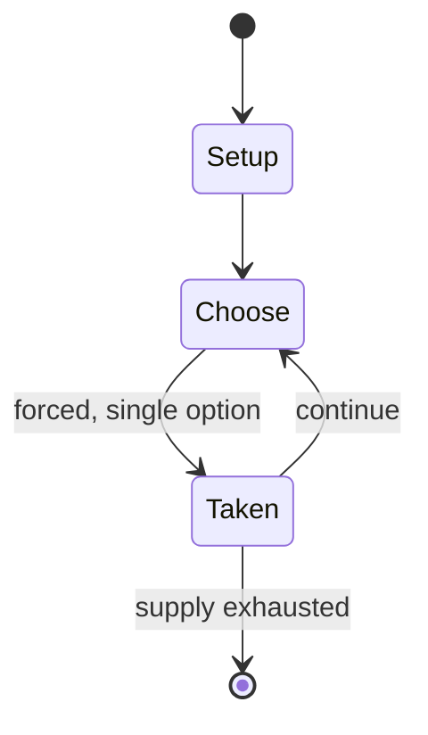

# The Fantod Pack

*card deck by Edward Gorey*

`the_fantod_pack` &nbsp; state: **DEEPENED** &nbsp; method: **heuristic**

## Found layer (recorded, not trusted)

| field | value |
| --- | --- |
| wikidata | Q138603274 |
| wikipedia | The Fantod Pack |
| genres (source) | -- |
| instance of (source) | artist's book, card deck, card game |
| country of origin | United States |

## Declared layer (orders bench work)

| field | value |
| --- | --- |
| year created | -- |
| epoch | -- |
| region | NORTH_AMERICA |
| media | CARD, WORD |
| players | -- |
| age band | -- |
| exogenous process | -- |
| loss shape | -- |
| live axes | - |
| horizon | -- |
| scoring shape | SET_COLLECTION_CONVEX |
| information | -- |
| interaction | -- |
| turn structure | -- |
| tractability | SAMPLING_ONLY |
| randomness | -- |
| luck factor | 0.35 |
| rules complexity | 1.83 |
| strategic depth | 2.25 |
| novelty | 0.4166 |
| solved status | -- |
| strategies | spatial_packing |
| algorithms | -- |

## Object model

```
Episode
  players      : ?
  turn_structure: ?
  horizon       : ?
  scoring       : SET_COLLECTION_CONVEX

Deck           -- ordered multiset, drawn without replacement
Hand           -- private multiset held by one player
DiscardPile    -- public accumulation of spent cards
```

## State transition diagram



## Research item -- turn trace

```
# The Fantod Pack -- simulated turn events
# generated from the DECLARED vector, not from a rulebook.
# structure: exo=None loss=None horizon=None scoring=SET_COLLECTION_CONVEX axes=-

t=0    SETUP        players=2  pot=0  capacity=4
t=1    FORCED       p1 single legal option taken (pot_gain=+1.1)
t=2    ENDTURN      turn passes to p2
t=3    FORCED       p2 single legal option taken (pot_gain=+0.8)
t=4    FORCED       p2 single legal option taken (pot_gain=+1.8)
t=5    FORCED       p2 single legal option taken (pot_gain=+0.7)
t=6    FORCED       p2 single legal option taken (pot_gain=+1.4)
t=7    ENDTURN      turn passes to p1
t=8    FORCED       p1 single legal option taken (pot_gain=+0.8)
t=9    FORCED       p1 single legal option taken (pot_gain=+1.5)
t=10   FORCED       p1 single legal option taken (pot_gain=+1.0)
t=11   FORCED       p1 single legal option taken (pot_gain=+0.6)
t=12   FORCED       p1 single legal option taken (pot_gain=+0.7)
t=13   FORCED       p1 single legal option taken (pot_gain=+1.1)
t=14   FORCED       p1 single legal option taken (pot_gain=+1.9)
t=15   FORCED       p1 single legal option taken (pot_gain=+1.4)
t=16   FORCED       p1 single legal option taken (pot_gain=+0.7)
t=17   FORCED       p1 single legal option taken (pot_gain=+0.6)
t=18   FORCED       p1 single legal option taken (pot_gain=+1.1)
t=19   FORCED       p1 single legal option taken (pot_gain=+1.9)
t=20   FORCED       p1 single legal option taken (pot_gain=+1.1)
t=21   FORCED       p1 single legal option taken (pot_gain=+1.3)
t=22   FORCED       p1 single legal option taken (pot_gain=+2.0)
t=23   ENDTURN      turn passes to p2
t=24   FORCED       p2 single legal option taken (pot_gain=+0.8)
t=25   FORCED       p2 single legal option taken (pot_gain=+1.1)
t=26   FORCED       p2 single legal option taken (pot_gain=+0.9)

terminal: VARIABLE
```

## Source extract

The Fantod Pack is a set of 20 illustrated divinatory cards created by American author and
illustrator Edward Gorey, attributed to "Madame Groeda Weyrd", an anagram of his name. Gorey
began work on the cards in 1959, and they first appeared in Esquire in December 1966. An
unauthorized edition followed in the late 1960s, and authorized editions in 1995 and 2007.   ==
Background == Gorey believed in "graphology, also palmistry, the I Ching, the tarot, astrology".
Biographer Mark Dery noted that Gorey did not trust cards to predict the future; his interest in
divination grew from his fascination with Taoism and surrealism. The Fantod Pack was not
intended to be a serious divinatory tool.   == Description == In the Esquire feature, the pack
is attributed to a fictional clairvoyant, Madame Groeda Weyrd, who is claimed to be the author
of such works as Floating Tambourines and The Future Speaks Through Entrails (none of which
really exist). The text claims the pack is "of incredible antiquity". The imagery on the cards
includes recurring motifs from Gorey's work: urns, men in fur coats, and ill-fated children. The
back of each card depicts Figbash (a recurring Gorey character) on a unicy

<sub>Wikipedia, CC BY-SA. Retained as evidence for the structural
classification above. Every rule inferred from it is HYPOTHESIZED
until audited against a rulebook.</sub>
