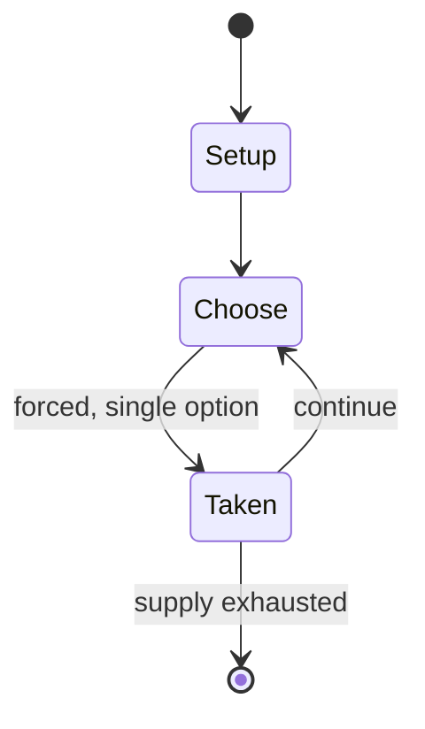

# The floor is lava

`the_floor_is_lava` &nbsp; state: **DEEPENED** &nbsp; method: **heuristic**

## Found layer (recorded, not trusted)

| field | value |
| --- | --- |
| wikidata | Q10536135 |
| wikipedia | The floor is lava |
| genres (source) | -- |
| instance of (source) | -- |
| country of origin | -- |

## Declared layer (orders bench work)

| field | value |
| --- | --- |
| year created | -- |
| epoch | -- |
| region | -- |
| media | PLAYGROUND |
| players | -- |
| age band | -- |
| exogenous process | -- |
| loss shape | -- |
| live axes | - |
| horizon | -- |
| scoring shape | RACE_POSITION |
| information | -- |
| interaction | -- |
| turn structure | -- |
| tractability | SAMPLING_ONLY |
| randomness | -- |
| luck factor | 0.35 |
| rules complexity | 1.79 |
| strategic depth | 2.0 |
| novelty | 0.4815 |
| solved status | -- |
| strategies | -- |
| algorithms | -- |

## Object model

```
Episode
  players      : ?
  turn_structure: ?
  horizon       : ?
  scoring       : RACE_POSITION

State          -- opaque; no medium or axis evidence was found
Player         -- an agent that selects among legal successors
```

## State transition diagram



## Research item -- turn trace

```
# The floor is lava -- simulated turn events
# generated from the DECLARED vector, not from a rulebook.
# structure: exo=None loss=None horizon=None scoring=RACE_POSITION axes=-

t=0    SETUP        players=2  pot=0  capacity=8
t=1    FORCED       p1 single legal option taken (pot_gain=+0.6)
t=2    ENDTURN      turn passes to p2
t=3    FORCED       p2 single legal option taken (pot_gain=+1.0)
t=4    ENDTURN      turn passes to p1
t=5    FORCED       p1 single legal option taken (pot_gain=+1.3)
t=6    ENDTURN      turn passes to p2
t=7    FORCED       p2 single legal option taken (pot_gain=+1.7)
t=8    FORCED       p2 single legal option taken (pot_gain=+1.0)
t=9    FORCED       p2 single legal option taken (pot_gain=+0.7)
t=10   FORCED       p2 single legal option taken (pot_gain=+1.5)
t=11   FORCED       p2 single legal option taken (pot_gain=+1.2)
t=12   FORCED       p2 single legal option taken (pot_gain=+1.4)
t=13   ENDTURN      turn passes to p1
t=14   FORCED       p1 single legal option taken (pot_gain=+1.4)
t=15   FORCED       p1 single legal option taken (pot_gain=+1.4)
t=16   ENDTURN      turn passes to p2
t=17   FORCED       p2 single legal option taken (pot_gain=+1.3)
t=18   FORCED       p2 single legal option taken (pot_gain=+1.2)
t=19   ENDTURN      turn passes to p1
t=20   FORCED       p1 single legal option taken (pot_gain=+0.7)
t=21   FORCED       p1 single legal option taken (pot_gain=+1.1)
t=22   ENDTURN      turn passes to p2
t=23   FORCED       p2 single legal option taken (pot_gain=+1.2)
t=24   ENDTURN      turn passes to p1
t=25   FORCED       p1 single legal option taken (pot_gain=+0.7)
t=26   FORCED       p1 single legal option taken (pot_gain=+1.2)

terminal: VARIABLE
```

## Source extract

The floor is lava is a game in which players pretend that the floor or ground is made of lava
(or any other lethal substance, such as acid or quicksand), and thus must avoid touching the
ground, as touching the ground would "kill" the player who did so. The players stay off the
floor by standing on furniture or the room's architecture. The players generally may not remain
still, and are required to move from one piece of furniture to the next. This is due to some
people saying that the furniture is acidic, sinking, or in some other way time-limited in its
use. The game can be played with a group or alone for self amusement. There may even be a goal,
to which the players must race. The game may also be played outdoors in playgrounds or similar
areas.   == Gameplay ==  Typically, any individual starts the game just by shouting "The floor
is lava!" Any player remaining on the floor in the next few seconds would be "out". There often
are tasks, items or places that can "regenerate" lost body parts or health. Depending on the
players, these could be embarrassing tasks, or simple things like finding a particular person.
Players can also set up obstacles such as padded chairs to make the

<sub>Wikipedia, CC BY-SA. Retained as evidence for the structural
classification above. Every rule inferred from it is HYPOTHESIZED
until audited against a rulebook.</sub>
