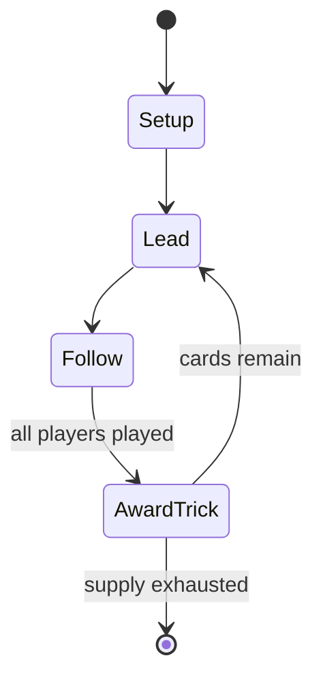

# The Fox in the Forest

`the_fox_in_the_forest` &nbsp; state: **DEEPENED** &nbsp; method: **heuristic**

## Found layer (recorded, not trusted)

| field | value |
| --- | --- |
| wikidata | Q137614810 |
| wikipedia | The Fox in the Forest |
| genres (source) | -- |
| instance of (source) | -- |
| country of origin | -- |

## Declared layer (orders bench work)

| field | value |
| --- | --- |
| year created | 2017 |
| epoch | CONTEMPORARY |
| region | -- |
| media | TRICK_TAKING |
| players | -- |
| age band | -- |
| exogenous process | -- |
| loss shape | -- |
| live axes | ORDER |
| horizon | VARIABLE |
| scoring shape | LINEAR_ACCUMULATION |
| information | -- |
| interaction | SOLITAIRE |
| turn structure | TRICK_ROUND |
| tractability | SAMPLING_ONLY |
| randomness | -- |
| luck factor | 0.35 |
| rules complexity | 2.09 |
| strategic depth | 2.0 |
| novelty | 0.6828 |
| solved status | -- |
| strategies | -- |
| algorithms | -- |

## Object model

```
Episode
  players      : ?
  turn_structure: TRICK_ROUND
  horizon       : VARIABLE
  scoring       : LINEAR_ACCUMULATION

Trick          -- one card per player; a winner is determined
Trump          -- suit that dominates the ordering
Sequence       -- the permutation under the player's control
```

## State transition diagram



## Research item -- turn trace

```
# The Fox in the Forest -- simulated turn events
# generated from the DECLARED vector, not from a rulebook.
# structure: exo=None loss=None horizon=VARIABLE scoring=LINEAR_ACCUMULATION axes=ORDER

t=0    SETUP        players=2  pot=0  capacity=7
t=1    FORCED       p1 single legal option taken (pot_gain=+0.7)
t=2    FORCED       p1 single legal option taken (pot_gain=+1.0)
t=3    FORCED       p1 single legal option taken (pot_gain=+0.9)
t=4    FORCED       p1 single legal option taken (pot_gain=+0.8)
t=5    FORCED       p1 single legal option taken (pot_gain=+0.8)
t=6    FORCED       p1 single legal option taken (pot_gain=+1.1)
t=7    FORCED       p1 single legal option taken (pot_gain=+1.3)
t=8    FORCED       p1 single legal option taken (pot_gain=+1.0)
t=9    FORCED       p1 single legal option taken (pot_gain=+1.6)
t=10   FORCED       p1 single legal option taken (pot_gain=+0.5)
t=11   FORCED       p1 single legal option taken (pot_gain=+1.9)
t=12   FORCED       p1 single legal option taken (pot_gain=+0.5)
t=13   ENDTURN      turn passes to p2
t=14   FORCED       p2 single legal option taken (pot_gain=+0.7)
t=15   ENDTURN      turn passes to p1
t=16   FORCED       p1 single legal option taken (pot_gain=+0.6)
t=17   FORCED       p1 single legal option taken (pot_gain=+0.9)
t=18   FORCED       p1 single legal option taken (pot_gain=+1.2)
t=19   FORCED       p1 single legal option taken (pot_gain=+0.7)
t=20   FORCED       p1 single legal option taken (pot_gain=+1.5)
t=21   ENDTURN      turn passes to p2
t=22   FORCED       p2 single legal option taken (pot_gain=+1.5)
t=23   FORCED       p2 single legal option taken (pot_gain=+1.5)
t=24   FORCED       p2 single legal option taken (pot_gain=+1.2)
t=25   ENDTURN      turn passes to p1
t=26   FORCED       p1 single legal option taken (pot_gain=+1.4)

terminal: VARIABLE
```

## Conditions

| kind | threshold | effect | trigger |
| --- | --- | --- | --- |
| TERMINATE | 21 points | -- | The game ends when either player has at least 21 points, and the winner is the player with the most points. |
| TERMINATE | -- | -- | After all tricks have been played, the round ends and players win points based on the number of tricks they won. |
| TERMINATE | -- | -- | The game ends if players run out of forest tiles to place, resulting in a defeat, or all 22 gem tokens have been collected, resulting in a victory. |

## Source extract

The Fox in the Forest is a trick-taking card game designed by Joshua Buergel and published in
2017 by Foxtrot Games and Renegade Game Studios. Two players play cards of different suits to
win tricks over rounds of 13 turns, then score point based on the number of tricks they won
during that round in order to end the game with the highest number of points.   == Publishing
history == The Fox in the Forest Duet, a cooperative reimplementation of the game mechanics from
The Fox in the Forest, was published in 2020 by Foxtrot Games and Renegade Game Studios. An app
version of The Fox in the Forest was developed by Dire Wolf Digital and released on October 17,
2021.   == Gameplay == The Fox in the Forest is played over multiple rounds, each consisting of
13 turns or "tricks". Players start each round with a hand of 13 cards and both play one card
from their hand every trick. A round begins with one player revealing the top card of the deck,
known as the Decree Card; the other player then leads the trick by playing a card of any suit
(Bells, Keys, or Moons) from their hand. In subsequent rounds the winner of the previous trick
leads. The non-leading player then plays a card that matches t

<sub>Wikipedia, CC BY-SA. Retained as evidence for the structural
classification above. Every rule inferred from it is HYPOTHESIZED
until audited against a rulebook.</sub>
