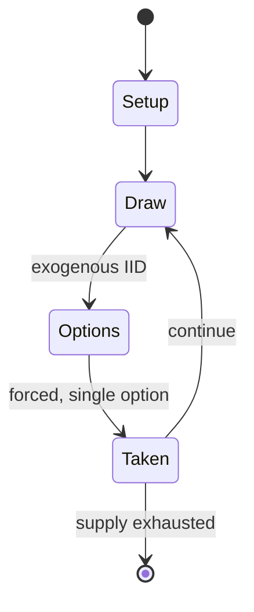

# :The Game:

*indie game by Nicky Case*

`the_game` &nbsp; state: **DEEPENED** &nbsp; method: **heuristic**

## Found layer (recorded, not trusted)

| field | value |
| --- | --- |
| wikidata | Q19680984 |
| wikipedia | The Game (dice game) |
| genres (source) | -- |
| instance of (source) | video game |
| country of origin | -- |

## Declared layer (orders bench work)

| field | value |
| --- | --- |
| year created | 1979 |
| epoch | DIGITAL |
| region | -- |
| media | DICE |
| players | -- |
| age band | -- |
| exogenous process | IID |
| loss shape | -- |
| live axes | - |
| horizon | -- |
| scoring shape | NONLINEAR |
| information | -- |
| interaction | -- |
| turn structure | -- |
| tractability | EXACT_WITH_CUT |
| randomness | DICE |
| luck factor | 0.58 |
| rules complexity | 1.7 |
| strategic depth | 1.87 |
| novelty | 0.7424 |
| solved status | -- |
| strategies | -- |
| algorithms | -- |

## Object model

```
Episode
  players      : ?
  turn_structure: ?
  horizon       : ?
  scoring       : NONLINEAR

DicePool       -- n dice, each an iid categorical draw
Roll           -- realised outcome of a pool
```

## State transition diagram



## Research item -- turn trace

```
# :The Game: -- simulated turn events
# generated from the DECLARED vector, not from a rulebook.
# structure: exo=IID loss=None horizon=None scoring=NONLINEAR axes=-

t=0    SETUP        players=2  pot=0  capacity=3
t=1    DRAW         p1 roll from d6 pool -> outcome #5  (p=0.228)
t=2    FORCED       p1 single legal option taken (pot_gain=+1.0)
t=3    ENDTURN      turn passes to p2
t=4    DRAW         p2 roll from d6 pool -> outcome #5  (p=0.031)
t=5    FORCED       p2 single legal option taken (pot_gain=+1.6)
t=6    ENDTURN      turn passes to p1
t=7    DRAW         p1 roll from d6 pool -> outcome #3  (p=0.228)
t=8    FORCED       p1 single legal option taken (pot_gain=+1.0)
t=9    DRAW         p1 roll from d6 pool -> outcome #4  (p=0.028)
t=10   FORCED       p1 single legal option taken (pot_gain=+0.7)
t=11   DRAW         p1 roll from d6 pool -> outcome #2  (p=0.214)
t=12   FORCED       p1 single legal option taken (pot_gain=+1.6)
t=13   ENDTURN      turn passes to p2
t=14   DRAW         p2 roll from d6 pool -> outcome #1  (p=0.242)
t=15   FORCED       p2 single legal option taken (pot_gain=+1.2)
t=16   DRAW         p2 roll from d6 pool -> outcome #3  (p=0.056)
t=17   FORCED       p2 single legal option taken (pot_gain=+1.4)
t=18   DRAW         p2 roll from d6 pool -> outcome #3  (p=0.160)
t=19   FORCED       p2 single legal option taken (pot_gain=+1.4)
t=20   ENDTURN      turn passes to p1
t=21   DRAW         p1 roll from d6 pool -> outcome #1  (p=0.129)
t=22   FORCED       p1 single legal option taken (pot_gain=+1.2)
t=23   DRAW         p1 roll from d6 pool -> outcome #4  (p=0.082)
t=24   FORCED       p1 single legal option taken (pot_gain=+1.7)
t=25   DRAW         p1 roll from d6 pool -> outcome #5  (p=0.065)
t=26   FORCED       p1 single legal option taken (pot_gain=+1.5)

terminal: VARIABLE
```

## Source extract

The Game is a dice game designed by Reinhold Wittig. It was first published in Germany in 1979,
without rules and under the German name Das Spiel. It contains a triangular base plate and 281
dice of four different colours, and a rule book that gives rules for some 50+ games.  Most of
the games are centered on building or demolishing pyramids of dice, but there are also racing
games and games of skill.  The game has been originally published by Diego Rodriguez (Reinhold
Wittig), Göttingen, in 1979. The Game won the 1980 Spiel des Jahres special award for "most
beautiful game". In his preface Wittig writes:  I've often been asked how you go about it to
invent a game. I want to add one answer now.  Is perhaps the best answer possible to show the
many different ways of designing a game.  The answer is also a challenge: Invent rules of your
own to my dice pyramid. The first edition of the game was a small version of the dice pyramid,
without any rules. Over time, players contributed their own rules to a collection.   == Reviews
== Jeux & Stratégie #47 (as "Le Jeu")   == See also == Game design   == References ==   ==
External links == The Game   at BoardGameGeek

<sub>Wikipedia, CC BY-SA. Retained as evidence for the structural
classification above. Every rule inferred from it is HYPOTHESIZED
until audited against a rulebook.</sub>
