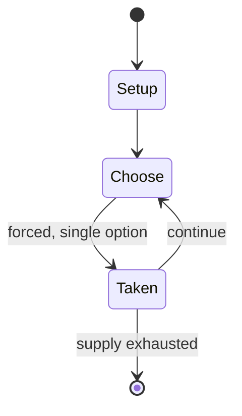

# The King of Fighters EX: Neo Blood

*2001 video game*

`the_king_of_fighters_ex_neo_blood` &nbsp; state: **DEEPENED** &nbsp; method: **heuristic**

## Found layer (recorded, not trusted)

| field | value |
| --- | --- |
| wikidata | Q28501087 |
| wikipedia | The King of Fighters EX: Neo Blood |
| genres (source) | -- |
| instance of (source) | video game |
| country of origin | Japan |

## Declared layer (orders bench work)

| field | value |
| --- | --- |
| year created | 2002 |
| epoch | CONTEMPORARY |
| region | EAST_ASIA |
| media | VIDEO |
| players | -- |
| age band | -- |
| exogenous process | -- |
| loss shape | -- |
| live axes | - |
| horizon | -- |
| scoring shape | SURVIVAL |
| information | -- |
| interaction | COMPETITIVE |
| turn structure | -- |
| tractability | SAMPLING_ONLY |
| randomness | -- |
| luck factor | 0.35 |
| rules complexity | 1.75 |
| strategic depth | 2.0 |
| novelty | 0.5428 |
| solved status | -- |
| strategies | -- |
| algorithms | -- |

## Object model

```
Episode
  players      : ?
  turn_structure: ?
  horizon       : ?
  scoring       : SURVIVAL

WorldState     -- simulation state advanced by the engine
Avatar         -- player-controlled agent
Clock          -- frame or tick counter
```

## State transition diagram



## Research item -- turn trace

```
# The King of Fighters EX: Neo Blood -- simulated turn events
# generated from the DECLARED vector, not from a rulebook.
# structure: exo=None loss=None horizon=None scoring=SURVIVAL axes=-

t=0    SETUP        players=2  pot=0  capacity=6
t=1    FORCED       p1 single legal option taken (pot_gain=+1.7)
t=2    FORCED       p1 single legal option taken (pot_gain=+0.8)
t=3    FORCED       p1 single legal option taken (pot_gain=+1.5)
t=4    ENDTURN      turn passes to p2
t=5    FORCED       p2 single legal option taken (pot_gain=+0.5)
t=6    FORCED       p2 single legal option taken (pot_gain=+1.8)
t=7    FORCED       p2 single legal option taken (pot_gain=+0.8)
t=8    FORCED       p2 single legal option taken (pot_gain=+0.8)
t=9    ENDTURN      turn passes to p1
t=10   FORCED       p1 single legal option taken (pot_gain=+1.9)
t=11   FORCED       p1 single legal option taken (pot_gain=+0.7)
t=12   FORCED       p1 single legal option taken (pot_gain=+1.1)
t=13   ENDTURN      turn passes to p2
t=14   FORCED       p2 single legal option taken (pot_gain=+1.2)
t=15   FORCED       p2 single legal option taken (pot_gain=+1.7)
t=16   FORCED       p2 single legal option taken (pot_gain=+1.6)
t=17   FORCED       p2 single legal option taken (pot_gain=+1.9)
t=18   FORCED       p2 single legal option taken (pot_gain=+1.2)
t=19   ENDTURN      turn passes to p1
t=20   FORCED       p1 single legal option taken (pot_gain=+0.7)
t=21   FORCED       p1 single legal option taken (pot_gain=+1.5)
t=22   ENDTURN      turn passes to p2
t=23   FORCED       p2 single legal option taken (pot_gain=+1.2)
t=24   FORCED       p2 single legal option taken (pot_gain=+0.9)
t=25   FORCED       p2 single legal option taken (pot_gain=+1.6)
t=26   FORCED       p2 single legal option taken (pot_gain=+1.0)

terminal: VARIABLE
```

## Source extract

The King of Fighters EX: Neo Blood (or KOF EX) is a fighting game developed by Playmore and
Artoon in 2002 for Nintendo's Game Boy Advance. Despite being based on The King of Fighters '99
in terms of systems and design, the game features different playable characters with an original
storyline involving Kyo Kusanagi and his friends being the protagonist of a new "King of
Fighters" tournament set by crimelord Geese Howard. The game offers several returning characters
with Kyo's ally Moe Habana being a new character.  Despite SNK going bankrupt, there were no
issues with the development of the game, with Marvelous Entertainment developing it. The game
received positive response by critics for its controls and cast and was followed by a  sequel
titled The King of Fighters EX2: Howling Blood in 2003.   == Development == The game's data is
based on the 1999 arcade 2D fighting game The King of Fighters '99 but rather than focusing on
its NESTS narrative, SNK chose to expand the previous Orochi's arc primarily focusing on Kyo
Kusanagi. The protagonist's spin-off game The King of Fighters: Kyo explored more lore behind
his clan and writer Akihiko Ureshino lamented that the concept of the T

<sub>Wikipedia, CC BY-SA. Retained as evidence for the structural
classification above. Every rule inferred from it is HYPOTHESIZED
until audited against a rulebook.</sub>
