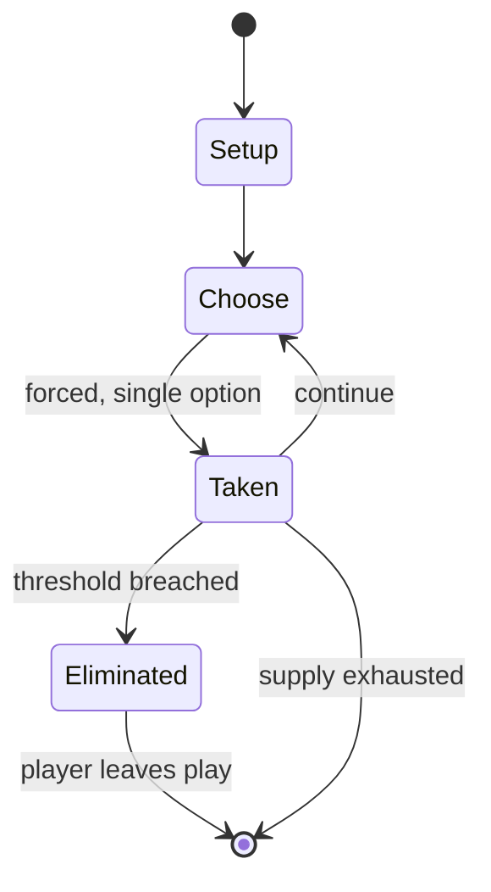

# The Landlord's Game

*board game*

`the_landlord_s_game` &nbsp; state: **DEEPENED** &nbsp; method: **heuristic**

## Found layer (recorded, not trusted)

| field | value |
| --- | --- |
| wikidata | Q1550933 |
| wikipedia | The Landlord's Game |
| genres (source) | -- |
| instance of (source) | board game |
| country of origin | -- |

## Declared layer (orders bench work)

| field | value |
| --- | --- |
| year created | 1906 |
| epoch | MODERN |
| region | -- |
| media | BOARD |
| players | 2-4 |
| age band | -- |
| exogenous process | -- |
| loss shape | ELIMINATION |
| live axes | - |
| horizon | -- |
| scoring shape | -- |
| information | -- |
| interaction | COMPETITIVE |
| turn structure | -- |
| tractability | SAMPLING_ONLY |
| randomness | -- |
| luck factor | 0.35 |
| rules complexity | 1.78 |
| strategic depth | 2.0 |
| novelty | 0.5098 |
| solved status | -- |
| strategies | -- |
| algorithms | -- |

## Object model

```
Episode
  players      : 2-4
  turn_structure: ?
  horizon       : ?
  scoring       : ?

Board          -- spatial substrate; cells carry position and occupancy
Piece          -- movable token owned by a player
```

## State transition diagram



## Research item -- turn trace

```
# The Landlord's Game -- simulated turn events
# generated from the DECLARED vector, not from a rulebook.
# structure: exo=None loss=ELIMINATION horizon=None scoring=None axes=-

t=0    SETUP        players=2  pot=0  capacity=6
t=1    FORCED       p1 single legal option taken (pot_gain=+1.6)
t=2    FORCED       p1 single legal option taken (pot_gain=+1.2)
t=3    FORCED       p1 single legal option taken (pot_gain=+0.6)
t=4    ENDTURN      turn passes to p2
t=5    FORCED       p2 single legal option taken (pot_gain=+1.0)
t=6    FORCED       p2 single legal option taken (pot_gain=+1.3)
t=7    FORCED       p2 single legal option taken (pot_gain=+0.9)
t=8    FORCED       p2 single legal option taken (pot_gain=+0.9)
t=9    ENDTURN      turn passes to p1
t=10   FORCED       p1 single legal option taken (pot_gain=+1.7)
t=11   FORCED       p1 single legal option taken (pot_gain=+0.8)
t=12   ENDTURN      turn passes to p2
t=13   FORCED       p2 single legal option taken (pot_gain=+1.7)
t=14   FORCED       p2 single legal option taken (pot_gain=+1.6)
t=15   FORCED       p2 single legal option taken (pot_gain=+1.2)
t=16   FORCED       p2 single legal option taken (pot_gain=+0.6)
t=17   FORCED       p2 single legal option taken (pot_gain=+1.6)
t=18   FORCED       p2 single legal option taken (pot_gain=+1.7)
t=19   FORCED       p2 single legal option taken (pot_gain=+0.9)
t=20   FORCED       p2 single legal option taken (pot_gain=+1.2)
t=21   FORCED       p2 single legal option taken (pot_gain=+1.4)
t=22   FORCED       p2 single legal option taken (pot_gain=+1.4)
t=23   ENDTURN      turn passes to p1
t=24   FORCED       p1 single legal option taken (pot_gain=+1.8)
t=25   FORCED       p1 single legal option taken (pot_gain=+1.4)
t=26   FORCED       p1 single legal option taken (pot_gain=+2.0)

terminal: VARIABLE
```

## Conditions

| kind | threshold | effect | trigger |
| --- | --- | --- | --- |
| ELIMINATE | -- | -- | The anti-monopolist rules reward all players during wealth creation, whereas the monopolist rules incentivize forming monopolies and forcing opponents out of the game. |

## Source extract

The Landlord's Game is a board game patented in 1904 by Elizabeth Magie as U.S. patent 748,626.
A realty and taxation game intended to educate users about Georgism, it is the inspiration for
the 1935 board game Monopoly.   == History ==  In 1902 to 1903, Magie designed the game and
playtested it in Arden, Delaware. The game was created to be a "practical demonstration of the
present system of land grabbing with all its usual outcomes and consequences". She based the
game on the economic principles of Georgism, a system proposed by Henry George, with the object
of demonstrating how rents enrich property owners and impoverish tenants. She knew that some
people could find it hard to understand why this happened and what might be done about it, and
she thought that if Georgist ideas were put into the concrete form of a game, they might be
easier to demonstrate. Magie also hoped that when played by children the game would provoke
their natural suspicion of unfairness, and that they might carry this awareness into adulthood.
The Landlord's Game has some similarities to the basic rules of the board game Zohn Ahl, played
by the Kiowa Indians of North America. There are hints that suggest E

<sub>Wikipedia, CC BY-SA. Retained as evidence for the structural
classification above. Every rule inferred from it is HYPOTHESIZED
until audited against a rulebook.</sub>
