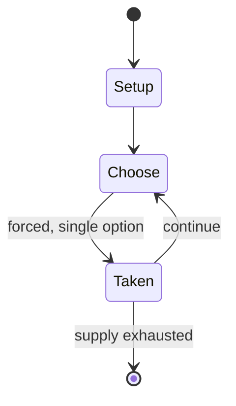

# The Mansion of Happiness

*board game*

`the_mansion_of_happiness` &nbsp; state: **DEEPENED** &nbsp; method: **heuristic**

## Found layer (recorded, not trusted)

| field | value |
| --- | --- |
| wikidata | Q7750227 |
| wikipedia | The Mansion of Happiness |
| genres (source) | -- |
| instance of (source) | board game |
| country of origin | -- |

## Declared layer (orders bench work)

| field | value |
| --- | --- |
| year created | 1800 |
| epoch | INDUSTRIAL |
| region | -- |
| media | BOARD |
| players | -- |
| age band | -- |
| exogenous process | -- |
| loss shape | -- |
| live axes | - |
| horizon | -- |
| scoring shape | RACE_POSITION |
| information | -- |
| interaction | -- |
| turn structure | -- |
| tractability | SAMPLING_ONLY |
| randomness | -- |
| luck factor | 0.35 |
| rules complexity | 1.74 |
| strategic depth | 2.0 |
| novelty | 0.486 |
| solved status | -- |
| strategies | -- |
| algorithms | -- |

## Object model

```
Episode
  players      : ?
  turn_structure: ?
  horizon       : ?
  scoring       : RACE_POSITION

Board          -- spatial substrate; cells carry position and occupancy
Piece          -- movable token owned by a player
```

## State transition diagram



## Research item -- turn trace

```
# The Mansion of Happiness -- simulated turn events
# generated from the DECLARED vector, not from a rulebook.
# structure: exo=None loss=None horizon=None scoring=RACE_POSITION axes=-

t=0    SETUP        players=2  pot=0  capacity=6
t=1    FORCED       p1 single legal option taken (pot_gain=+0.9)
t=2    FORCED       p1 single legal option taken (pot_gain=+1.7)
t=3    ENDTURN      turn passes to p2
t=4    FORCED       p2 single legal option taken (pot_gain=+0.7)
t=5    FORCED       p2 single legal option taken (pot_gain=+1.0)
t=6    ENDTURN      turn passes to p1
t=7    FORCED       p1 single legal option taken (pot_gain=+1.1)
t=8    FORCED       p1 single legal option taken (pot_gain=+1.3)
t=9    FORCED       p1 single legal option taken (pot_gain=+1.8)
t=10   ENDTURN      turn passes to p2
t=11   FORCED       p2 single legal option taken (pot_gain=+1.4)
t=12   FORCED       p2 single legal option taken (pot_gain=+0.6)
t=13   FORCED       p2 single legal option taken (pot_gain=+1.8)
t=14   FORCED       p2 single legal option taken (pot_gain=+1.4)
t=15   FORCED       p2 single legal option taken (pot_gain=+1.1)
t=16   FORCED       p2 single legal option taken (pot_gain=+1.7)
t=17   FORCED       p2 single legal option taken (pot_gain=+0.6)
t=18   FORCED       p2 single legal option taken (pot_gain=+0.9)
t=19   FORCED       p2 single legal option taken (pot_gain=+1.1)
t=20   FORCED       p2 single legal option taken (pot_gain=+0.5)
t=21   FORCED       p2 single legal option taken (pot_gain=+0.5)
t=22   FORCED       p2 single legal option taken (pot_gain=+1.4)
t=23   FORCED       p2 single legal option taken (pot_gain=+2.0)
t=24   ENDTURN      turn passes to p1
t=25   FORCED       p1 single legal option taken (pot_gain=+1.0)
t=26   ENDTURN      turn passes to p2

terminal: VARIABLE
```

## Conditions

| kind | threshold | effect | trigger |
| --- | --- | --- | --- |
| BOUNDARY | -- | -- | There are at least two known copies of the Chandler edition, one was owned by deceased game historian Lee Dennis. |
| BOUNDARY | -- | -- | Weeks published at least two new games: Experts and Tournament & Knighthood. |

## Source extract

The Mansion of Happiness: An Instructive Moral and Entertaining Amusement  is a children's board
game inspired by Christian ethics.  Players race about a 67-space spiral track depicting virtues
and vices with their goal being the Mansion of Happiness at track's end.  Instructions upon
virtue spaces advance players toward the goal while those upon vice spaces force them to
retreat. The Mansion of Happiness was designed by George Fox, a children's author and game
designer in England. The first edition, printed in gold ink "containing real gold" using one
copperplate engraving and black ink using a second copper plate engraving, produced a few
hundred copies. Water coloring was used to complete the game board, making a brilliant,
colorful, and expensive product fit for the nobility. Later in 1800, a second edition was
printed, probably for rich but common folk. Only one copper plate was used to print black ink
and no water coloring was used. The game must have become quite popular in England as a third
edition was printed using two copper plates, one for black, and the second for green lines to
indicate blank spaces. Water colors were added to make a beautiful product. Laurie and Whit

<sub>Wikipedia, CC BY-SA. Retained as evidence for the structural
classification above. Every rule inferred from it is HYPOTHESIZED
until audited against a rulebook.</sub>
