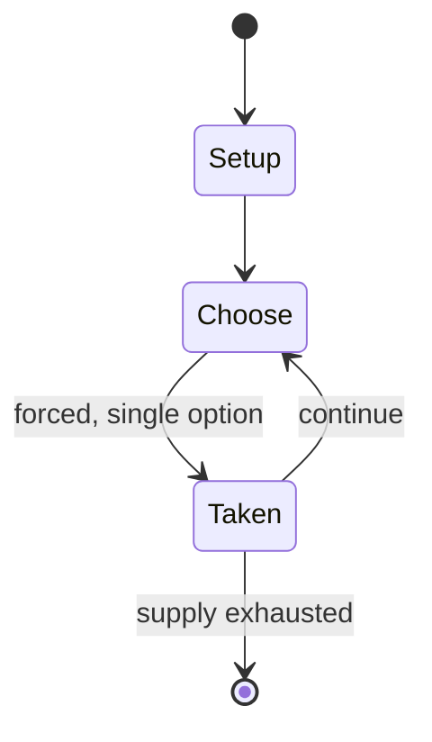

# The Mechanoids

*tabletop role-playing game*

`the_mechanoids` &nbsp; state: **DEEPENED** &nbsp; method: **heuristic**

## Found layer (recorded, not trusted)

| field | value |
| --- | --- |
| wikidata | Q104842213 |
| wikipedia | The Mechanoids |
| genres (source) | tabletop role-playing game |
| instance of (source) | tabletop role-playing game |
| country of origin | United States |

## Declared layer (orders bench work)

| field | value |
| --- | --- |
| year created | 1985 |
| epoch | DIGITAL |
| region | NORTH_AMERICA |
| media | RPG |
| players | -- |
| age band | -- |
| exogenous process | -- |
| loss shape | -- |
| live axes | - |
| horizon | -- |
| scoring shape | RACE_POSITION |
| information | -- |
| interaction | -- |
| turn structure | -- |
| tractability | SAMPLING_ONLY |
| randomness | -- |
| luck factor | 0.35 |
| rules complexity | 2.87 |
| strategic depth | 2.0 |
| novelty | 0.4894 |
| solved status | -- |
| strategies | -- |
| algorithms | -- |

## Object model

```
Episode
  players      : ?
  turn_structure: ?
  horizon       : ?
  scoring       : RACE_POSITION

Character      -- persistent stat block owned by a player
GameMaster     -- adjudicating agent outside the scoring loop
Scenario       -- authored state the players traverse
```

## State transition diagram



## Research item -- turn trace

```
# The Mechanoids -- simulated turn events
# generated from the DECLARED vector, not from a rulebook.
# structure: exo=None loss=None horizon=None scoring=RACE_POSITION axes=-

t=0    SETUP        players=2  pot=0  capacity=5
t=1    FORCED       p1 single legal option taken (pot_gain=+0.7)
t=2    FORCED       p1 single legal option taken (pot_gain=+1.1)
t=3    FORCED       p1 single legal option taken (pot_gain=+2.0)
t=4    FORCED       p1 single legal option taken (pot_gain=+0.8)
t=5    FORCED       p1 single legal option taken (pot_gain=+1.7)
t=6    FORCED       p1 single legal option taken (pot_gain=+0.6)
t=7    ENDTURN      turn passes to p2
t=8    FORCED       p2 single legal option taken (pot_gain=+1.9)
t=9    FORCED       p2 single legal option taken (pot_gain=+1.9)
t=10   ENDTURN      turn passes to p1
t=11   FORCED       p1 single legal option taken (pot_gain=+1.5)
t=12   FORCED       p1 single legal option taken (pot_gain=+0.7)
t=13   FORCED       p1 single legal option taken (pot_gain=+0.5)
t=14   FORCED       p1 single legal option taken (pot_gain=+1.5)
t=15   FORCED       p1 single legal option taken (pot_gain=+1.0)
t=16   FORCED       p1 single legal option taken (pot_gain=+0.9)
t=17   FORCED       p1 single legal option taken (pot_gain=+1.3)
t=18   FORCED       p1 single legal option taken (pot_gain=+1.4)
t=19   ENDTURN      turn passes to p2
t=20   FORCED       p2 single legal option taken (pot_gain=+1.8)
t=21   FORCED       p2 single legal option taken (pot_gain=+1.8)
t=22   FORCED       p2 single legal option taken (pot_gain=+1.3)
t=23   FORCED       p2 single legal option taken (pot_gain=+0.8)
t=24   FORCED       p2 single legal option taken (pot_gain=+1.8)
t=25   FORCED       p2 single legal option taken (pot_gain=+0.8)
t=26   FORCED       p2 single legal option taken (pot_gain=+1.9)
t=27   ENDTURN      turn passes to p1

terminal: VARIABLE
```

## Source extract

The Mechanoids is a science fiction role-playing game published by Palladium Books in 1985 that
is based on the earlier role-playing game The Mechanoid Invasion.   == Description == The
Mechanoids is set one month after the events described in the original The Mechanoid Invasion,
an alien invasion by a race known as the Mechanoids, who are bent on destroying humanity. The
players must try to find out more about the plans of the Mechanoids, and search for ancient
weapons buried deep in the Earth that can help them. The book includes character generation, a
timeline of the alien invasion that forms the focus of the game, notable people, weapons,
information about the Mechanoid aliens, and ancient weapons. The book also includes five
adventures:  "Little Mechanoid Lost" "Run to Ramtau" "The Rescue of Doctor Druall" "Survival"
"The Ocean's Outrage"   == Publication history == Palladium Books published The Mechanoid
Invasion, their first role-playing game, in 1981, followed by sequels The Journey and Homeworld.
In 1984, Palladium undertook a major revision of its role-playing rules, and the following year,
Palladium published The Mechanoids, which incorporated the new rules as well as a

<sub>Wikipedia, CC BY-SA. Retained as evidence for the structural
classification above. Every rule inferred from it is HYPOTHESIZED
until audited against a rulebook.</sub>
