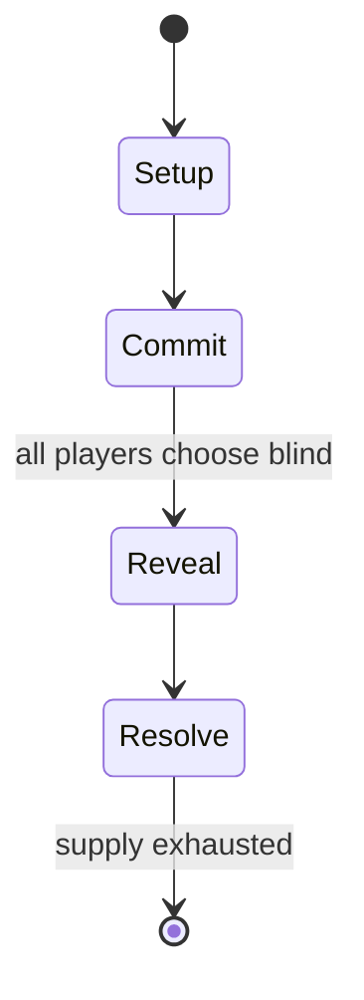

# The Mind

*2018 card game*

`the_mind` &nbsp; state: **DEEPENED** &nbsp; method: **heuristic**

## Found layer (recorded, not trusted)

| field | value |
| --- | --- |
| wikidata | Q53726996 |
| wikipedia | The Mind (card game) |
| genres (source) | -- |
| instance of (source) | card game, cooperative board game, game |
| country of origin | -- |

## Declared layer (orders bench work)

| field | value |
| --- | --- |
| year created | 2018 |
| epoch | CONTEMPORARY |
| region | -- |
| media | CARD |
| players | 2-4 |
| age band | -- |
| exogenous process | DEPLETING_DECK |
| loss shape | -- |
| live axes | COMMIT_BLIND, DISCARD |
| horizon | -- |
| scoring shape | -- |
| information | SIMULTANEOUS |
| interaction | COOPERATIVE |
| turn structure | SIMULTANEOUS |
| tractability | EXACT_WITH_CUT |
| randomness | DECK_SHUFFLE, HIDDEN_INFO, SIMULTANEOUS_CHOICE |
| luck factor | 0.53 |
| rules complexity | 2.34 |
| strategic depth | 1.95 |
| novelty | 0.811 |
| solved status | -- |
| strategies | -- |
| algorithms | -- |

## Object model

```
Episode
  players      : 2-4
  turn_structure: SIMULTANEOUS
  horizon       : ?
  scoring       : ?

Deck           -- ordered multiset, drawn without replacement
Hand           -- private multiset held by one player
DiscardPile    -- public accumulation of spent cards
SealedChoice   -- irrevocable choice made without observation
DiscardChoice  -- what is given up to satisfy a limit
```

## State transition diagram



## Research item -- turn trace

```
# The Mind -- simulated turn events
# generated from the DECLARED vector, not from a rulebook.
# structure: exo=DEPLETING_DECK loss=None horizon=None scoring=None axes=COMMIT_BLIND,DISCARD

t=0    SETUP        players=2  pot=0  capacity=6
t=1    DRAW         p1 draw from deck -> outcome #4  (p=0.295)
t=2    FORCED       p1 single legal option taken (pot_gain=+1.9)
t=3    DISCARD      p1 discards to hand limit
t=4    DRAW         p1 draw from deck -> outcome #5  (p=0.265)
t=5    FORCED       p1 single legal option taken (pot_gain=+0.6)
t=6    DISCARD      p1 discards to hand limit
t=7    DRAW         p1 draw from deck -> outcome #3  (p=0.203)
t=8    FORCED       p1 single legal option taken (pot_gain=+1.8)
t=9    DRAW         p1 draw from deck -> outcome #3  (p=0.196)
t=10   FORCED       p1 single legal option taken (pot_gain=+1.0)
t=11   ENDTURN      turn passes to p2
t=12   DRAW         p2 draw from deck -> outcome #4  (p=0.179)
t=13   FORCED       p2 single legal option taken (pot_gain=+1.4)
t=14   ENDTURN      turn passes to p1
t=15   DRAW         p1 draw from deck -> outcome #5  (p=0.067)
t=16   FORCED       p1 single legal option taken (pot_gain=+1.9)
t=17   DISCARD      p1 discards to hand limit
t=18   DRAW         p1 draw from deck -> outcome #5  (p=0.229)
t=19   FORCED       p1 single legal option taken (pot_gain=+0.9)
t=20   ENDTURN      turn passes to p2
t=21   DRAW         p2 draw from deck -> outcome #5  (p=0.063)
t=22   FORCED       p2 single legal option taken (pot_gain=+1.7)
t=23   DRAW         p2 draw from deck -> outcome #1  (p=0.053)
t=24   FORCED       p2 single legal option taken (pot_gain=+0.7)
t=25   DRAW         p2 draw from deck -> outcome #6  (p=0.071)
t=26   FORCED       p2 single legal option taken (pot_gain=+0.6)

terminal: VARIABLE
```

## Source extract

The Mind is a card game designed by Wolfgang Warsch and published in 2018 by Nürnberger-
Spielkarten-Verlag (NSV). Players attempt to play hands of numbered cards in correct ascending
order without communicating.   == Publishing history == The Mind was first published in Germany
in early 2018 by NSV, before its North American release in late 2018 published by Pandasaurus
Games. In 2019, NSV published The Mind Extreme, an adaptation of the game played using one
increasing and one decreasing deck, and Pandasaurus Games followed in early 2020. The Mind:
Soulmates, another adaptation which has players play their cards face down with the help of a
Seer, was published by NSV in 2023.   == Gameplay == The Mind is played over an amount of levels
depending on the number of players (eight rounds in a four-player game, ten rounds in a three-
player game, and twelve rounds in a two-player game) using a deck of cards labelled from 1 to
100. Every round, the deck is shuffled and each player is dealt an amount of cards equal to the
level number, which they keep hidden from the other players. Once play begins, any player can
play a card from their hand at any time face up into a central pile with th

<sub>Wikipedia, CC BY-SA. Retained as evidence for the structural
classification above. Every rule inferred from it is HYPOTHESIZED
until audited against a rulebook.</sub>
