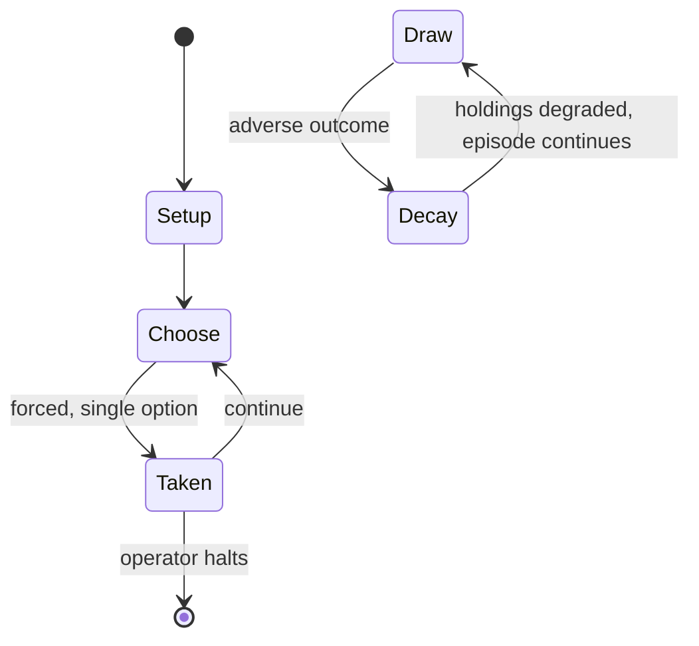

# The Moscow Campaign

*board wargame*

`the_moscow_campaign` &nbsp; state: **DEEPENED** &nbsp; method: **heuristic**

## Found layer (recorded, not trusted)

| field | value |
| --- | --- |
| wikidata | Q112913213 |
| wikipedia | The Moscow Campaign |
| genres (source) | -- |
| instance of (source) | board wargame |
| country of origin | -- |

## Declared layer (orders bench work)

| field | value |
| --- | --- |
| year created | -- |
| epoch | -- |
| region | -- |
| media | WARGAME |
| players | -- |
| age band | -- |
| exogenous process | -- |
| loss shape | PARTIAL_DECAY |
| live axes | SPATIAL |
| horizon | OPEN_ENDED |
| scoring shape | RACE_POSITION |
| information | ASYMMETRIC |
| interaction | COMPETITIVE |
| turn structure | PHASE_STRUCTURED |
| tractability | SAMPLING_ONLY |
| randomness | DICE |
| luck factor | 0.58 |
| rules complexity | 4.04 |
| strategic depth | 1.87 |
| novelty | 0.7425 |
| solved status | -- |
| strategies | -- |
| algorithms | -- |

## Object model

```
Episode
  players      : ?
  turn_structure: PHASE_STRUCTURED
  horizon       : OPEN_ENDED
  scoring       : RACE_POSITION

Placement      -- position subject to geometric legality
```

## State transition diagram



## Research item -- turn trace

```
# The Moscow Campaign -- simulated turn events
# generated from the DECLARED vector, not from a rulebook.
# structure: exo=None loss=PARTIAL_DECAY horizon=OPEN_ENDED scoring=RACE_POSITION axes=SPATIAL

t=0    SETUP        players=2  pot=0  capacity=7
t=1    FORCED       p1 single legal option taken (pot_gain=+1.4)
t=2    FORCED       p1 single legal option taken (pot_gain=+0.9)
t=3    SPATIAL      p1 places at (5,2); adjacency legal
t=4    FORCED       p1 single legal option taken (pot_gain=+1.1)
t=5    FORCED       p1 single legal option taken (pot_gain=+1.1)
t=6    SPATIAL      p1 places at (7,5); adjacency legal
t=7    FORCED       p1 single legal option taken (pot_gain=+1.3)
t=8    SPATIAL      p1 places at (1,6); adjacency legal
t=9    FORCED       p1 single legal option taken (pot_gain=+1.0)
t=10   FORCED       p1 single legal option taken (pot_gain=+0.7)
t=11   SPATIAL      p1 places at (7,4); adjacency legal
t=12   ENDTURN      turn passes to p2
t=13   FORCED       p2 single legal option taken (pot_gain=+0.7)
t=14   SPATIAL      p2 places at (6,7); adjacency legal
t=15   ENDTURN      turn passes to p1
t=16   FORCED       p1 single legal option taken (pot_gain=+0.6)
t=17   FORCED       p1 single legal option taken (pot_gain=+1.0)
t=18   SPATIAL      p1 places at (5,1); adjacency legal
t=19   ENDTURN      turn passes to p2
t=20   FORCED       p2 single legal option taken (pot_gain=+0.9)
t=21   FORCED       p2 single legal option taken (pot_gain=+1.9)
t=22   FORCED       p2 single legal option taken (pot_gain=+0.7)
t=23   SPATIAL      p2 places at (1,4); adjacency legal
t=24   FORCED       p2 single legal option taken (pot_gain=+1.3)
t=25   SPATIAL      p2 places at (3,5); adjacency legal
t=26   ENDTURN      turn passes to p1

terminal: OPEN_ENDED
```

## Conditions

| kind | threshold | effect | trigger |
| --- | --- | --- | --- |
| BOUNDARY | -- | -- | For the purposes of determining whether a unit is supplied or not, units must be able to trace an unbroken line no more than 12 hexes to supplies, and the supplies themselves must connect to unbroken rail lines. |
| PENALTY | -- | -- | Most zones of control allow enemy movement through them provided a movement penalty is paid. |

## Source extract

The Moscow Campaign, subtitled "Strike and Counterstrike Russia", is a board wargame published
by Simulations Publications Inc. (SPI) in 1972 that simulates combat near Moscow during World
War II.   == Background == On 22 June 1941, less than two years after Germany and the Soviet
Union signed the non-aggression Molotov–Ribbentrop Pact, Germany attacked the Soviet Union
across a wide front, with several strategic goals in mind, including the capture of Moscow.
Although the Germans exploited the element of surprise and quickly realized large geographical
gains through the summer and fall of 1941, lack of supplies and worsening weather brought the
German attack to a halt on the outskirts of Moscow. Soviet forces, bolstered by reinforcements
from Siberia, then staged a powerful counteroffensive at the end of 1941.   == Description ==
The Moscow Campaign is a two-player board wargame in which one player controls German forces,
and the other player controls the Soviets.   === Components === The game box contains:  22" x
34" paper hex grid map scaled at 6 mi (9.6 km) per hex 400 die-cut counters map-folded rulesheet
small 6-sided die   === Gameplay === The Moscow Campaign uses the combat

<sub>Wikipedia, CC BY-SA. Retained as evidence for the structural
classification above. Every rule inferred from it is HYPOTHESIZED
until audited against a rulebook.</sub>
