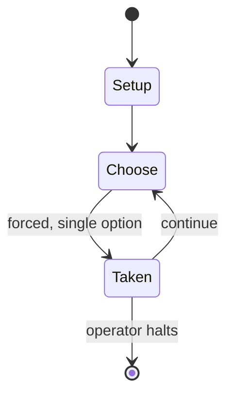

# The Priest of the Parish

*party game*

`the_priest_of_the_parish` &nbsp; state: **DEEPENED** &nbsp; method: **heuristic**

## Found layer (recorded, not trusted)

| field | value |
| --- | --- |
| wikidata | Q7758199 |
| wikipedia | The priest of the parish |
| genres (source) | -- |
| instance of (source) | party game |
| country of origin | -- |

## Declared layer (orders bench work)

| field | value |
| --- | --- |
| year created | -- |
| epoch | -- |
| region | -- |
| media | PARTY |
| players | -- |
| age band | -- |
| exogenous process | NONE |
| loss shape | OPPORTUNITY_ONLY |
| live axes | ORDER |
| horizon | OPEN_ENDED |
| scoring shape | -- |
| information | PERFECT |
| interaction | TEAM |
| turn structure | -- |
| tractability | SAMPLING_ONLY |
| randomness | NONE |
| luck factor | 0.35 |
| rules complexity | 1.76 |
| strategic depth | 2.0 |
| novelty | 0.0938 |
| solved status | -- |
| strategies | memory_recall |
| algorithms | -- |

## Object model

```
Episode
  players      : ?
  turn_structure: ?
  horizon       : OPEN_ENDED
  scoring       : ?

Sequence       -- the permutation under the player's control
```

## State transition diagram



## Research item -- turn trace

```
# The Priest of the Parish -- simulated turn events
# generated from the DECLARED vector, not from a rulebook.
# structure: exo=NONE loss=OPPORTUNITY_ONLY horizon=OPEN_ENDED scoring=None axes=ORDER

t=0    SETUP        players=2  pot=0  capacity=6
t=1    FORCED       p1 single legal option taken (pot_gain=+1.6)
t=2    FORCED       p1 single legal option taken (pot_gain=+1.9)
t=3    FORCED       p1 single legal option taken (pot_gain=+0.8)
t=4    FORCED       p1 single legal option taken (pot_gain=+0.8)
t=5    ENDTURN      turn passes to p2
t=6    FORCED       p2 single legal option taken (pot_gain=+0.9)
t=7    ENDTURN      turn passes to p1
t=8    FORCED       p1 single legal option taken (pot_gain=+1.2)
t=9    FORCED       p1 single legal option taken (pot_gain=+1.1)
t=10   FORCED       p1 single legal option taken (pot_gain=+0.7)
t=11   FORCED       p1 single legal option taken (pot_gain=+1.4)
t=12   ENDTURN      turn passes to p2
t=13   FORCED       p2 single legal option taken (pot_gain=+1.0)
t=14   FORCED       p2 single legal option taken (pot_gain=+1.7)
t=15   FORCED       p2 single legal option taken (pot_gain=+1.0)
t=16   FORCED       p2 single legal option taken (pot_gain=+0.8)
t=17   ENDTURN      turn passes to p1
t=18   FORCED       p1 single legal option taken (pot_gain=+1.8)
t=19   FORCED       p1 single legal option taken (pot_gain=+1.3)
t=20   FORCED       p1 single legal option taken (pot_gain=+1.5)
t=21   FORCED       p1 single legal option taken (pot_gain=+0.8)
t=22   ENDTURN      turn passes to p2
t=23   FORCED       p2 single legal option taken (pot_gain=+2.0)
t=24   FORCED       p2 single legal option taken (pot_gain=+1.4)
t=25   FORCED       p2 single legal option taken (pot_gain=+0.9)
t=26   FORCED       p2 single legal option taken (pot_gain=+1.5)

terminal: OPEN_ENDED
```

## Conditions

| kind | threshold | effect | trigger |
| --- | --- | --- | --- |
| TERMINATE | -- | -- | The aim is to be furthest away from the "losing row" when the Gossiper decides the game is over. |

## Source extract

The priest of the parish (or the priest has lost his cap) is a party game for 50–150 people and
one chair for each person. The chairs are arranged in rows of equal numbers (for example, ten
rows of five), half of them facing the other. Each row of chairs is given a number from one to
ten. The players get into teams of five and each team sits in one of the ten rows. One person,
who is running the game (who is called the Gossiper) says: "The priest of the parish has lost
his considering cap. Some say this, and some say that, but I say it was team number X." That
team stands up all at once and says (in unison), "Who me sir?" The team and the Gossiper have a
conversation, which runs like this:  Gossiper: "The priest of the parish has lost his
considering cap. Some say this, and some say that, but I say it was team number X." Team X: "Who
me sir?" Gossiper: "Yes, you sir." Team X: "Couldn't be, sir!" Gossiper: "Then who, sir?" Team
X: "Team number Y, sir!" At this point, all of team Y stands up and says "Who me sir?" and so
on. This continues until a team fails to stand up together, a team speaks out of unison or the
wrong team stands up. When one of these happens, the team that made th

<sub>Wikipedia, CC BY-SA. Retained as evidence for the structural
classification above. Every rule inferred from it is HYPOTHESIZED
until audited against a rulebook.</sub>
