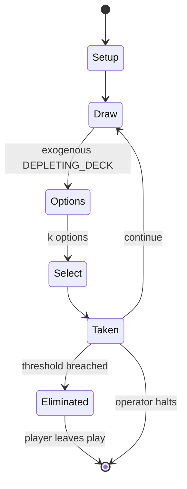

# The Resistance (game)

`the_resistance_game` &nbsp; state: **DEEPENED** &nbsp; method: **heuristic**

## Found layer (recorded, not trusted)

| field | value |
| --- | --- |
| wikidata | Q7760289 |
| wikipedia | The Resistance (game) |
| genres (source) | -- |
| instance of (source) | -- |
| country of origin | -- |

## Declared layer (orders bench work)

| field | value |
| --- | --- |
| year created | 2012 |
| epoch | CONTEMPORARY |
| region | -- |
| media | CARD |
| players | -- |
| age band | -- |
| exogenous process | DEPLETING_DECK |
| loss shape | ELIMINATION |
| live axes | COMMIT_BLIND, DISCARD, SELECT |
| horizon | OPEN_ENDED |
| scoring shape | SET_COLLECTION_CONVEX |
| information | IMPERFECT |
| interaction | TRAITOR |
| turn structure | -- |
| tractability | SAMPLING_ONLY |
| randomness | DECK_SHUFFLE, DICE, HIDDEN_INFO |
| luck factor | 0.81 |
| rules complexity | 4.08 |
| strategic depth | 2.5 |
| novelty | 0.7624 |
| solved status | -- |
| strategies | area_control, deduction, probability_estimation, set_collection |
| algorithms | -- |

## Object model

```
Episode
  players      : ?
  turn_structure: ?
  horizon       : OPEN_ENDED
  scoring       : SET_COLLECTION_CONVEX

Deck           -- ordered multiset, drawn without replacement
Hand           -- private multiset held by one player
DiscardPile    -- public accumulation of spent cards
SealedChoice   -- irrevocable choice made without observation
DiscardChoice  -- what is given up to satisfy a limit
OptionSet      -- the choices available after an exogenous draw
```

## State transition diagram



## Research item -- turn trace

```
# The Resistance (game) -- simulated turn events
# generated from the DECLARED vector, not from a rulebook.
# structure: exo=DEPLETING_DECK loss=ELIMINATION horizon=OPEN_ENDED scoring=SET_COLLECTION_CONVEX axes=COMMIT_BLIND,DISCARD,SELECT

t=0    SETUP        players=2  pot=0  capacity=6
t=1    DRAW         p1 draw from deck -> outcome #5  (p=0.149)
t=2    SELECT       p1 4 options; take #2  (pot_gain=+1.1, capacity=-1)
t=3    DRAW         p1 draw from deck -> outcome #6  (p=0.133)
t=4    SELECT       p1 1 options; take #1  (pot_gain=+2.7, capacity=-2)
t=5    DRAW         p1 draw from deck -> outcome #2  (p=0.073)
t=6    SELECT       p1 2 options; take #2  (pot_gain=+3.3, capacity=-2)
t=7    DRAW         p1 draw from deck -> outcome #2  (p=0.051)
t=8    SELECT       p1 4 options; take #2  (pot_gain=+1.0, capacity=-2)
t=9    DRAW         p1 draw from deck -> outcome #5  (p=0.098)
t=10   SELECT       p1 1 options; take #1  (pot_gain=+2.1, capacity=-0)
t=11   DRAW         p1 draw from deck -> outcome #1  (p=0.253)
t=12   SELECT       p1 1 options; take #1  (pot_gain=+1.5, capacity=-0)
t=13   DRAW         p1 draw from deck -> outcome #2  (p=0.144)
t=14   SELECT       p1 1 options; take #1  (pot_gain=+0.7, capacity=-0)
t=15   DISCARD      p1 discards to hand limit
t=16   DRAW         p1 draw from deck -> outcome #4  (p=0.216)
t=17   SELECT       p1 2 options; take #1  (pot_gain=+1.9, capacity=-0)
t=18   DISCARD      p1 discards to hand limit
t=19   DRAW         p1 draw from deck -> outcome #5  (p=0.214)
t=20   SELECT       p1 2 options; take #2  (pot_gain=+0.5, capacity=-0)
t=21   DRAW         p1 draw from deck -> outcome #5  (p=0.287)
t=22   SELECT       p1 2 options; take #1  (pot_gain=+2.0, capacity=-0)
t=23   DRAW         p1 draw from deck -> outcome #6  (p=0.196)
t=24   SELECT       p1 3 options; take #1  (pot_gain=+1.1, capacity=-2)
t=25   ENDTURN      turn passes to p2
t=26   DRAW         p2 draw from deck -> outcome #1  (p=0.033)
t=27   SELECT       p2 3 options; take #2  (pot_gain=+2.2, capacity=-1)

terminal: OPEN_ENDED
```

## Conditions

| kind | threshold | effect | trigger |
| --- | --- | --- | --- |
| BOUNDARY | 7 players | -- | If one (or two in Mission 4 when at least 7 players are playing) Mission Fail cards were turned in, the Spies win a point for the active mission. |
| ELIMINATE | -- | eliminated | In Mafia, a player is eliminated during every day round and every night round. |
| ELIMINATE | -- | -- | Being eliminated from the game early prevents one from playing most of the game. |
| ELIMINATE | -- | -- | In The Resistance, on the other hand, players are never eliminated, and get to play in every round. |
| WIN | -- | -- | After five successively rejected mission proposals in a single mission, the Spies immediately win the game. |
| BOUNDARY | -- | -- | In The Resistance, a failed mission gives definite information that at least one of the players who went on the mission is an Imperial Spy. |

## Source extract

The Resistance is a social role-playing card-based social deduction party game. The game's
premise involves a war between government and resistance groups, and players are assigned
various roles related to these groups. A King Arthur themed-variant with additional roles is
marketed as Avalon. Like other social deduction games, The Resistance and Avalon rely on certain
players attempting to disrupt the larger group working together, while the rest of the players
work to reveal the spy working against them. Games take upwards of half an hour, and are played
with five to ten players. The Resistance was initially playable with a standard 52-card deck of
playing cards, but the newest version of the game includes extra cards which cannot be simulated
in such a way. The published version of the game includes a board to track progress, role cards,
voting cards, mission success and fail cards, tokens, and additional game-modifying plot cards.
Thematically, the game shares the same dystopian setting as Coup and Grifters, two other games
by Indie Board & Cards.   == Gameplay == At the start of the game, one third of the set of
players (rounded up) is randomly and secretly chosen to be governm

<sub>Wikipedia, CC BY-SA. Retained as evidence for the structural
classification above. Every rule inferred from it is HYPOTHESIZED
until audited against a rulebook.</sub>
