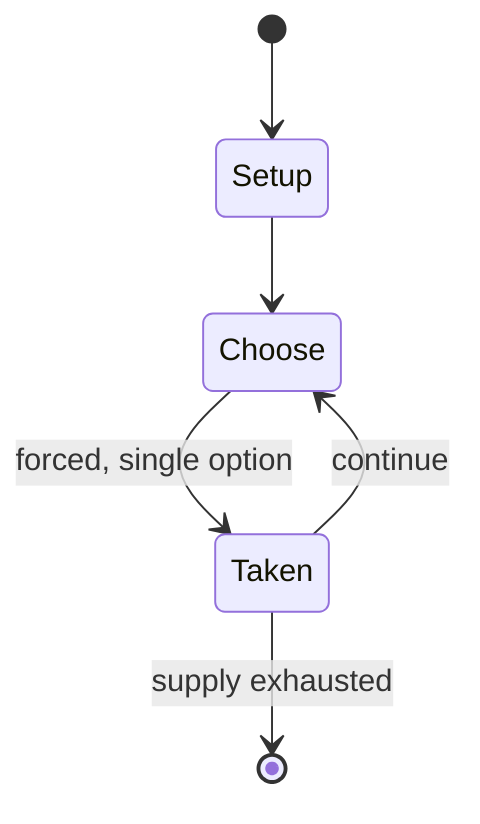

# The Trash Pack

*collectible toy brand*

`the_trash_pack` &nbsp; state: **DEEPENED** &nbsp; method: **heuristic**

## Found layer (recorded, not trusted)

| field | value |
| --- | --- |
| wikidata | Q18216029 |
| wikipedia | Trash Pack |
| genres (source) | -- |
| instance of (source) | video game |
| country of origin | Australia |

## Declared layer (orders bench work)

| field | value |
| --- | --- |
| year created | 2011 |
| epoch | CONTEMPORARY |
| region | OCEANIA |
| media | VIDEO |
| players | -- |
| age band | -- |
| exogenous process | -- |
| loss shape | -- |
| live axes | - |
| horizon | -- |
| scoring shape | -- |
| information | -- |
| interaction | TEAM |
| turn structure | -- |
| tractability | SAMPLING_ONLY |
| randomness | -- |
| luck factor | 0.35 |
| rules complexity | 1.8 |
| strategic depth | 2.25 |
| novelty | 0.4956 |
| solved status | -- |
| strategies | spatial_packing |
| algorithms | -- |

## Object model

```
Episode
  players      : ?
  turn_structure: ?
  horizon       : ?
  scoring       : ?

WorldState     -- simulation state advanced by the engine
Avatar         -- player-controlled agent
Clock          -- frame or tick counter
```

## State transition diagram



## Research item -- turn trace

```
# The Trash Pack -- simulated turn events
# generated from the DECLARED vector, not from a rulebook.
# structure: exo=None loss=None horizon=None scoring=None axes=-

t=0    SETUP        players=2  pot=0  capacity=6
t=1    FORCED       p1 single legal option taken (pot_gain=+1.1)
t=2    FORCED       p1 single legal option taken (pot_gain=+0.7)
t=3    FORCED       p1 single legal option taken (pot_gain=+0.6)
t=4    FORCED       p1 single legal option taken (pot_gain=+1.6)
t=5    FORCED       p1 single legal option taken (pot_gain=+1.4)
t=6    FORCED       p1 single legal option taken (pot_gain=+1.4)
t=7    FORCED       p1 single legal option taken (pot_gain=+0.6)
t=8    ENDTURN      turn passes to p2
t=9    FORCED       p2 single legal option taken (pot_gain=+1.2)
t=10   FORCED       p2 single legal option taken (pot_gain=+1.0)
t=11   FORCED       p2 single legal option taken (pot_gain=+0.6)
t=12   FORCED       p2 single legal option taken (pot_gain=+0.6)
t=13   FORCED       p2 single legal option taken (pot_gain=+0.5)
t=14   FORCED       p2 single legal option taken (pot_gain=+1.0)
t=15   ENDTURN      turn passes to p1
t=16   FORCED       p1 single legal option taken (pot_gain=+0.9)
t=17   ENDTURN      turn passes to p2
t=18   FORCED       p2 single legal option taken (pot_gain=+1.7)
t=19   ENDTURN      turn passes to p1
t=20   FORCED       p1 single legal option taken (pot_gain=+1.0)
t=21   FORCED       p1 single legal option taken (pot_gain=+1.5)
t=22   FORCED       p1 single legal option taken (pot_gain=+1.4)
t=23   FORCED       p1 single legal option taken (pot_gain=+1.3)
t=24   FORCED       p1 single legal option taken (pot_gain=+2.0)
t=25   FORCED       p1 single legal option taken (pot_gain=+1.9)
t=26   FORCED       p1 single legal option taken (pot_gain=+1.0)

terminal: VARIABLE
```

## Source extract

The Trash Pack was a brand of collectible toys produced by Moose Toys, first launched in 2011.
The toys were released in series, all with their own specific themes, and there are seven series
in all. Along with the individual toys, the line also includes other merchandise, such as video
games, activity books and sticker albums. A Trash Pack magazine has also been released through
PONY Magazine.   == Description == The individual toys are called "Trashies" and are typically
made of rubber. Each comes in a container shaped like a trash can, the color and size of which
can change depending on the series. Limited and special edition Trashies are frequently composed
of non-rubber materials. Each Trashie will have a certain name and various toys will have
specific attributes, such as the ability to glow in the dark or change colors. Particularly rare
Trashies have been known to sell for as much as £1,296.   == Availability == The Trash Pack was
available globally, primarily in North America, Europe and Oceania. Outside of the United States
and Australia, companies would distribute the brand to every other region. In Canada, Imports
Dragon distributed The Trash Pack throughout the country

<sub>Wikipedia, CC BY-SA. Retained as evidence for the structural
classification above. Every rule inferred from it is HYPOTHESIZED
until audited against a rulebook.</sub>
