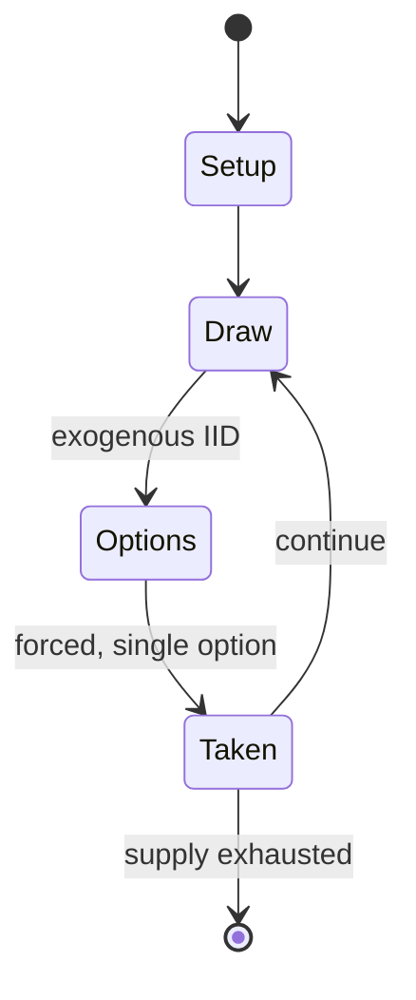

# The Warlock of Firetop Mountain

*board game*

`the_warlock_of_firetop_mountain` &nbsp; state: **DEEPENED** &nbsp; method: **heuristic**

## Found layer (recorded, not trusted)

| field | value |
| --- | --- |
| wikidata | Q102227154 |
| wikipedia | The Warlock of Firetop Mountain (board game) |
| genres (source) | -- |
| instance of (source) | board game |
| country of origin | -- |

## Declared layer (orders bench work)

| field | value |
| --- | --- |
| year created | 1986 |
| epoch | DIGITAL |
| region | -- |
| media | BOARD |
| players | 2-6 |
| age band | -- |
| exogenous process | IID |
| loss shape | -- |
| live axes | - |
| horizon | -- |
| scoring shape | -- |
| information | IMPERFECT |
| interaction | -- |
| turn structure | -- |
| tractability | EXACT_WITH_CUT |
| randomness | DICE, HIDDEN_INFO |
| luck factor | 0.63 |
| rules complexity | 1.74 |
| strategic depth | 2.04 |
| novelty | 0.7312 |
| solved status | -- |
| strategies | deduction |
| algorithms | -- |

## Object model

```
Episode
  players      : 2-6
  turn_structure: ?
  horizon       : ?
  scoring       : ?

Board          -- spatial substrate; cells carry position and occupancy
Piece          -- movable token owned by a player
```

## State transition diagram



## Research item -- turn trace

```
# The Warlock of Firetop Mountain -- simulated turn events
# generated from the DECLARED vector, not from a rulebook.
# structure: exo=IID loss=None horizon=None scoring=None axes=-

t=0    SETUP        players=2  pot=0  capacity=8
t=1    DRAW         p1 roll from d6 pool -> outcome #1  (p=0.059)
t=2    FORCED       p1 single legal option taken (pot_gain=+1.7)
t=3    DRAW         p1 roll from d6 pool -> outcome #5  (p=0.249)
t=4    FORCED       p1 single legal option taken (pot_gain=+0.8)
t=5    DRAW         p1 roll from d6 pool -> outcome #4  (p=0.287)
t=6    FORCED       p1 single legal option taken (pot_gain=+1.3)
t=7    DRAW         p1 roll from d6 pool -> outcome #2  (p=0.175)
t=8    FORCED       p1 single legal option taken (pot_gain=+1.2)
t=9    DRAW         p1 roll from d6 pool -> outcome #3  (p=0.268)
t=10   FORCED       p1 single legal option taken (pot_gain=+1.9)
t=11   DRAW         p1 roll from d6 pool -> outcome #2  (p=0.042)
t=12   FORCED       p1 single legal option taken (pot_gain=+1.2)
t=13   DRAW         p1 roll from d6 pool -> outcome #6  (p=0.102)
t=14   FORCED       p1 single legal option taken (pot_gain=+1.6)
t=15   DRAW         p1 roll from d6 pool -> outcome #1  (p=0.108)
t=16   FORCED       p1 single legal option taken (pot_gain=+0.8)
t=17   DRAW         p1 roll from d6 pool -> outcome #1  (p=0.116)
t=18   FORCED       p1 single legal option taken (pot_gain=+1.5)
t=19   DRAW         p1 roll from d6 pool -> outcome #1  (p=0.108)
t=20   FORCED       p1 single legal option taken (pot_gain=+1.4)
t=21   DRAW         p1 roll from d6 pool -> outcome #2  (p=0.135)
t=22   FORCED       p1 single legal option taken (pot_gain=+0.6)
t=23   DRAW         p1 roll from d6 pool -> outcome #6  (p=0.087)
t=24   FORCED       p1 single legal option taken (pot_gain=+1.8)
t=25   ENDTURN      turn passes to p2
t=26   DRAW         p2 roll from d6 pool -> outcome #5  (p=0.084)
t=27   FORCED       p2 single legal option taken (pot_gain=+0.7)

terminal: VARIABLE
```

## Conditions

| kind | threshold | effect | trigger |
| --- | --- | --- | --- |
| WIN | -- | -- | The first player to deduce the correct key combination of the Warlock's treasure chest, obtain those keys and open the chest is the winner. |

## Source extract

The Warlock of Firetop Mountain is a Games Workshop adventure board game published in 1986,
based on the Fighting Fantasy gamebook The Warlock of Firetop Mountain. The game can be played
by 2-6 players. A typical game has a length of two hours.   == Gameplay == The game consists of
the players roaming a labyrinth, where they fight creatures and find treasures. The players have
three basic scores which affect combat and how a player can react to traps: SKILL, STAMINA and
LUCK, mirroring the system in the original gamebook. To win, the players travel across the game
board to where the dungeon ends and open the treasure chest of the evil warlock Zagor. However,
whilst doing this the players must work out the combination involving three keys that will allow
them access to the treasure chest and obtain these keys, either by finding or stealing them.
Players do this by using a system similar to Cluedo, asking other players whether they have key
cards showing a particular number and secretly noting the answer given.   === Components === The
contents of the game are:  A large six-piece playing board Six plastic playing figures which
represent the players Fifteen full-colour Key Challenge c

<sub>Wikipedia, CC BY-SA. Retained as evidence for the structural
classification above. Every rule inferred from it is HYPOTHESIZED
until audited against a rulebook.</sub>
