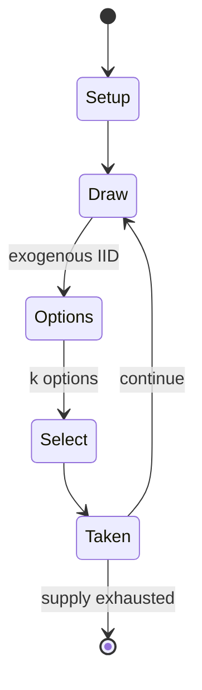

# The Witcher Adventure Game

*2014 board and video game*

`the_witcher_adventure_game` &nbsp; state: **DEEPENED** &nbsp; method: **heuristic**

## Found layer (recorded, not trusted)

| field | value |
| --- | --- |
| wikidata | Q28127430 |
| wikipedia | The Witcher Adventure Game |
| genres (source) | board video game |
| instance of (source) | board game, video game |
| country of origin | Poland |

## Declared layer (orders bench work)

| field | value |
| --- | --- |
| year created | 2014 |
| epoch | CONTEMPORARY |
| region | EUROPE_EAST |
| media | BOARD, DICE, VIDEO |
| players | 2-4 |
| age band | -- |
| exogenous process | IID |
| loss shape | -- |
| live axes | SELECT |
| horizon | VARIABLE |
| scoring shape | SET_COLLECTION_CONVEX |
| information | ASYMMETRIC |
| interaction | SOLITAIRE |
| turn structure | STRICT_TURN |
| tractability | SAMPLING_ONLY |
| randomness | DICE |
| luck factor | 0.58 |
| rules complexity | 2.24 |
| strategic depth | 2.12 |
| novelty | 0.6804 |
| solved status | -- |
| strategies | set_collection |
| algorithms | -- |

## Object model

```
Episode
  players      : 2-4
  turn_structure: STRICT_TURN
  horizon       : VARIABLE
  scoring       : SET_COLLECTION_CONVEX

Board          -- spatial substrate; cells carry position and occupancy
Piece          -- movable token owned by a player
DicePool       -- n dice, each an iid categorical draw
Roll           -- realised outcome of a pool
WorldState     -- simulation state advanced by the engine
Avatar         -- player-controlled agent
Clock          -- frame or tick counter
OptionSet      -- the choices available after an exogenous draw
```

## State transition diagram



## Research item -- turn trace

```
# The Witcher Adventure Game -- simulated turn events
# generated from the DECLARED vector, not from a rulebook.
# structure: exo=IID loss=None horizon=VARIABLE scoring=SET_COLLECTION_CONVEX axes=SELECT

t=0    SETUP        players=2  pot=0  capacity=3
t=1    DRAW         p1 roll from d6 pool -> outcome #1  (p=0.114)
t=2    SELECT       p1 4 options; take #1  (pot_gain=+0.7, capacity=-0)
t=3    DRAW         p1 roll from d6 pool -> outcome #3  (p=0.286)
t=4    SELECT       p1 1 options; take #1  (pot_gain=+2.8, capacity=-2)
t=5    DRAW         p1 roll from d6 pool -> outcome #2  (p=0.144)
t=6    SELECT       p1 1 options; take #1  (pot_gain=+3.1, capacity=-1)
t=7    DRAW         p1 roll from d6 pool -> outcome #6  (p=0.253)
t=8    SELECT       p1 3 options; take #3  (pot_gain=+0.5, capacity=-1)
t=9    DRAW         p1 roll from d6 pool -> outcome #2  (p=0.222)
t=10   SELECT       p1 1 options; take #1  (pot_gain=+2.5, capacity=-2)
t=11   DRAW         p1 roll from d6 pool -> outcome #5  (p=0.298)
t=12   SELECT       p1 4 options; take #3  (pot_gain=+0.8, capacity=-1)
t=13   DRAW         p1 roll from d6 pool -> outcome #6  (p=0.226)
t=14   SELECT       p1 4 options; take #4  (pot_gain=+1.6, capacity=-2)
t=15   DRAW         p1 roll from d6 pool -> outcome #2  (p=0.245)
t=16   SELECT       p1 3 options; take #3  (pot_gain=+1.9, capacity=-1)
t=17   ENDTURN      turn passes to p2
t=18   DRAW         p2 roll from d6 pool -> outcome #6  (p=0.242)
t=19   SELECT       p2 3 options; take #2  (pot_gain=+1.2, capacity=-0)
t=20   DRAW         p2 roll from d6 pool -> outcome #6  (p=0.190)
t=21   SELECT       p2 4 options; take #2  (pot_gain=+1.4, capacity=-0)
t=22   DRAW         p2 roll from d6 pool -> outcome #4  (p=0.145)
t=23   SELECT       p2 1 options; take #1  (pot_gain=+1.4, capacity=-2)
t=24   DRAW         p2 roll from d6 pool -> outcome #3  (p=0.211)
t=25   SELECT       p2 3 options; take #2  (pot_gain=+3.0, capacity=-2)
t=26   DRAW         p2 roll from d6 pool -> outcome #4  (p=0.235)
t=27   SELECT       p2 4 options; take #2  (pot_gain=+0.9, capacity=-1)

terminal: VARIABLE
```

## Conditions

| kind | threshold | effect | trigger |
| --- | --- | --- | --- |
| TERMINATE | 1 player | -- | The game ends when one player completes a third main quest, after which the remaining players play a final turn, and the winner is the person with the highest number of victory points. |
| PENALTY | -- | -- | However, some reviewers criticized technical and functional issues such as long delays on AI turns and a lack of convenient solutions (IGN, Hardcore Gamer, Hardcore Droid), as well as technical problems and the lack of a |

## Source extract

The Witcher Adventure Game (Polish: Wiedźmin: Gra przygodowa) is a Polish board game set in The
Witcher universe, released in 2014 by CD Projekt RED in cooperation with Fantasy Flight Games.
Its designer was Ignacy Trzewiczek. The game is intended for 2–4 players, who assume one of four
characters known from the universe—Geralt, Triss Merigold, Dandelion, or Yarpen Zigrin—competing
to gain the largest number of victory points by completing quests and defeating monsters. In the
same year, an electronic version of the game developed by CD Projekt Red and Can Explode Games
was also released, constituting a digital adaptation of the board edition, published for
Microsoft Windows, Android, and iOS. The game received a mixed reception from reviewers, who
primarily praised its atmosphere and references to the world of The Witcher, while pointing to
limited interaction between players, randomness, and repetitive gameplay.   == Setting ==  The
game is set in the The Witcher universe, created by Andrzej Sapkowski. The action takes place in
a fictional world inspired by medieval Europe, inhabited by humans and numerous non-human beings
such as elfves, dwarfs, and monsters derived from Slavic

<sub>Wikipedia, CC BY-SA. Retained as evidence for the structural
classification above. Every rule inferred from it is HYPOTHESIZED
until audited against a rulebook.</sub>
