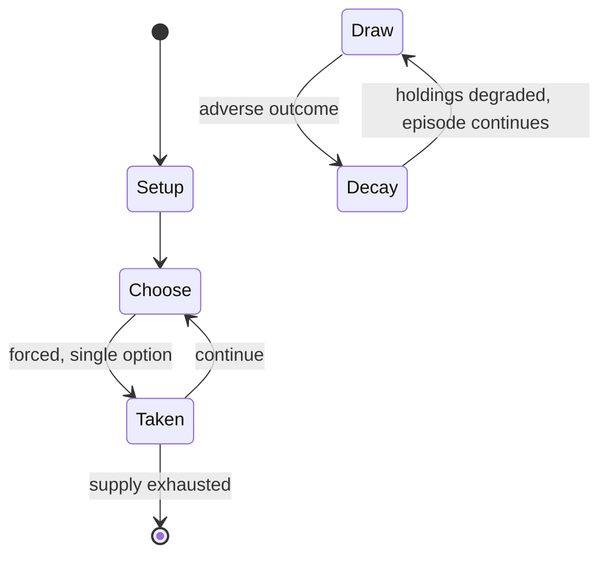

# Thirty-one (card game)

`thirty_one_card_game` &nbsp; state: **DEEPENED** &nbsp; method: **heuristic**

## Found layer (recorded, not trusted)

| field | value |
| --- | --- |
| wikidata | Q1425194 |
| wikipedia | Thirty-one (card game) |
| genres (source) | -- |
| instance of (source) | -- |
| country of origin | -- |

## Declared layer (orders bench work)

| field | value |
| --- | --- |
| year created | -- |
| epoch | -- |
| region | -- |
| media | CARD |
| players | -- |
| age band | -- |
| exogenous process | -- |
| loss shape | PARTIAL_DECAY |
| live axes | DISCARD |
| horizon | -- |
| scoring shape | -- |
| information | -- |
| interaction | SOLITAIRE |
| turn structure | -- |
| tractability | SAMPLING_ONLY |
| randomness | -- |
| luck factor | 0.35 |
| rules complexity | 2.28 |
| strategic depth | 2.25 |
| novelty | 0.5424 |
| solved status | -- |
| strategies | memory_recall |
| algorithms | -- |

## Object model

```
Episode
  players      : ?
  turn_structure: ?
  horizon       : ?
  scoring       : ?

Deck           -- ordered multiset, drawn without replacement
Hand           -- private multiset held by one player
DiscardPile    -- public accumulation of spent cards
DiscardChoice  -- what is given up to satisfy a limit
```

## State transition diagram



## Research item -- turn trace

```
# Thirty-one (card game) -- simulated turn events
# generated from the DECLARED vector, not from a rulebook.
# structure: exo=None loss=PARTIAL_DECAY horizon=None scoring=None axes=DISCARD

t=0    SETUP        players=2  pot=0  capacity=6
t=1    FORCED       p1 single legal option taken (pot_gain=+1.3)
t=2    DISCARD      p1 discards to hand limit
t=3    FORCED       p1 single legal option taken (pot_gain=+1.9)
t=4    DISCARD      p1 discards to hand limit
t=5    FORCED       p1 single legal option taken (pot_gain=+1.5)
t=6    ENDTURN      turn passes to p2
t=7    FORCED       p2 single legal option taken (pot_gain=+1.3)
t=8    DISCARD      p2 discards to hand limit
t=9    FORCED       p2 single legal option taken (pot_gain=+0.8)
t=10   FORCED       p2 single legal option taken (pot_gain=+0.6)
t=11   FORCED       p2 single legal option taken (pot_gain=+1.5)
t=12   FORCED       p2 single legal option taken (pot_gain=+0.6)
t=13   DISCARD      p2 discards to hand limit
t=14   FORCED       p2 single legal option taken (pot_gain=+1.2)
t=15   DISCARD      p2 discards to hand limit
t=16   FORCED       p2 single legal option taken (pot_gain=+1.0)
t=17   ENDTURN      turn passes to p1
t=18   FORCED       p1 single legal option taken (pot_gain=+1.3)
t=19   ENDTURN      turn passes to p2
t=20   FORCED       p2 single legal option taken (pot_gain=+1.1)
t=21   DISCARD      p2 discards to hand limit
t=22   FORCED       p2 single legal option taken (pot_gain=+1.8)
t=23   FORCED       p2 single legal option taken (pot_gain=+2.0)
t=24   ENDTURN      turn passes to p1
t=25   FORCED       p1 single legal option taken (pot_gain=+1.7)
t=26   DISCARD      p1 discards to hand limit
t=27   ENDTURN      turn passes to p2

terminal: VARIABLE
```

## Conditions

| kind | threshold | effect | trigger |
| --- | --- | --- | --- |
| TERMINATE | 1 token | -- | If any player acquires a blitz in their hand, they immediately show it, the round ends, all other players place one token or coin on the table, and the player who blitzed takes all of the tokens or coins on the table. |
| BOUNDARY | 2 lives | -- | If the knocker does not have a higher value than at least one other player, the knocker loses two lives. |
| BOUNDARY | 2 tokens | -- | A player who knocks but does not beat at least one other player, pays two tokens. |
| ELIMINATE | -- | out of the game | A player with no pennies left is said to be "on the county", and is out of the game if they lose any further lives. |
| ELIMINATE | -- | -- | On losing again, the player drops out of the game. |
| ELIMINATE | -- | -- | Typically the first players knocked out will often choose an active player and place a "side bet" on which player will win or go further in the game. |
| TERMINATE | -- | -- | The round ends when the player to the right of the player who knocked has had a final turn. |
| TERMINATE | -- | -- | If no one knocks by the time a player exhausts the stock, the round ends in a draw. |
| TERMINATE | -- | -- | In addition, if the first person to play knocks on their first turn, the round ends and all players reveal their hand without drawing any more cards. |
| BOUNDARY | -- | -- | When it is a player's turn, and that player believes their hand is high enough to beat at least one other opponent, that player may knock on the table in lieu of drawing and discarding. |

## Source extract

Thirty-one or trente et un is a gambling card game played by two to seven people, where players
attempt to assemble a hand which totals 31. Such a goal has formed the whole or part of various
games since the 15th century such as commerce, cribbage, trentuno, and wit and reason.  31 is
popular in America and Britain. Although the game is also known as scat, it has no connection
with Germany's national card game of Skat. It should also not be confused with other games
called 31 including Schwimmen (also known as Schnauz or Hosen runter) and the Greek banking game
of 31.   == Name == The object is to obtain a hand with a value total as close as possible to
31, from which the name of the game is taken. The game is also known as blitz, scat, Cadillac in
south Louisiana and Mississippi, cad in Pennsylvania, whammy! in central Indiana, juble in
Oklahoma and Kansas, as also as kitty, high hat, ride the bus and Geronimo. The game is also
known as nickle knock in Hawaii.   == History == Thirty-one is first mentioned in a French
translation of a 1440 sermon by the Italian, Saint Bernadine, so may be of Italian origin. It is
mentioned by Rabelais, Cardano and numerous other 16th century source

<sub>Wikipedia, CC BY-SA. Retained as evidence for the structural
classification above. Every rule inferred from it is HYPOTHESIZED
until audited against a rulebook.</sub>
