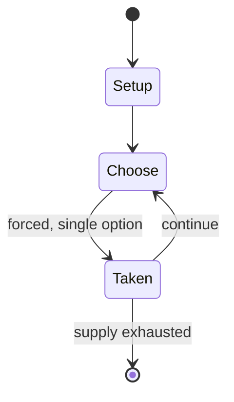

# three musketeers

*abstract strategy game*

`three_musketeers` &nbsp; state: **DEEPENED** &nbsp; method: **heuristic**

## Found layer (recorded, not trusted)

| field | value |
| --- | --- |
| wikidata | Q1088769 |
| wikipedia | Three musketeers (game) |
| genres (source) | -- |
| instance of (source) | abstract strategy game, solved game |
| country of origin | -- |

## Declared layer (orders bench work)

| field | value |
| --- | --- |
| year created | 2011 |
| epoch | CONTEMPORARY |
| region | -- |
| media | ABSTRACT, BOARD |
| players | -- |
| age band | -- |
| exogenous process | -- |
| loss shape | -- |
| live axes | SPATIAL |
| horizon | -- |
| scoring shape | -- |
| information | -- |
| interaction | SOLITAIRE |
| turn structure | STRICT_TURN |
| tractability | EXACT |
| randomness | -- |
| luck factor | 0.05 |
| rules complexity | 2.01 |
| strategic depth | 1.4 |
| novelty | 0.8085 |
| solved status | SOLVED_STRONG |
| strategies | -- |
| algorithms | -- |

## Object model

```
Episode
  players      : ?
  turn_structure: STRICT_TURN
  horizon       : ?
  scoring       : ?

Board          -- spatial substrate; cells carry position and occupancy
Piece          -- movable token owned by a player
Placement      -- position subject to geometric legality
```

## State transition diagram



## Research item -- turn trace

```
# three musketeers -- simulated turn events
# generated from the DECLARED vector, not from a rulebook.
# structure: exo=None loss=None horizon=None scoring=None axes=SPATIAL

t=0    SETUP        players=2  pot=0  capacity=5
t=1    FORCED       p1 single legal option taken (pot_gain=+0.7)
t=2    SPATIAL      p1 places at (4,0); adjacency legal
t=3    ENDTURN      turn passes to p2
t=4    FORCED       p2 single legal option taken (pot_gain=+1.1)
t=5    FORCED       p2 single legal option taken (pot_gain=+1.4)
t=6    FORCED       p2 single legal option taken (pot_gain=+1.8)
t=7    ENDTURN      turn passes to p1
t=8    FORCED       p1 single legal option taken (pot_gain=+1.0)
t=9    SPATIAL      p1 places at (0,5); adjacency legal
t=10   FORCED       p1 single legal option taken (pot_gain=+1.8)
t=11   FORCED       p1 single legal option taken (pot_gain=+1.0)
t=12   FORCED       p1 single legal option taken (pot_gain=+0.7)
t=13   SPATIAL      p1 places at (0,2); adjacency legal
t=14   FORCED       p1 single legal option taken (pot_gain=+0.8)
t=15   SPATIAL      p1 places at (7,5); adjacency legal
t=16   ENDTURN      turn passes to p2
t=17   FORCED       p2 single legal option taken (pot_gain=+0.8)
t=18   SPATIAL      p2 places at (0,4); adjacency legal
t=19   FORCED       p2 single legal option taken (pot_gain=+1.4)
t=20   FORCED       p2 single legal option taken (pot_gain=+1.2)
t=21   SPATIAL      p2 places at (4,4); adjacency legal
t=22   ENDTURN      turn passes to p1
t=23   FORCED       p1 single legal option taken (pot_gain=+1.5)
t=24   FORCED       p1 single legal option taken (pot_gain=+0.7)
t=25   FORCED       p1 single legal option taken (pot_gain=+1.0)
t=26   FORCED       p1 single legal option taken (pot_gain=+1.2)

terminal: VARIABLE
```

## Source extract

Three Musketeers is an abstract strategy board game by Haar Hoolim.  It was published in Sid
Sackson's A Gamut of Games (2011).  Like the traditional game fox and geese, it uses the
principle of unequal forces; the two players neither use the same types of pieces nor the same
rules, and their victory conditions are different.   == Equipment == Twenty-five tokens (such as
checkers or poker chips), twenty-two light and three dark. A board marked out as a 5 by 5 grid.
== Rules == One player takes the part of the three musketeers, the other of Cardinal Richelieu's
men ("the enemy"). The musketeer player sets up their tokens in two opposite corners and in the
center space; the enemy places tokens in all remaining board spaces:  The players take turns
moving one piece, beginning with the musketeer player. The musketeer player must move a
musketeer to any orthogonally (non-diagonal) adjacent space occupied by an enemy piece, removing
that enemy piece from the game. Next, the enemy must move one enemy piece to any orthogonally
adjacent empty space. The enemy wins if it forces all three musketeers to the same row or
column. The musketeers win if on their turn they cannot move due to a lac

<sub>Wikipedia, CC BY-SA. Retained as evidence for the structural
classification above. Every rule inferred from it is HYPOTHESIZED
until audited against a rulebook.</sub>
