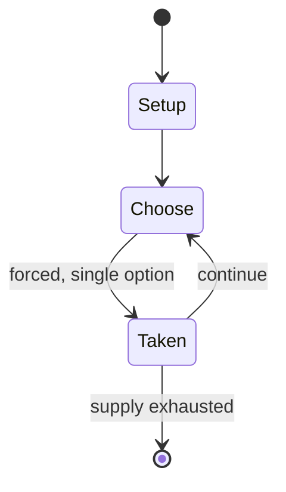

# Thurn and Taxis

*board game*

`thurn_and_taxis` &nbsp; state: **DEEPENED** &nbsp; method: **heuristic**

## Found layer (recorded, not trusted)

| field | value |
| --- | --- |
| wikidata | Q1852249 |
| wikipedia | Thurn and Taxis (board game) |
| genres (source) | historical board game |
| instance of (source) | board game |
| country of origin | Germany |

## Declared layer (orders bench work)

| field | value |
| --- | --- |
| year created | 2006 |
| epoch | CONTEMPORARY |
| region | EUROPE_WEST |
| media | BOARD |
| players | 2-4 |
| age band | -- |
| exogenous process | NONE |
| loss shape | OPPORTUNITY_ONLY |
| live axes | ORDER |
| horizon | -- |
| scoring shape | LINEAR_ACCUMULATION |
| information | PERFECT |
| interaction | SOLITAIRE |
| turn structure | -- |
| tractability | SAMPLING_ONLY |
| randomness | NONE |
| luck factor | 0.35 |
| rules complexity | 2.09 |
| strategic depth | 2.25 |
| novelty | 0.5646 |
| solved status | -- |
| strategies | route_optimisation |
| algorithms | -- |

## Object model

```
Episode
  players      : 2-4
  turn_structure: ?
  horizon       : ?
  scoring       : LINEAR_ACCUMULATION

Board          -- spatial substrate; cells carry position and occupancy
Piece          -- movable token owned by a player
Sequence       -- the permutation under the player's control
```

## State transition diagram



## Research item -- turn trace

```
# Thurn and Taxis -- simulated turn events
# generated from the DECLARED vector, not from a rulebook.
# structure: exo=NONE loss=OPPORTUNITY_ONLY horizon=None scoring=LINEAR_ACCUMULATION axes=ORDER

t=0    SETUP        players=2  pot=0  capacity=3
t=1    FORCED       p1 single legal option taken (pot_gain=+0.6)
t=2    FORCED       p1 single legal option taken (pot_gain=+1.7)
t=3    ENDTURN      turn passes to p2
t=4    FORCED       p2 single legal option taken (pot_gain=+1.6)
t=5    FORCED       p2 single legal option taken (pot_gain=+1.8)
t=6    FORCED       p2 single legal option taken (pot_gain=+1.1)
t=7    FORCED       p2 single legal option taken (pot_gain=+1.2)
t=8    ENDTURN      turn passes to p1
t=9    FORCED       p1 single legal option taken (pot_gain=+1.2)
t=10   FORCED       p1 single legal option taken (pot_gain=+0.6)
t=11   ENDTURN      turn passes to p2
t=12   FORCED       p2 single legal option taken (pot_gain=+1.9)
t=13   ENDTURN      turn passes to p1
t=14   FORCED       p1 single legal option taken (pot_gain=+0.6)
t=15   ENDTURN      turn passes to p2
t=16   FORCED       p2 single legal option taken (pot_gain=+1.0)
t=17   FORCED       p2 single legal option taken (pot_gain=+0.6)
t=18   FORCED       p2 single legal option taken (pot_gain=+1.1)
t=19   FORCED       p2 single legal option taken (pot_gain=+1.3)
t=20   FORCED       p2 single legal option taken (pot_gain=+1.6)
t=21   ENDTURN      turn passes to p1
t=22   FORCED       p1 single legal option taken (pot_gain=+1.8)
t=23   FORCED       p1 single legal option taken (pot_gain=+0.7)
t=24   FORCED       p1 single legal option taken (pot_gain=+1.3)
t=25   FORCED       p1 single legal option taken (pot_gain=+1.7)
t=26   FORCED       p1 single legal option taken (pot_gain=+0.7)

terminal: VARIABLE
```

## Conditions

| kind | threshold | effect | trigger |
| --- | --- | --- | --- |
| TERMINATE | 1 player | -- | Play ends after each player has had an equal number of turns and at least one player has either run out of markers or completed the sequence of target lengths; the first player to satisfy either condition also receives a |
| BOUNDARY | -- | awarded for the length of the route | Points are awarded for the length of the route, for marking all cities in any of the different regions, for marking a city in every province, and for completing routes at least as long as a succession of target lengths t |

## Source extract

Thurn and Taxis is a board game designed by Karen and Andreas Seyfarth and published in 2006 by
Hans im Glück in German (as Thurn und Taxis) and by Rio Grande Games in English.  In the game,
players seek to build postal networks and post offices in Bavaria and surrounding areas, as did
the house of Thurn und Taxis in the 16th century. The game won the prestigious 2006 Spiel des
Jahres award.   == Gameplay == The board is a map of southern Germany and nearby parts of other
countries; it is marked into nine provinces, most of which are grouped into five regions.  The
map shows 22 cities and a network of roads connecting them.  Each player has a supply of 20
markers (houses) to place on the cities.  Each city may be marked once by each player and the
markers remain in place. At each turn, the players draw one or more cards representing cities,
then play one or more cards, forming or extending a route through successive cities along a
sequence of roads.  The route may be extended at either end but cannot include the same city
twice.  After reaching a certain length, a route may be closed and scored.  The player then puts
markers on some of the cities on the route that he or she has not

<sub>Wikipedia, CC BY-SA. Retained as evidence for the structural
classification above. Every rule inferred from it is HYPOTHESIZED
until audited against a rulebook.</sub>
