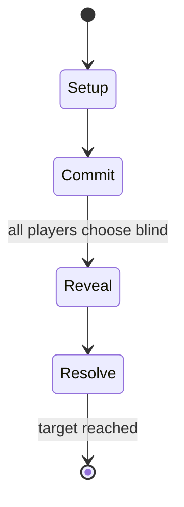

# Tic-tac-toe

`tic_tac_toe` &nbsp; state: **DEEPENED** &nbsp; method: **heuristic**

## Found layer (recorded, not trusted)

| field | value |
| --- | --- |
| wikidata | Q210339 |
| wikipedia | Tic-tac-toe |
| genres (source) | -- |
| instance of (source) | -- |
| country of origin | -- |

## Declared layer (orders bench work)

| field | value |
| --- | --- |
| year created | -1300 |
| epoch | DEEP_ANTIQUITY |
| region | -- |
| media | EDUCATIONAL, PAPER_AND_PENCIL |
| players | 2 |
| age band | CHILD |
| exogenous process | NONE |
| loss shape | OPPORTUNITY_ONLY |
| live axes | SPATIAL |
| horizon | RACE_TO_TARGET |
| scoring shape | -- |
| information | SIMULTANEOUS |
| interaction | COMPETITIVE |
| turn structure | SIMULTANEOUS |
| tractability | EXACT |
| randomness | SIMULTANEOUS_CHOICE |
| luck factor | 0.05 |
| rules complexity | 2.56 |
| strategic depth | 2.2 |
| novelty | 0.8304 |
| solved status | SOLVED_STRONG |
| strategies | blocking, signalling |
| algorithms | minimax |

## Object model

```
Episode
  players      : 2
  turn_structure: SIMULTANEOUS
  horizon       : RACE_TO_TARGET
  scoring       : ?

Placement      -- position subject to geometric legality
```

## State transition diagram



## Research item -- turn trace

```
# Tic-tac-toe -- simulated turn events
# generated from the DECLARED vector, not from a rulebook.
# structure: exo=NONE loss=OPPORTUNITY_ONLY horizon=RACE_TO_TARGET scoring=None axes=SPATIAL

t=0    SETUP        players=2  pot=0  capacity=4
t=1    FORCED       p1 single legal option taken (pot_gain=+0.8)
t=2    FORCED       p1 single legal option taken (pot_gain=+1.9)
t=3    FORCED       p1 single legal option taken (pot_gain=+1.7)
t=4    SPATIAL      p1 places at (1,2); adjacency legal
t=5    FORCED       p1 single legal option taken (pot_gain=+0.7)
t=6    SPATIAL      p1 places at (1,1); adjacency legal
t=7    FORCED       p1 single legal option taken (pot_gain=+1.8)
t=8    ENDTURN      turn passes to p2
t=9    FORCED       p2 single legal option taken (pot_gain=+1.7)
t=10   ENDTURN      turn passes to p1
t=11   FORCED       p1 single legal option taken (pot_gain=+0.7)
t=12   ENDTURN      turn passes to p2
t=13   FORCED       p2 single legal option taken (pot_gain=+1.4)
t=14   SPATIAL      p2 places at (6,6); adjacency legal
t=15   FORCED       p2 single legal option taken (pot_gain=+1.3)
t=16   ENDTURN      turn passes to p1
t=17   FORCED       p1 single legal option taken (pot_gain=+1.6)
t=18   FORCED       p1 single legal option taken (pot_gain=+0.7)
t=19   FORCED       p1 single legal option taken (pot_gain=+1.8)
t=20   SPATIAL      p1 places at (2,7); adjacency legal
t=21   ENDTURN      turn passes to p2
t=22   FORCED       p2 single legal option taken (pot_gain=+1.7)
t=23   FORCED       p2 single legal option taken (pot_gain=+1.9)
t=24   SPATIAL      p2 places at (6,3); adjacency legal
t=25   ENDTURN      turn passes to p1
t=26   FORCED       p1 single legal option taken (pot_gain=+1.8)
t=27   SPATIAL      p1 places at (7,7); adjacency legal

terminal: RACE_TO_TARGET
```

## Conditions

| kind | threshold | effect | trigger |
| --- | --- | --- | --- |
| BOUNDARY | 9 points | -- | Tic-tac-toe's incidence structure consists of nine points, three horizontal lines, three vertical lines, and two diagonal lines, with each line consisting of at least three points. |
| WIN | -- | -- | In the following example, the first player (X) wins the game in seven steps: |
| WIN | -- | -- | Many board games share the element of trying to be the first to get n-in-a-row, including three men's morris, nine men's morris, pente, gomoku, Qubic, Connect Four, Quarto, Gobblet, Order and Chaos, Toss Across, and Mojo |
| BOUNDARY | -- | -- | A player can play a perfect game of tic-tac-toe (to win or at least draw) if, each time it is their turn to play, they choose the first available move from the following list, as used in Newell and Simon's 1972 tic-tac-t |

## Source extract

Tic-tac-toe (American English), noughts and crosses (Commonwealth English), or Xs and Os
(Canadian or Irish English) is a paper-and-pencil game for two players who take turns marking
the spaces in a three-by-three grid, one with Xs and the other with Os. A player wins when they
mark all three spaces of a row, column, or diagonal of the grid, whereupon they traditionally
draw a line through those three marks to indicate the win. It is a solved game, with a forced
draw assuming best play from both players.   == Names == In American English, the game is known
as "tic-tac-toe". It may also be spelled "tick-tack-toe", "tick-tat-toe", or "tit-tat-toe". In
Commonwealth English (particularly British, South African, Indian, Australian, and New Zealand
English), the game is known as "noughts and crosses", alternatively spelled "naughts and
crosses". This name derives from the shape of the marks in the game (i.e the X and O); "nought"
is another name for the number zero, while "cross" refers to the X shape. Sometimes, tic-tac-toe
(where players keep adding "pieces") and three men's morris (where pieces start to move after a
certain number have been placed) are confused with each other.   == G

<sub>Wikipedia, CC BY-SA. Retained as evidence for the structural
classification above. Every rule inferred from it is HYPOTHESIZED
until audited against a rulebook.</sub>
