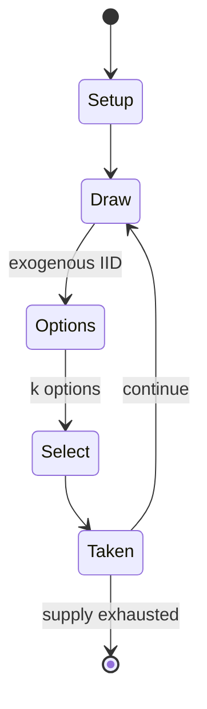

# Ticket to Ride (board game)

`ticket_to_ride_board_game` &nbsp; state: **DEEPENED** &nbsp; method: **heuristic**

## Found layer (recorded, not trusted)

| field | value |
| --- | --- |
| wikidata | Q228308 |
| wikipedia | Ticket to Ride (board game) |
| genres (source) | -- |
| instance of (source) | -- |
| country of origin | -- |

## Declared layer (orders bench work)

| field | value |
| --- | --- |
| year created | 2004 |
| epoch | CONTEMPORARY |
| region | -- |
| media | BOARD, CARD, PUZZLE |
| players | 2-5 |
| age band | -- |
| exogenous process | IID |
| loss shape | -- |
| live axes | SELECT |
| horizon | VARIABLE |
| scoring shape | LINEAR_ACCUMULATION |
| information | -- |
| interaction | SOLITAIRE |
| turn structure | TICK_BASED |
| tractability | SAMPLING_ONLY |
| randomness | HIDDEN_INFO |
| luck factor | 0.35 |
| rules complexity | 2.22 |
| strategic depth | 2.25 |
| novelty | 0.7104 |
| solved status | -- |
| strategies | route_optimisation |
| algorithms | -- |

## Object model

```
Episode
  players      : 2-5
  turn_structure: TICK_BASED
  horizon       : VARIABLE
  scoring       : LINEAR_ACCUMULATION

Board          -- spatial substrate; cells carry position and occupancy
Piece          -- movable token owned by a player
Deck           -- ordered multiset, drawn without replacement
Hand           -- private multiset held by one player
DiscardPile    -- public accumulation of spent cards
Configuration  -- the arrangement to be resolved
Constraint     -- predicate a legal configuration must satisfy
OptionSet      -- the choices available after an exogenous draw
```

## State transition diagram



## Research item -- clock trace

```
# Ticket to Ride (board game) -- simulated clock trace (no turn boundary)
# generated from the DECLARED vector, not from a rulebook.
# structure: exo=IID loss=None horizon=VARIABLE scoring=LINEAR_ACCUMULATION axes=SELECT

clk=0.000s  START        agents=5  clock=free running
clk=0.517s  ACTION       a2 acts continuously; no turn boundary crossed
clk=3.324s  CONTEST      a1 and a2 contend for the same resource
clk=5.349s  ACTION       a1 acts continuously; no turn boundary crossed
clk=8.233s  CONTEST      a1 and a2 contend for the same resource
clk=8.512s  CONTEST      a4 and a5 contend for the same resource
clk=9.555s  ACTION       a2 acts continuously; no turn boundary crossed
clk=10.520s  CONTEST      a1 and a2 contend for the same resource
clk=12.472s  ACTION       a4 acts continuously; no turn boundary crossed
clk=15.091s  ACTION       a5 acts continuously; no turn boundary crossed
clk=15.863s  ACTION       a4 acts continuously; no turn boundary crossed
clk=17.037s  ACTION       a1 acts continuously; no turn boundary crossed
clk=17.478s  INFRACTION   a2 commits infraction (count=1)
clk=19.991s  ACTION       a2 acts continuously; no turn boundary crossed
clk=21.255s  SCORE        a1 scores (+2)
clk=22.505s  ACTION       a5 acts continuously; no turn boundary crossed
clk=24.436s  ACTION       a4 acts continuously; no turn boundary crossed
clk=25.179s  STOPPAGE     clock halts; state frozen
clk=27.034s  ACTION       a4 acts continuously; no turn boundary crossed
clk=27.568s  ACTION       a1 acts continuously; no turn boundary crossed
clk=30.528s  ACTION       a5 acts continuously; no turn boundary crossed
clk=31.813s  CONTEST      a4 and a5 contend for the same resource
clk=33.155s  SCORE        a4 scores (+3)
clk=33.945s  SCORE        a3 scores (+1)
clk=36.283s  SCORE        a3 scores (+3)
clk=37.190s  INFRACTION   a3 commits infraction (count=1)
clk=37.982s  ACTION       a2 acts continuously; no turn boundary crossed

note: elapsed time, not move count, is the episode's ordering variable.
```

## Conditions

| kind | threshold | effect | trigger |
| --- | --- | --- | --- |
| TERMINATE | 1 player | -- | The game ends when one player possesses a number of their remaining coloured train pieces which falls below three trains (except for the Rails and Sails version, which is ended when the combined number of any player's ow |
| PENALTY | -- | -- | The Rails and Sails and Great Lakes versions use two draw card piles of 3 train cards and 3 ship cards instead,, with the restriction that drawing a face-up wild Locomotive card forfeits drawing another card for that tur |
| PENALTY | -- | -- | On 26 April 2006 a version was released entitled Ticket to Ride: Märklin by Märklin, a German toy company best known for model railways and technical toys, based on a map of 1902 Germany. |

## Source extract

Ticket to Ride is a series of turn-based strategy railway-themed Eurogames designed by Alan R.
Moon, the first of which was released in 2004 by Days of Wonder. This game is the world's
highest-selling train game. As of 2026, over 20 million copies of the game have been sold
worldwide, and it has been translated into 33 languages. Days of Wonder has released digital
versions of the board games, card games, puzzles, and a foreshadowed on-screen adaptation.   ==
Concept ==   === Inception === The game was created by Alan R. Moon. The inspiration for the
game was ocean waves, which Moon had viewed on a walk while reflecting on an unsuccessful
session of a complex war game.   === Gateway game === The introductory nature of Ticket to Ride
has been noted. Alan R. Moon wrote, "the rules are simple enough to write on a train ticket –
each turn you either draw more cards, claim a route or get more destination tickets". Days of
Wonder wrote in its promotion that Ticket to Ride's elegantly simple game play can be learned in
less than five minutes." Giving the game a 4.7 out of 5, "Board Game Review" wrote, "those in
the board game community call games like these ‘Entry Level’. Ticket To Ride e

<sub>Wikipedia, CC BY-SA. Retained as evidence for the structural
classification above. Every rule inferred from it is HYPOTHESIZED
until audited against a rulebook.</sub>
