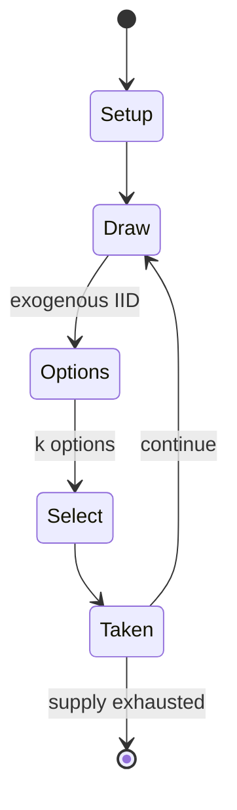

# To Court the King

*dice game*

`to_court_the_king` &nbsp; state: **DEEPENED** &nbsp; method: **heuristic**

## Found layer (recorded, not trusted)

| field | value |
| --- | --- |
| wikidata | Q2477995 |
| wikipedia | To Court the King |
| genres (source) | -- |
| instance of (source) | dice game |
| country of origin | -- |

## Declared layer (orders bench work)

| field | value |
| --- | --- |
| year created | -- |
| epoch | -- |
| region | -- |
| media | DICE |
| players | 2-5 |
| age band | -- |
| exogenous process | IID |
| loss shape | -- |
| live axes | SELECT |
| horizon | -- |
| scoring shape | -- |
| information | -- |
| interaction | COMPETITIVE |
| turn structure | -- |
| tractability | EXACT_WITH_CUT |
| randomness | DICE |
| luck factor | 0.58 |
| rules complexity | 2.07 |
| strategic depth | 1.87 |
| novelty | 0.609 |
| solved status | -- |
| strategies | -- |
| algorithms | -- |

## Object model

```
Episode
  players      : 2-5
  turn_structure: ?
  horizon       : ?
  scoring       : ?

DicePool       -- n dice, each an iid categorical draw
Roll           -- realised outcome of a pool
OptionSet      -- the choices available after an exogenous draw
```

## State transition diagram



## Research item -- turn trace

```
# To Court the King -- simulated turn events
# generated from the DECLARED vector, not from a rulebook.
# structure: exo=IID loss=None horizon=None scoring=None axes=SELECT

t=0    SETUP        players=2  pot=0  capacity=4
t=1    DRAW         p1 roll from d6 pool -> outcome #3  (p=0.087)
t=2    SELECT       p1 3 options; take #1  (pot_gain=+0.9, capacity=-1)
t=3    DRAW         p1 roll from d6 pool -> outcome #3  (p=0.151)
t=4    SELECT       p1 2 options; take #2  (pot_gain=+2.2, capacity=-2)
t=5    DRAW         p1 roll from d6 pool -> outcome #5  (p=0.293)
t=6    SELECT       p1 1 options; take #1  (pot_gain=+0.9, capacity=-1)
t=7    ENDTURN      turn passes to p2
t=8    DRAW         p2 roll from d6 pool -> outcome #3  (p=0.077)
t=9    SELECT       p2 3 options; take #3  (pot_gain=+2.0, capacity=-0)
t=10   DRAW         p2 roll from d6 pool -> outcome #4  (p=0.026)
t=11   SELECT       p2 4 options; take #4  (pot_gain=+1.7, capacity=-2)
t=12   ENDTURN      turn passes to p1
t=13   DRAW         p1 roll from d6 pool -> outcome #1  (p=0.261)
t=14   SELECT       p1 3 options; take #3  (pot_gain=+2.3, capacity=-0)
t=15   DRAW         p1 roll from d6 pool -> outcome #5  (p=0.151)
t=16   SELECT       p1 4 options; take #2  (pot_gain=+2.7, capacity=-2)
t=17   DRAW         p1 roll from d6 pool -> outcome #2  (p=0.208)
t=18   SELECT       p1 1 options; take #1  (pot_gain=+2.3, capacity=-0)
t=19   DRAW         p1 roll from d6 pool -> outcome #2  (p=0.207)
t=20   SELECT       p1 3 options; take #3  (pot_gain=+3.4, capacity=-2)
t=21   ENDTURN      turn passes to p2
t=22   DRAW         p2 roll from d6 pool -> outcome #4  (p=0.256)
t=23   SELECT       p2 4 options; take #2  (pot_gain=+2.2, capacity=-2)
t=24   DRAW         p2 roll from d6 pool -> outcome #2  (p=0.196)
t=25   SELECT       p2 1 options; take #1  (pot_gain=+2.4, capacity=-2)
t=26   ENDTURN      turn passes to p1

terminal: VARIABLE
```

## Conditions

| kind | threshold | effect | trigger |
| --- | --- | --- | --- |
| TERMINATE | 45 minutes | -- | If five newcomers play, the game will certainly last longer than the specified 45 minutes." The reviewer also didn't like the fact that your character cards improve your chances in the final round but have no bearing on  |
| WIN | -- | -- | After the final round of dice rolling is complete, the owner of the king is the winner. |
| TERMINATE | -- | -- | One final round of dice rolling follows this action, where each player is given the opportunity to wrest ownership of the king from the current owner by rolling a better dice result than the current owner rolled. |
| TERMINATE | -- | -- | If the king is successfully claimed by another player during this final round, the owner of the queen has one last chance to roll a better total of dice to win back the king. |
| BOUNDARY | -- | -- | After the first roll, the active player may choose to reserve any number of those dice (but must choose at least one), and then re-rolls the rest. |

## Source extract

To Court the King is a dice-based board game for 2–5 players designed by Tom Lehmann.  It was
published in German by Amigo Spiele as Um Krone und Kragen (Around Crown and Collar) in 2006,
and in English as To Court the King by Rio Grande Games.  The basic mechanics of rolling and re-
rolling dice have drawn comparisons to the game of Yahtzee.   == Publication history == When
Amigo Spiele was designing this game, they invited players to comment on the ongoing development
and make suggestions. This started with the initial conceptualization, and continued through the
prototype game, initial sketches of the character cards, final oil paintings, and selection of
the symbols appearing on each card. Players were also invited to submit suggestions for a game
title, and one of them, Um Krone und Kragen, was chosen.   == Description ==   === Components
=== The game components are:  60 character cards with 19 different characters 12 dice 5
character overview cards a starting player marker rulebook   === Gameplay === For setup, the
character cards are distributed in the middle of the table. The first player receives the
starting player marker and starts a round of dice rolling with three dice.

<sub>Wikipedia, CC BY-SA. Retained as evidence for the structural
classification above. Every rule inferred from it is HYPOTHESIZED
until audited against a rulebook.</sub>
